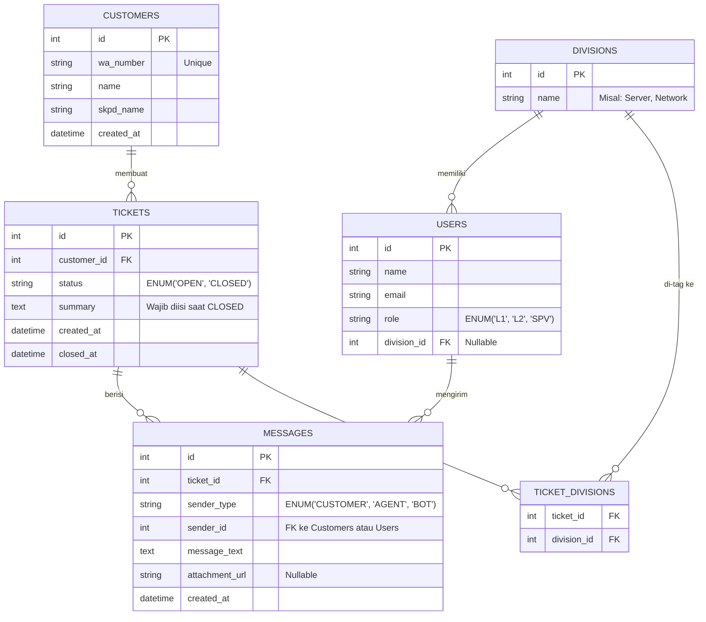

# Rancangan Database (ERD)
**Proyek:** Integrasi WhatsApp ke Web Helpdesk

Struktur *database* ini dirancang menggunakan pendekatan relasional (SQL) yang mencakup tabel-tabel utama untuk mengakomodasi alur tiket, multi-divisi, serta histori *chat*.

## 1. Entity Relationship Diagram (ERD)

---

## 2. Definisi Tabel & Penjelasan

### 2.1. Tabel `customers`
Tabel ini menyimpan data pengguna/pelapor yang mengirim pesan via WhatsApp.
*   `id` (INT, PK, Auto Increment)
*   `wa_number` (VARCHAR, Unique) - Nomor WhatsApp pelapor.
*   `name` (VARCHAR) - Nama kontak pelapor.
*   `skpd_name` (VARCHAR) - Nama Instansi / SKPD pelapor.
*   `created_at` (TIMESTAMP)

### 2.2. Tabel `divisions`
Tabel master untuk menyimpan daftar divisi teknis (contoh: Server, Network, All).
*   `id` (INT, PK, Auto Increment)
*   `name` (VARCHAR) - Nama divisi.

### 2.3. Tabel `users`
Tabel untuk agen L1, L2, dan Manajemen (Supervisor) yang bisa *login* ke dashboard Web.
*   `id` (INT, PK, Auto Increment)
*   `name` (VARCHAR)
*   `email` (VARCHAR, Unique)
*   `password` (VARCHAR) - Hashed
*   `role` (ENUM: 'L1', 'L2', 'SPV')
*   `division_id` (INT, FK) - Menunjuk ke `divisions.id`. L1 & SPV mungkin bernilai *null*.

### 2.4. Tabel `tickets`
Tabel utama untuk menyimpan data tiket aduan. Waktu (SLA basis) dapat dihitung dari selisih `created_at` dan `closed_at`.
*   `id` (INT, PK, Auto Increment)
*   `customer_id` (INT, FK)
*   `status` (ENUM: 'OPEN', 'CLOSED') - Status tiket saat ini.
*   `summary` (TEXT, Nullable) - Kesimpulan yang **wajib** diisi sebelum status menjadi CLOSED.
*   `created_at` (TIMESTAMP) - Waktu tiket dibuat (SLA Start).
*   `closed_at` (TIMESTAMP, Nullable) - Waktu tiket ditutup.

### 2.5. Tabel `ticket_divisions` (Pivot / Junction Table)
Tabel ini memecahkan masalah **F3 (Penanganan Multi-Kendala)**. Satu tiket dapat di-*tag* ke banyak divisi (misal `ticket_id: 1` di-tag ke `Network` dan `Server`).
*   `ticket_id` (INT, FK)
*   `division_id` (INT, FK)
*   *(Primary Key adalah kombinasi dari `ticket_id` dan `division_id`)*

### 2.6. Tabel `messages`
Tabel untuk menyimpan seluruh riwayat percakapan (*chat*) dalam suatu tiket. Mendukung konsep **Many-to-One** (berbagai agen bisa membalas 1 tiket yang sama).
*   `id` (INT, PK, Auto Increment)
*   `ticket_id` (INT, FK) - Menunjuk ke tiket mana pesan ini berada.
*   `sender_type` (ENUM: 'CUSTOMER', 'AGENT', 'BOT') - Menandakan siapa pengirimnya.
*   `sender_id` (INT, FK) - ID pengirim. Jika `sender_type` = CUSTOMER, maka menunjuk ke `customers.id`. Jika AGENT, menunjuk ke `users.id`.
*   `message_text` (TEXT, Nullable) - Isi teks pesan (termasuk *auto-reply* bot).
*   `attachment_url` (VARCHAR, Nullable) - Path/URL jika ada *upload* gambar/dokumen.
*   `created_at` (TIMESTAMP)

---

## 3. Relasi dengan Fitur PRD
1. **Multi-Kendala (F3):** Diselesaikan menggunakan tabel `ticket_divisions`.
2. **Blast Broadcast (F4):** Sistem bisa men-*query* tiket baru dan mengambil ID divisi dari `ticket_divisions`, lalu mengirim notifikasi ke semua `users` yang memiliki `division_id` tersebut.
3. **Mandatory Summary (F7):** Field `summary` di tabel `tickets` siap digunakan sebagai validasi *backend* sebelum merubah `status` menjadi `CLOSED`.
4. **Jeda Rule Bot (F6):** Aplikasi (*backend*) cukup mengecek apakah di tabel `messages` untuk `ticket_id` tersebut sudah ada balasan dengan `sender_type = 'AGENT'`. Jika ada, maka matikan *auto-reply* bot (kecuali tiket tersebut sudah ditutup dan *user* membuka *chat* baru).
