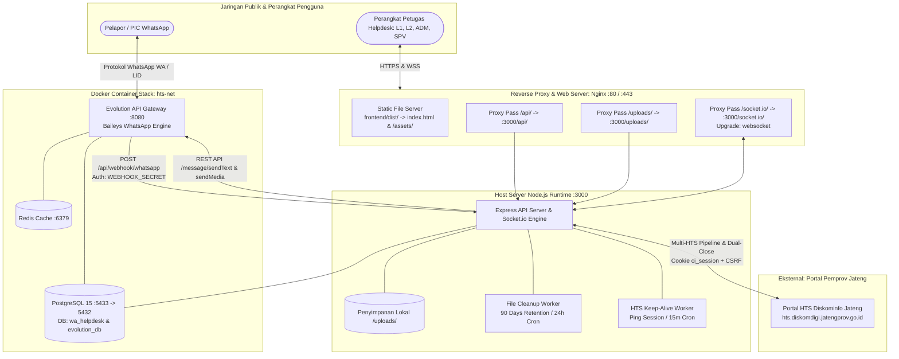
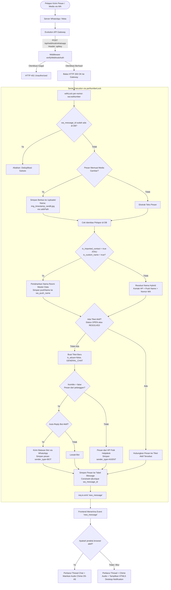
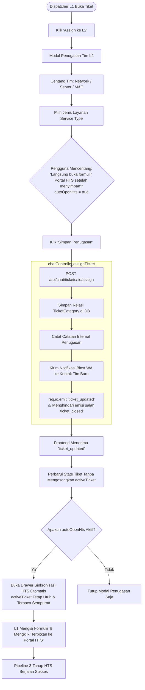
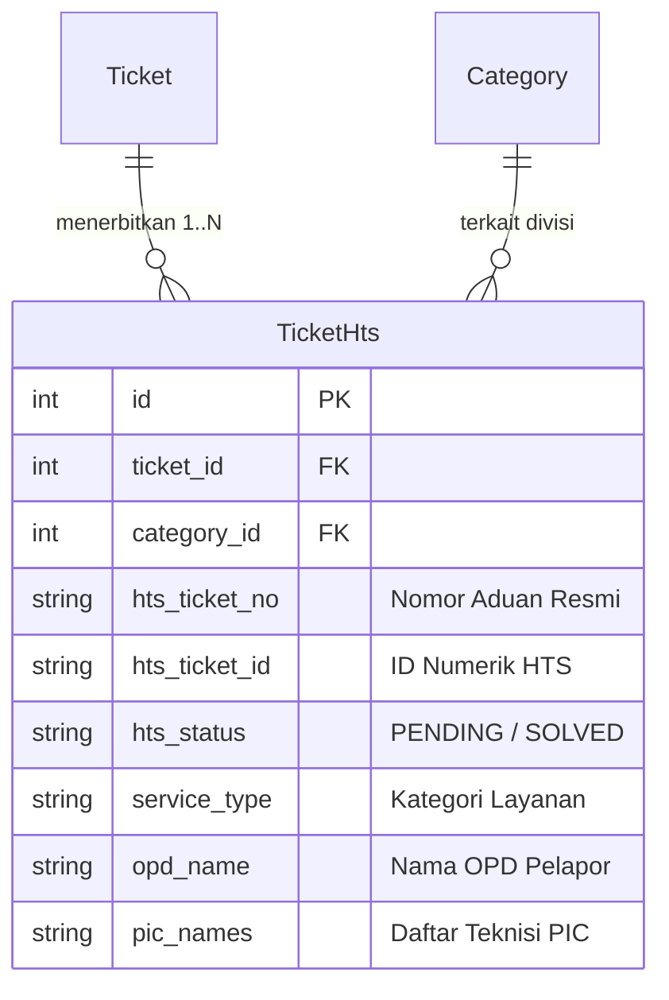

# 🏗️ Arsitektur Teknologi, Diagram Alur & Keamanan Sistem
**Proyek:** HTS Chat Integration (WhatsApp Helpdesk to Web Ticketing System)  
**Versi:** Workflow V4.2.1 Produksi (Full-Stack SPA Integration & Consolidated Architecture)  
**Audiens Dokumen:** Developer, System Architect & DevOps Engineer  
**Terakhir Diperbarui:** 03 Oktober 2026  

---

## 1. Tumpukan Teknologi Terpadu (Full-Stack Tech Stack)

| Layer | Teknologi & Pustaka | Versi | Peran & Tanggung Jawab Arsitektural |
|---|---|:---:|---|
| **WhatsApp Gateway** | **Evolution API v2 (Baileys)** | `v2.3+` | Engine Baileys dalam Docker, memelihara sesi multi-device WhatsApp, webhook `messages.upsert`, pengiriman teks & media lampiran. |
| **Realtime Gateway** | **Socket.io** | `v4.8+` | WebSocket dua arah terotentikasi JWT handshake; mengalirkan pembaruan chat, tiket, dan mutasi Multi-HTS ke *rooms* terisolasi. |
| **Backend Core** | **Node.js + Express.js** | `v5.2.1` | REST API berkecepatan tinggi, otorisasi RBAC tingkat peladen (*server-side enforcement*), reverse-engineering portal HTS, dan worker background. |
| **HTS Engine** | **Axios + Form-Data** | `v1.7+` | Integrasi portal HTS Diskominfo (cookie PHP `ci_session`, CSRF token, bypass visual CAPTCHA, multipart form-data upload, dan dual-close). |
| **Database & ORM** | **PostgreSQL 15 + Prisma** | `v5.22` | Relational storage ACID-compliant: model relasi tiket Multi-HTS (One-to-Many), customer master, pesan, quick replies, dan indeks komposit. |
| **Session Cache** | **Redis (Alpine)** | Latest | Session store & antrean pesan internal Evolution API pada jaringan Docker `hts-net`. |
| **Frontend Framework** | **React.js + Vite** | `v18.3.1` / `v5.4.10` | Single Page Application (SPA) modern, Hot Module Replacement (HMR), dan kompilasi statis cepat (`dist/`). |
| **Routing Sisi Klien** | **React Router DOM** | `v7.18.4` | Deklarasi rute browser (`/login`, `/`, wildcard redirect) dengan proteksi navigasi autentikasi. |
| **UI Styling & Ikon** | **Tailwind CSS + Lucide React** | `v3.4.19` / `v1.48.0` | Desain antarmuka 3-kolom modern responsif, palet warna tematik (L1 vs L2 vs SPV), animasi mikro, dan icon set SVG ringan. |
| **Audio & Notifikasi**| **Web Audio API + HTML5 Notif** | Native Web APIs | Sintesis nada dering audio murni (*two-tone chime* D5 $\rightarrow$ A5 frekuensi $587.33\text{ Hz} \rightarrow 880\text{ Hz}$) tanpa dependensi file eksternal + notifikasi push desktop latar belakang. |
| **Web Server / Proxy** | **Nginx Reverse Proxy** | Produksi VPS | Routing virtual host: penyedia aset SPA statis, passthrough `/api/`, proxy stream berkas `/uploads/`, terminasi SSL Certbot, dan upgrade WebSocket `/socket.io/`. |

---

## 2. Topologi Infrastruktur & Aliran Komunikasi



### Matriks Port & Variabel Lingkungan

| Layanan | Port Host | Port Kontainer | Variabel Lingkungan Kunci |
|---|:---:|:---:|---|
| **PostgreSQL** | `5433` | `5432` | `POSTGRES_USER=helpdesk_user`, `POSTGRES_DB=wa_helpdesk` (Database `evolution_db` diinisialisasi via `docker/init.sql`). |
| **Redis** | `6379` | `6379` | Digunakan untuk cache sesi dan antrean internal Evolution API. |
| **Evolution API** | `8080` | `8080` | `SERVER_URL`, `AUTHENTICATION_API_KEY`, `DATABASE_CONNECTION_URI`. |
| **Backend Express**| `3000` | - | `PORT=3000`, `DATABASE_URL` (wajib port `5433`), `JWT_SECRET`, `WEBHOOK_SECRET`, `EVOLUTION_API_URL`, `FRONTEND_URL`. |
| **Frontend Vite** | `5200` (Dev) | - | `VITE_API_URL` (default dev: `http://localhost:3000/api`), `VITE_SOCKET_URL` (default dev: `http://localhost:3000`). Pada produksi Nginx, URL relatif digunakan secara otomatis (`/api` dan `/socket.io`). |

---

## 3. Arsitektur Internal Frontend SPA (`frontend/`)

Antarmuka dasbor helpdesk dibangun sebagai Single Page Application (SPA) monolitik modular berkinerja tinggi pada [`frontend/src/App.jsx`](file:///d:/Kuliah/Repository/hts-chat-integration/frontend/src/App.jsx) dan diinisialisasi melalui [`frontend/src/main.jsx`](file:///d:/Kuliah/Repository/hts-chat-integration/frontend/src/main.jsx).

```mermaid
flowchart TD
    MAIN[main.jsx] --> EB[ErrorBoundary: Tangkap Uncaught Exceptions]
    EB --> APP[App: Root Router]
    APP --> BR[BrowserRouter]
    BR --> R_LOGIN[Route /login -> Login Component]
    BR --> R_DASH[Route / -> Dashboard Component]
    BR --> R_REDIR[Route * -> Navigate to /]

    subgraph Dashboard_Component [Struktur Internal Dashboard Component]
        D_NAV[Top Navbar & Tab Navigation: chat | report | users | teams | bot]
        D_AUDIO[Web Audio API Chime & Desktop Notification Manager]
        D_SOCK[Socket.io Dynamic Auth Lifecycle]
        
        subgraph Tab_Chat [Tab 1: Workspace Percakapan 3-Kolom]
            COL_LEFT[Panel Kiri: Filter Kategori, SLA Timer, Search Ticket]
            COL_CENTER[Panel Tengah: Thread Pesan, Divider Riwayat Lampau, Mode Chat / Internal, Slash Commands /]
            COL_RIGHT[Panel Kanan: Pusat Kendali, Multi-HTS Cards, Drawer Manual Link, Auto-Open HTS Modal]
        end

        subgraph Tab_Lain [Tab Administrasi & Pelaporan]
            TAB_REP[Tab Report: Metrik SLA MTTR/FRT + Ekspor CSV]
            TAB_USR[Tab Users: CRUD Akun Pengguna & Role RBAC]
            TAB_TMS[Tab Teams: CRUD Kontak Blast L2 Network, Server, M&E]
            TAB_BOT[Tab Bot: Pengaturan Auto-Reply Sambutan]
        end
    end

    R_DASH --> Dashboard_Component
```

### 3.1 Siklus Hidup Socket.io & Pencegahan Stale Closures
1. **Dynamic Handshake Auth:**
   Objek soket dikonfigurasi dengan fungsi callback autentikasi dinamis:
   ```javascript
   const socket = io(SOCKET_URL, {
     auth: (cb) => { cb({ token: localStorage.getItem('token') || '' }); },
     autoConnect: Boolean(localStorage.getItem('token'))
   });
   ```
   Saat pengguna melakukan login atau logout, soket secara otomatis memutus dan membangun kembali koneksi (`socket.disconnect().connect()`) dengan token terkini.
2. **Sinkronisasi State dengan `useRef`:**
   Pada aplikasi chat reaktif, listener WebSocket asynchronous sering kali mengalami jebakan nilai lama (*stale closures*). Untuk menjamin akurasi mutasi state tanpa merusak performa render, dashboard memadukan React State dengan referensi mutable:
   - `activeTicketRef` memantau ID tiket yang sedang aktif dibuka pengguna.
   - `ticketsRef` memantau daftar tiket mutakhir saat event `new_message` atau `ticket_updated` tiba.

### 3.2 Penanganan Kesalahan & Ketahanan Crash (`ErrorBoundary`)
Pada [`frontend/src/main.jsx`](file:///d:/Kuliah/Repository/hts-chat-integration/frontend/src/main.jsx), seluruh antarmuka dibungkus oleh kelas `ErrorBoundary`. Jika terjadi kesalahan render mendadak (*uncaught JavaScript error*), aplikasi tidak menampilkan layar putih (*blank screen*), melainkan menampilkan panel diagnostik bersahabat lengkap dengan *component stack trace* untuk memudahkan investigasi tanpa menghapus data sesi.

### 3.3 Penanganan Token Kedaluwarsa (Axios Global Interceptor)
Axios dikonfigurasi secara global untuk menyuntikkan header `Authorization: Bearer <token>` pada setiap *request*. Jika peladen backend mengembalikan respon HTTP 401 Unauthorized (misalnya masa berlaku token 12 jam habis), frontend secara anggun membersihkan `localStorage` dan mengarahkan pengguna kembali ke halaman `/login`.

---

## 4. Diagram Alur Sistem Terkonsolidasi (End-to-End System Flows)

### 4.1 Alur Pesan Masuk (Inbound WhatsApp $\rightarrow$ Webhook $\rightarrow$ Database $\rightarrow$ WebSocket)



---

### 4.2 Alur Pendelegasian Tim L2 & Integrasi Resilient Auto-Open HTS



> **Catatan Kunci Arsitektural (Pelajaran dari Insiden Auto-Open HTS):**  
> Sebelumnya, backend secara keliru memancarkan event `ticket_closed` saat tiket di-assign ke L2. Hal ini memicu listener frontend mengosongkan `activeTicket = null` sehingga saat drawer HTS terbuka, tombol *"Terbitkan ke Portal HTS"* kehilangan objek tiket aktif dan tidak dapat merespons. Solusi permanen dicapai dengan memancarkan `ticket_updated` dan memperkuat penjaga `activeTicketRef` di sisi klien.

---

### 4.3 Alur Arsitektur Multi-HTS (One-to-Many Relasi Mandiri)

Arsitektur Multi-HTS memisahkan sesi percakapan WhatsApp lokal (`Ticket`) dengan banyak nomor aduan portal resmi (`TicketHts`):



#### Siklus Hidup Penanganan Multi-HTS:
1. **Penerbitan Parsial (Pipeline 3 Tahap):**  
   - Tahap 1: `POST /submit_aduan` $\rightarrow$ Menerbitkan nomor aduan resmi (misal: `#2041-TShoot-2026-jateng-10`).
   - Tahap 2: `POST /submit_aduan_status` $\rightarrow$ Memvalidasi status penerbitan (`unsubmitted` $\rightarrow$ `input-pic`).
   - Tahap 3: `POST /submit_pic` $\rightarrow$ Mengalokasikan teknisi PIC penanganan sehingga status HTS resmi menjadi `PENDING`.
2. **Penyelesaian Mandiri (*Per-Ticket Resolution*):**  
   Setiap kartu HTS di panel kanan memiliki tombol tindakan independen. L1 dapat menyelesaikan tiket Network terlebih dahulu (`SOLVED`) sementara tiket Server masih berstatus `PENDING`.
3. **Dual-Close Berintegritas:**  
   Ketika L1 mengklik penutupan tiket lokal:
   - Sistem memvalidasi tabel `TicketHts` sebagai *Single Source of Truth* (SSOT).
   - Jika masih terdapat tiket HTS berstatus `PENDING`, sistem secara otomatis mengeksekusi penyelesaian HTS terlebih dahulu.
   - **Kompensasi Kegagalan:** Jika penutupan ke portal HTS gagal atau mengalami *timeout*, penutupan tiket lokal **langsung dibatalkan secara transaksional**. Tiket lokal tetap `OPEN` agar data tidak mengalami inkonsistensi (*zombie state*).
4. **Penautan Manual & Disaster Recovery (`Manual Link`):**  
   Jika gangguan jaringan terjadi saat proses submit, L1 dapat menautkan nomor tiket yang telah terbit manual via tab *Tautkan yang Sudah Ada*. Sistem memvalidasi nomor langsung ke portal HTS via `lookupTicketByNumber` dan menangani konflik duplikasi (HTTP 400 jika sama pada tiket ini, HTTP 409 dengan modal konfirmasi force link jika nomor sudah terhubung di tiket lain).

---

## 5. Arsitektur Keamanan & Durabilitas Data

### 5.1 Fail-Fast Initialization (`SEC-03`)
Modul [`config/env.js`](file:///d:/Kuliah/Repository/hts-chat-integration/backend/src/config/env.js) memvalidasi seluruh variabel lingkungan esensial (`DATABASE_URL`, `JWT_SECRET`, `EVOLUTION_API_TOKEN`, `WEBHOOK_SECRET`) saat proses Node.js mulai berjalan. Server menolak menyala jika terdapat kredensial yang kosong atau menggunakan nilai *fallback default*.

### 5.2 Autentikasi Webhook Shared Secret (`SEC-01`)
Endpoint penerimaan pesan `POST /api/webhook/whatsapp` dilindungi token rahasia bersama `WEBHOOK_SECRET` dengan verifikasi string waktu-konstan (`crypto.timingSafeEqual`) untuk menangkal eksploitasi serangan *timing attack*.

### 5.3 Server-Side RBAC & Isolasi Data Multi-Tenant (`SEC-02`)
Hak akses pengguna diverifikasi di tingkat Express menggunakan middleware `verifyToken` dan `requireRole`. Teknisi L2 yang memiliki penugasan `category_id` secara ketat dibatasi hanya dapat membaca data antrean dan percakapan timnya sendiri.

### 5.4 Sanitasi Berkas Anti-Path Traversal (`SEC-04`)
Seluruh jalur berkas lampiran yang akan dikirimkan ke portal HTS divalidasi oleh fungsi [`safePath.js`](file:///d:/Kuliah/Repository/hts-chat-integration/backend/src/utils/safePath.js). Jalur kanonikal berkas wajib berada di dalam subdirektori `/uploads`. Upaya eksploitasi direktori menggunakan `../` akan langsung ditolak peladen.

### 5.5 Serialisasi Antirace & Deduplikasi Atomik (`DATA-01` & `DATA-02`)
Pesan masuk dari nomor WhatsApp yang sama diserialisasi secara *in-memory* menggunakan mutex [`perNumberLock.js`](file:///d:/Kuliah/Repository/hts-chat-integration/backend/src/utils/perNumberLock.js). Deduplikasi pesan diperkuat oleh batasan unik database (`Message.wa_message_id @unique`), memastikan tidak ada tiket atau gelembung pesan dobel yang tercipta akibat *network retry* dari WhatsApp gateway.

### 5.6 Background Worker Terjadwal
1. **`htsKeepAliveService` (Interval 15 Menit):** Memelihara keaktifan sesi cookie PHP `ci_session` petugas helpdesk agar tidak terputus di tengah jam operasional.
2. **`fileCleanupService` (Interval 24 Jam):** Menghapus berkas media fisik pada direktori `/uploads` untuk seluruh tiket yang telah berstatus `CLOSED` lebih dari 90 hari.

---

## 6. Arsitektur Reverse Proxy & Hosting Nginx (Produksi VPS)

Pada lingkungan server produksi VPS (Ubuntu 22.04 LTS), Nginx bertindak sebagai gerbang terdepan (*front-facing reverse proxy*) yang mengelola SSL dan mempartisi lalu lintas:

```nginx
# Cuplikan Konfigurasi Nginx Produksi
server {
    listen 80;
    server_name helpdesk.diskominfo.jatengprov.go.id;
    return 301 https://$host$request_uri;
}

server {
    listen 443 ssl http2;
    server_name helpdesk.diskominfo.jatengprov.go.id;

    ssl_certificate /etc/letsencrypt/live/helpdesk.diskominfo.jatengprov.go.id/fullchain.pem;
    ssl_certificate_key /etc/letsencrypt/live/helpdesk.diskominfo.jatengprov.go.id/privkey.pem;

    # 1. Frontend SPA Static Hosting
    location / {
        root /var/www/hts-chat-integration/frontend/dist;
        index index.html;
        try_files $uri $uri/ /index.html;
    }

    # 2. Caching Aset Statis Vite Teroptimasi
    location /assets/ {
        root /var/www/hts-chat-integration/frontend/dist;
        expires 1y;
        add_header Cache-Control "public, immutable";
        access_log off;
    }

    # 3. REST API Passthrough
    location /api/ {
        proxy_pass http://127.0.0.1:3000/api/;
        proxy_http_version 1.1;
        proxy_set_header Host $host;
        proxy_set_header X-Real-IP $remote_addr;
        proxy_set_header X-Forwarded-For $proxy_add_x_forwarded_for;
        proxy_set_header X-Forwarded-Proto $scheme;
        client_max_body_size 50M;
    }

    # 4. Berkas Media Lampiran
    location /uploads/ {
        proxy_pass http://127.0.0.1:3000/uploads/;
        proxy_set_header Host $host;
        client_max_body_size 50M;
    }

    # 5. WebSocket Realtime Socket.io Upgrade
    location /socket.io/ {
        proxy_pass http://127.0.0.1:3000/socket.io/;
        proxy_http_version 1.1;
        proxy_set_header Upgrade $http_upgrade;
        proxy_set_header Connection "upgrade";
        proxy_set_header Host $host;
        proxy_cache_bypass $http_upgrade;
        proxy_read_timeout 86400s;
        proxy_send_timeout 86400s;
    }
}
```
