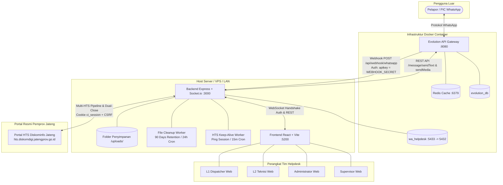
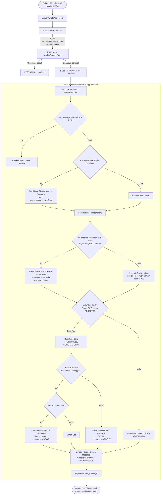
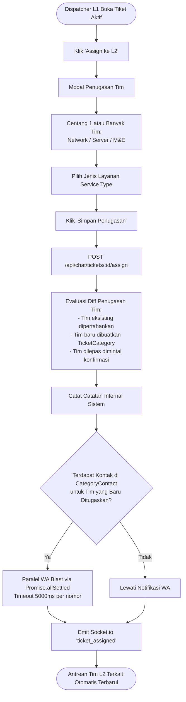
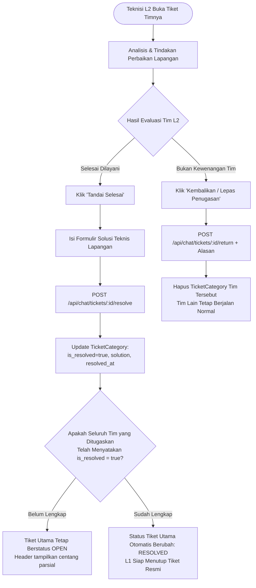
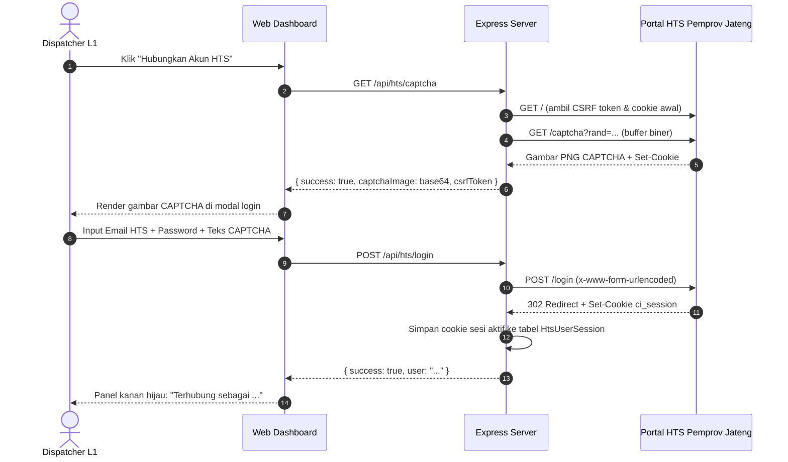
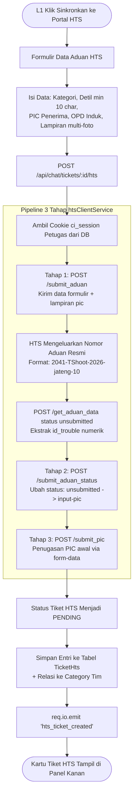
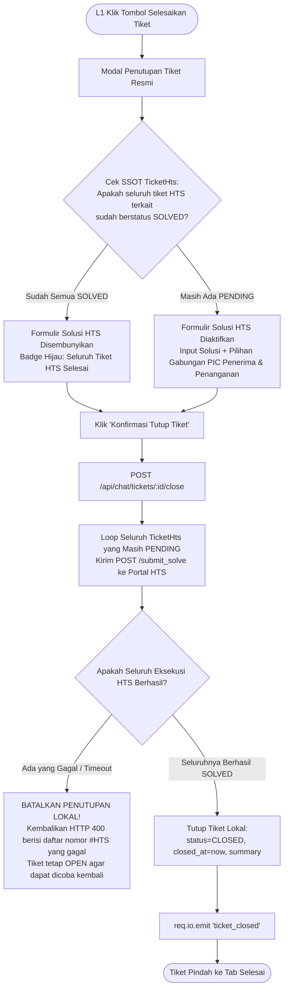

# 🏗️ Arsitektur Teknologi, Diagram Alur & Keamanan Sistem
**Proyek:** HTS Chat Integration (WhatsApp Helpdesk to Web Ticketing System)  
**Versi:** Workflow V4.2 Produksi  
**Audiens Dokumen:** Developer & System Architect  
**Terakhir Diperbarui:** 03 Oktober 2026  

---

## 1. Tech Stack

| Layer | Teknologi | Versi | Peran & Tanggung Jawab |
|---|---|:---:|---|
| **WhatsApp Gateway** | **Evolution API v2 (Baileys)** | `v2.3+` | Mengelola protokol WhatsApp (Baileys), autentikasi QR, webhook `messages.upsert`, pengiriman teks & media |
| **Realtime Gateway** | **Socket.io** | `v4.8+` | WebSocket dua arah terotentikasi: pembaruan chat, status tiket, notifikasi real-time terpartisi (*rooms*) |
| **Backend Core** | **Node.js + Express.js** | `v18+/v20/v22` | REST API, webhook controller, otentikasi JWT, penegakan RBAC, reverse-engineering HTS |
| **HTS Engine** | **Axios + Form-Data** | `v1.7+` | Integrasi portal HTS Diskominfo (cookie PHP `ci_session`, CSRF token, bypass CAPTCHA, multipart upload) |
| **Database & ORM** | **PostgreSQL 15 + Prisma** | `v5.22` | Relational storage (tiket, pesan, pengguna, pelanggan, sesi HTS, quick replies) + indeks komposit |
| **Session Cache** | **Redis (Alpine)** | Latest | Cache sesi WhatsApp pada Evolution API (Docker) |
| **Frontend** | **React.js + Vite** | `v18+/Vite 5` | Single Page Application dasbor helpdesk, manajemen state, perutean RBAC |
| **UI Styling & Ikon** | **Tailwind CSS + Lucide React** | `v3+` | Antarmuka responsif modern, tema warna, ikon grafis |

### Pustaka Backend Utama (`backend/package.json`)
- `@prisma/client` & `prisma` — ORM basis data PostgreSQL
- `jsonwebtoken` — Otentikasi stateless JWT (12 jam) & WebSocket handshake
- `bcryptjs` — Hashing kata sandi (salt rounds 10)
- `socket.io` — Engine WebSocket dengan middleware handshake otentikasi & room partition
- `axios`, `form-data` — Klien HTTP dengan timeout eksplisit untuk gateway WhatsApp & portal HTS
- `multer` — Penanganan berkas unggahan dengan sufiks acak dan sanitasi kanonikal
- `helmet`, `express-rate-limit` — Hardening header HTTP (CSP, CORP) & proteksi DoS
- `xlsx` — Parser multi-format impor master data kontak (Excel `.xlsx/.xls`, CSV, dan vCard `.vcf`)
- `cors`, `dotenv` — Konfigurasi lingkungan & CORS terarah

---

## 2. Topologi Arsitektur Sistem

### Catatan Jaringan & Port
- `docker-compose.yml` memetakan PostgreSQL ke **`5433:5432`** (host:container). Backend di host **wajib** menggunakan port **`5433`** pada `DATABASE_URL` di file `.env`.
- Webhook Evolution API menuju backend host dialirkan melalui alamat IP bridge gateway: `http://172.17.0.1:3000/api/webhook/whatsapp` (atau via hostname reverse proxy VPS).
- Frontend Vite dikonfigurasi pada port **`5200`** (`vite.config.js`) dan mendeteksi host backend secara otomatis via `window.location.hostname`.

---

## 3. Diagram Alur Sistem (Flowcharts)

### 3.1 Alur Pesan Masuk (Inbound WhatsApp $\rightarrow$ Webhook $\rightarrow$ Database)

---

### 3.2 Alur Pendelegasian Smart Multi-Assign & WhatsApp Blast L2

---

### 3.3 Alur Penyelesaian Mandiri Per-Tim (Per-Team Resolution)

---

### 3.4 Alur Integrasi Portal Resmi HTS Diskominfo

#### A. Autentikasi Sesi HTS (Bypass Visual CAPTCHA)

#### B. Penerbitan Tiket HTS (Pipeline 3 Tahap)

#### C. Dual-Close Berintegritas (Penutupan Lokal + Penyelesaian HTS)

---

## 4. Arsitektur Keamanan Sistem (Security Architecture)

### 4.1 Validasi Konfigurasi Lingkungan Fail-Fast (`SEC-03`)
Sistem menginisialisasi [`config/env.js`](file:///d:/Kuliah/Repository/hts-chat-integration/backend/src/config/env.js) pada baris pertama startup aplikasi. Jika salah satu variabel wajib (`DATABASE_URL`, `JWT_SECRET`, `EVOLUTION_API_TOKEN`) tidak disetel atau bernilai string kosong, peladen langsung menghentikan proses (`process.exit(1)`) dengan pesan kesalahan konfigurasi fatal, mencegah eksekusi dengan kredensial default yang lemah.

### 4.2 Autentikasi Webhook Shared Secret (`SEC-01`)
Endpoint penerimaan pesan WhatsApp `POST /api/webhook/whatsapp` dilindungi oleh [`webhookAuth.js`](file:///d:/Kuliah/Repository/hts-chat-integration/backend/src/middlewares/webhookAuth.js):
- Memvalidasi token dari header `apikey`, `x-api-key`, `Authorization: Bearer <token>`, atau query parameter `token`.
- Menggunakan perbandingan string waktu-konstan (`crypto.timingSafeEqual`) untuk menolak serangan *timing attack*.
- Membatasi ukuran body parser webhook maksimal **10MB** dan menerapkan *rate limiter* khusus **300 request / menit / IP**.

### 4.3 Penegakan Otorisasi RBAC Sisi Peladen (`SEC-02` & `AUTH-01`)
Otorisasi tidak hanya dibebankan pada antarmuka web, melainkan ditegakkan secara absolut di lapisan Express via [`authMiddleware.js`](file:///d:/Kuliah/Repository/hts-chat-integration/backend/src/middlewares/authMiddleware.js):
- `verifyToken`: Memverifikasi integritas token JWT dan menyuntikkan identitas pengguna ke `req.user`.
- `requireRole([...])`: Memeriksa peran aktif pengguna (`ADMIN`, `SPV`, `L1`, `L2`).
- **Isolasi Baris Data:** Agen L2 yang memiliki `category_id` hanya diizinkan membaca pesan dan antrean tiket timnya sendiri.

### 4.4 Otentikasi Handshake WebSocket & Isolasi Ruang (`SEC-05`)
Peladen Socket.io pada [`index.js`](file:///d:/Kuliah/Repository/hts-chat-integration/backend/src/index.js) menerapkan middleware handshake `io.use`:
- Memverifikasi token JWT dari `socket.handshake.auth.token` sebelum menyetujui koneksi WebSocket.
- Klien anonim langsung ditolak dengan pesan `unauthorized`.
- Soket yang terotentikasi otomatis dimasukkan ke dalam ruang (*rooms*) eksklusif: `user_{id}`, `role_{role}`, dan `category_{category_id}`.

### 4.5 Pencegahan Path Traversal Lampiran (`SEC-04`)
Seluruh fungsi pemrosesan lampiran berkas yang dikirimkan ke portal HTS disaring menggunakan modul [`safePath.js`](file:///d:/Kuliah/Repository/hts-chat-integration/backend/src/utils/safePath.js):
- Memeriksa nama berkas menggunakan `path.resolve` dan memastikan jalur kanonikal berkas berada di dalam folder yang diizinkan (`/uploads`).
- Upaya manipulasi jalur direktori (`../`) akan memicu penolakan seketika dengan pesan `Akses path traversal ditolak`.

### 4.6 Proteksi Race Condition & Konkurensi Data (`DATA-01` & `DATA-02`)
- **Mutex Per-Nomor WhatsApp:** Webhook incoming dibungkus oleh antrean janji in-memory [`perNumberLock.js`](file:///d:/Kuliah/Repository/hts-chat-integration/backend/src/utils/perNumberLock.js) berbasis key `wa:${waNumber}`. Pesan yang tiba dalam interval milidetik diproses secara serial.
- **Deduplikasi Atomik Database:** Kolom `Message.wa_message_id` memiliki indeks `@unique`. Jika terjadi tabrakan pesan ganda, penanganan kesalahan Prisma menangkap kode `P2002` secara elegan tanpa menjatuhkan proses peladen.

### 4.7 Background Workers & Siklus Hidup File (`RES-03`)
Aplikasi menjalankan dua background service mandiri di dalam event loop peladen:
1. **`htsKeepAliveService` (Interval 15 Menit):** Melakukan ping ringan otomatis ke portal HTS untuk memastikan sesi cookie petugas L1 tidak kedaluwarsa.
2. **`fileCleanupService` (Interval 24 Jam):** Memindai dan menghapus berkas lampiran media fisik pada direktori `/uploads` untuk tiket yang telah berstatus `CLOSED` lebih dari 90 hari.

### 4.8 Optimasi Indeks Skema Database (`DATA-04`)
Model basis data PostgreSQL telah dilengkapi dengan indeks komposit:
- `Ticket`: `@@index([status, is_aduan, created_at(sort: Desc)])` untuk filtering antrean cepat dan `@@index([customer_id, status])`.
- `Customer`: `@@index([name])` dan `@@index([skpd_name])` untuk pencarian direktori kontak berkinerja tinggi.
