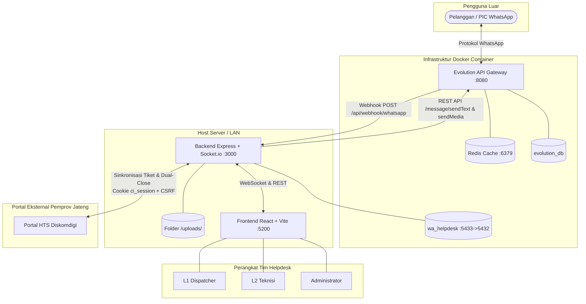
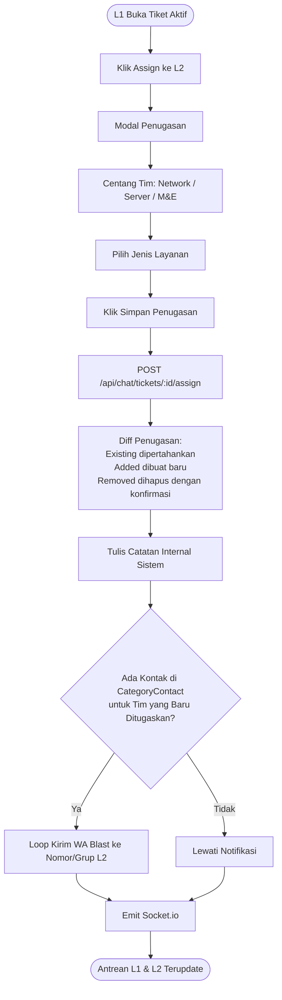
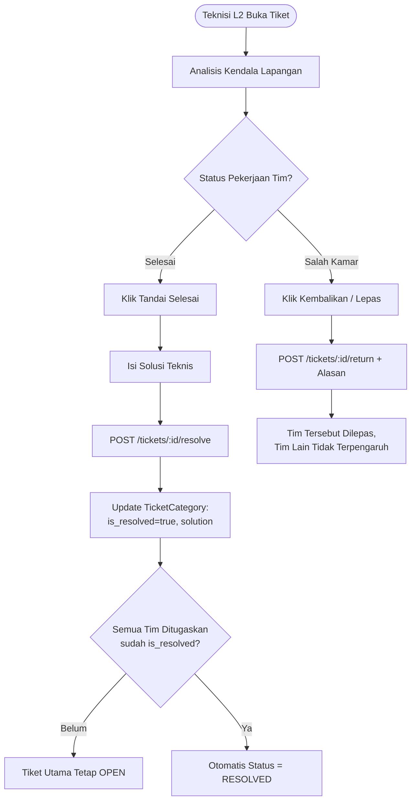
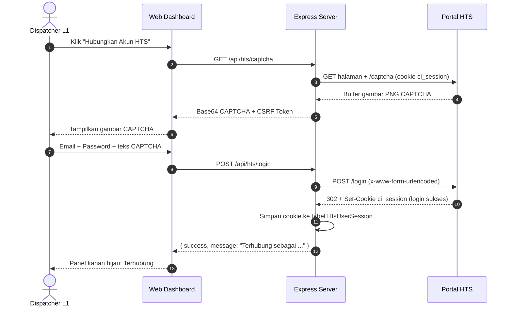
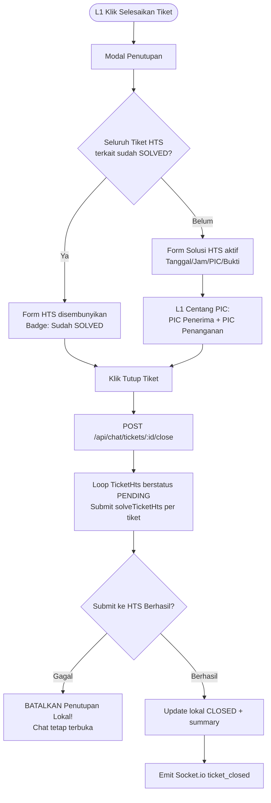
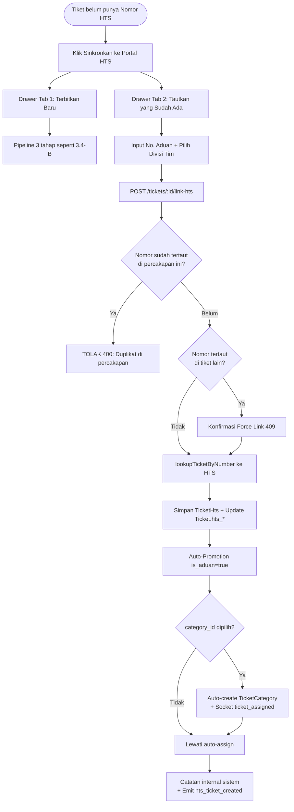
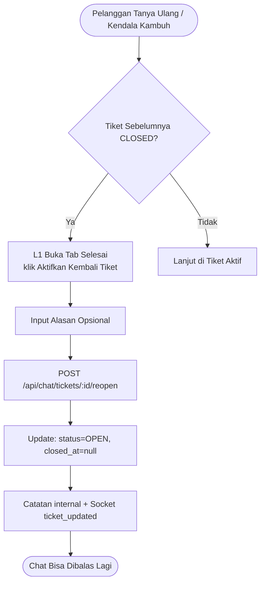

# 🏗️ Arsitektur Teknologi, Diagram Alur & Keamanan Sistem
**Proyek:** HTS Chat Integration (WhatsApp Helpdesk to Web Ticketing System)  
**Versi:** Workflow V4.1 Produksi  
**Audiens Dokumen:** Developer  

---

## 1. Tech Stack

| Layer | Teknologi | Versi | Peran |
|---|---|:---:|---|
| **WhatsApp Gateway** | **Evolution API v2 (Baileys)** | `v2.3.7` | Mengelola protokol WhatsApp (Baileys), QR auth, webhook `messages.upsert`, REST kirim teks/media |
| **Realtime Gateway** | **Socket.io** | `v4.8+` | WebSocket dua arah: pesan masuk, status tiket, notifikasi |
| **Backend Core** | **Node.js + Express.js** | `v18+/v22` | REST API, controller webhook, JWT, integrasi HTS |
| **HTS Engine** | **Axios + Form-Data** | `v1.7+` | Reverse-engineering portal HTS (cookie PHP `ci_session`, CSRF, bypass CAPTCHA, multipart) |
| **Database & ORM** | **PostgreSQL 15 + Prisma** | `v5.22` | Seluruh data relasional (tiket, pesan, pengguna, pelanggan, integrasi HTS) |
| **Session Cache** | **Redis (Alpine)** | Latest | Cache sesi Evolution API (Docker) |
| **Frontend** | **React.js + Vite** | `v18+/Vite 5` | SPA dasbor helpdesk, RBAC UI, react-router-dom |
| **UI Styling** | **Tailwind CSS + Lucide React** | `v3+` | Antarmuka responsif, ikon grafis |

### Pustaka Backend Utama (`backend/package.json`)
- `@prisma/client` & `prisma` — ORM PostgreSQL
- `jsonwebtoken` — JWT 12 jam
- `bcryptjs` — hashing password (salt rounds 10)
- `socket.io` — WebSocket real-time
- `axios`, `form-data` — komunikasi HTTP ke Evolution API & Portal HTS
- `multer` — upload file media (diskStorage, ekstensi asli)
- `helmet`, `express-rate-limit` — keamanan HTTP
- `xlsx` — parsing file import kontak (Excel/CSV)
- `cors`, `dotenv`

### Pustaka Frontend Utama (`frontend/package.json`)
- `react`, `react-dom`, `react-router-dom`, `vite`
- `socket.io-client`, `axios`
- `lucide-react`, `tailwindcss`, `date-fns`

---

## 2. Topologi Arsitektur Sistem



### Catatan Jaringan Docker
- `docker-compose.yml` memetakan Postgres ke **`5433:5432`** (host:container). Backend di host wajib memakai port **5433** di `DATABASE_URL`.
- Webhook Evolution → backend memakai IP bridge Docker host: `http://172.17.0.1:3000/api/webhook/whatsapp` (atau `HOST_IP`).
- Frontend memakai `window.location.hostname` dinamis untuk koneksi API/Socket agar akses LAN langsung jalan tanpa konfigurasi tambahan.

---

## 3. Diagram Alur Sistem (Flowcharts)

### 3.1 Alur Pesan Masuk (Inbound WhatsApp $\rightarrow$ Webhook)

```mermaid
flowchart TD
    A([Pelapor Kirim Pesan / Gambar via WA]) --> B[Server WhatsApp / Meta]
    B --> C[Evolution API Gateway]
    C -->|Webhook POST /api/webhook/whatsapp| D[Backend Express Controller]

    D --> E{Pesan Memuat Gambar?}
    E -- Ya --> F[Unduh Base64 dari Evolution API<br/>Simpan ke /uploads/img_*.jpg]
    E -- Tidak --> G[Ekstrak Teks Pesan]
    F --> H[Cek / Upsert Customer]
    G --> H

    H --> H2{Nama berasal dari<br/>Master Data Import / Edit Manual?}
    H2 -- Ya --> H3[TIDAK TIMPA nama<br/>Simpan pushName ke wa_push_name]
    H2 -- Tidak --> H4[Update nama dari pushName / kontak HP]
    H3 --> I
    H4 --> I

    I{Ada Tiket Aktif?<br/>OPEN atau RESOLVED}
    I -- Tidak --> J[Buat Tiket Baru<br/>is_aduan=false, GENERAL_CHAT]
    J --> K{fromMe = false<br/>(dari pelanggan)?}
    K -- Ya --> L[Kirim Auto-Reply Bot jika aktif]
    K -- Tidak --> P[Simpan sebagai AGENT]
    L --> M[Simpan pesan BOT]
    M --> P
    I -- Ada --> N[Sambungkan ke Tiket Aktif]
    N --> P

    P --> R[Emit Socket.io: new_message]
    R --> S([Tampil Seketika di Web Dashboard])
```

**Catatan teknis (V4.1):**
- Deduplikasi pesan via kolom `Message.wa_message_id` (`key.id` dari Evolution). Webhook skip jika ID sudah ada.
- Proteksi *race condition*: `prisma.customer.upsert` + fallback pembuatan tiket jika bentrok konkurensi.
- Mendukung **WhatsApp LID addressing** (`remoteJidAlt` $\rightarrow$ nomor HP asli).
- Pesan `fromMe=true` dari HP fisik helpdesk diterima & disimpan sebagai `AGENT`.

---

### 3.2 Alur Pendelegasian Smart Multi-Assign & WhatsApp Blast



**Catatan teknis:** Blast hanya dikirim ke tim **yang baru ditambahkan** (anti-spam berulang). Penugasan ulang tidak mereset `is_resolved` tim yang sudah selesai.

---

### 3.3 Alur Penyelesaian Mandiri Per-Tim (Per-Team Resolution)



---

### 3.4 Alur Integrasi Portal HTS Diskomdigi

#### A. Autentikasi Sesi HTS (Bypass CAPTCHA Visual)


#### B. Penerbitan Tiket (Pipeline 3 Tahap)
```mermaid
flowchart TD
    A([L1 Klik Sinkronkan ke Portal HTS]) --> B[Form Data HTS]
    B --> C[Isi: Kategori, Detil min 10 char,<br/>PIC Penerima, OPD Induk opsional, Lampiran multi-foto]
    C --> D[POST /api/chat/tickets/:id/sync-hts]
    D --> E[Ambil Cookie ci_session dari HtsUserSession]

    subgraph Pipeline [Pipeline 3 Tahap htsClientService]
        E --> F[Tahap 1: POST /submit_aduan<br/>Kirim data + pic[] array]
        F --> G[HTS Terbitkan Nomor Aduan<br/>contoh: 2041-TShoot-2026-jateng-10]
        G --> H[POST /get_aduan_data unsubmitted<br/>Ambil id_trouble numerik]
        H --> I[Tahap 2: POST /submit_aduan_status<br/>unsubmitted -> input-pic]
        I --> J[Tahap 3: POST /submit_pic<br/>PIC awal, misal pic_id=14]
    end

    J --> K[Status HTS = PENDING]
    K --> L[Simpan di DB:<br/>Ticket.hts_* + baris TicketHts]
    L --> M[Emit Socket.io hts_ticket_created]
    M --> N([Nomor HTS tampil di Header & Panel])
```

#### C. Dual-Close (Penutupan Tiket + Selesaikan di HTS)


**Kebijakan integritas:** Jika submit ke portal HTS gagal (file ditolak / sesi expired), tiket lokal **tidak tertutup** sehingga percakapan tidak terputus sepihak.

#### D. Manual Link & Disaster Recovery


---

### 3.5 Alur Start New Chat (Outbound) & Import Master Data Kontak

```mermaid
flowchart TD
    subgraph Impor [Import Master Data Kontak - Admin]
        A1[Admin Buka Modal Chat Baru<br/>klik Import Master Data Kontak] --> A2[Unggah File Excel/CSV/VCF]
        A2 --> A3{Deteksi Format File}
        A3 -- VCF --> A4[Parser vCard: FN/N + TEL + ORG]
        A3 -- CSV/XLSX --> A5[Parser xlsx: kolom fleksibel<br/>termasuk First/Middle/Last Name<br/>dan Organization Name]
        A4 --> A6
        A5 --> A6[Upsert Customer:<br/>is_imported_contact=true]
        A6 --> A7[MASTER DATA = PRIORITAS UTAMA<br/>Tidak tertimpa nama WA]
    end

    subgraph Chat [Start New Chat]
        B1[L1 Klik Chat Baru] --> B2[Pencarian Direktori Kontak<br/>(DB Master + Kontak HP Evolution)]
        B2 --> B3[Pilih Kontak atau Ketik Manual<br/>+ Pesan Pembuka]
        B3 --> B4{Toggle: Langsung<br/>Kirim Pesan?}
        B4 -- Ya --> B5[POST /chat/start-new-chat<br/>+ sendText Evolution]
        B4 -- Tidak --> B6[Tiket kosong<br/>(tanpa kirim WA)]
        B5 --> B7[Simpan pesan AGENT<br/>+ Socket new_message]
        B6 --> B8[Tiket terbuka,<br/>L1 kirim manual nanti]
    end
```

**Hierarki resolusi nama pelapor (V4.1):**
1. 🥇 **Hasil import Admin** (`is_imported_contact = true`) — tidak tertimpa apa pun
2. 🥈 **Edit manual via dashboard** (`is_custom_name = true`)
3. 🥉 **Kontak HP Evolution API** (`pushName`)
4. 🏅 **WhatsApp Push Name** (disimpan ke `wa_push_name` sebagai data pembanding)
5. 📱 **Nomor telepon** (fallback terakhir)

---

### 3.6 Alur Re-Open Tiket



---

## 4. Spesifikasi Keamanan (Security Specification)

### 4.1 Autentikasi (JWT & Hashing)
- Password dihash dengan **`bcryptjs`**, salt rounds **10**. Tidak pernah disimpan plaintext.
- Token JWT (`jsonwebtoken`) berlaku **12 jam**.
- Payload: `{ id, name, role, category_id }` (tanpa data sensitif).
- Transmisi: HTTP Header `Authorization: Bearer <TOKEN>`.

### 4.2 Otorisasi (RBAC)
- Middleware `verifyToken` di seluruh rute `/api/chat`, `/api/reports`, `/api/admin`, `/api/hts`.
- Middleware `requireRole([...])` untuk proteksi berbasis peran (misal `/api/admin` hanya `ADMIN`).
- Matriks hak akses lengkap ada di `Project_Overview.md`.

### 4.3 Proteksi HTTP Headers (Helmet & CORS)
```javascript
app.use(helmet({
  contentSecurityPolicy: {
    directives: {
      ...helmet.contentSecurityPolicy.getDefaultDirectives(),
      "img-src": ["'self'", "data:", "blob:", "*"],
    },
  },
  crossOriginResourcePolicy: { policy: "cross-origin" },
}));
```
- CORP `cross-origin` mengizinkan media `/uploads/` dimuat dari frontend di port/IP berbeda (LAN).
- CSP membatasi eksekusi skrip berbahaya (XSS).

### 4.4 Rate Limiting
- `express-rate-limit`: **1000 requests / 15 menit / IP**.
- Rute `/api/webhook` **dikecualikan** agar transmisi pesan WhatsApp tidak pernah terputus.

### 4.5 Validasi Unggahan Berkas (Multer)
1. Filter MIME: `image/jpeg`, `image/jpg`, `image/png`, `image/gif`, `image/webp` (tipe biner berbahaya ditolak).
2. Batas ukuran: **10 MB per file**.
3. Nama file acak berbasis `Date.now() + randomSuffix` — mencegah *path traversal* & collision timestamp.
4. Body parser JSON dibatasi **50 MB** agar payload webhook besar dari Evolution tidak error `PayloadTooLarge`.

### 4.6 Isolasi Database
Dua database terpisah dalam satu instance Postgres:
- **`wa_helpdesk`** — data aplikasi helpdesk (tiket, pesan, pengguna, pelanggan). Hanya diakses backend Node.js.
- **`evolution_db`** — session storage/cache Evolution API.

### 4.7 Integritas Data & Anti-Duplikasi
- **Deduplikasi pesan:** kolom `Message.wa_message_id` + time-window 60 detik untuk balasan agen.
- **Proteksi duplikat HTS:** penautan nomor HTS yang sama di 1 percakapan ditolak; nomor di tiket lain memicu konfirmasi force link.
- **FK `onDelete: Cascade`** pada `TicketCategory` & `Message` ke `Ticket` (anti-orphan record).
- **Index performa:** `Message` diindeks pada `(ticket_id)`, `(ticket_id, created_at)`, dan `(wa_message_id)`.
- **Race condition webhook:** `customer.upsert` atomik + fallback pembuatan tiket.

### 4.8 Batasan & Risiko yang Diketahui
| Risiko | Status |
|---|---|
| CSRF Token portal HTS invalidasi saat submit bersamaan | 🔴 **BELUM diperbaiki** — rekomendasi: mutex lock per userId (`async-mutex`) |
| Disk `/uploads/` tanpa retensi/cleanup cron | 🟡 Belum ada cron pembersihan berkas lama |
| Ekspor file kontak Google Contacts format `.vcf` dengan multi-`TEL` | ⚪ Parser menghasilkan baris per nomor (by design) |
