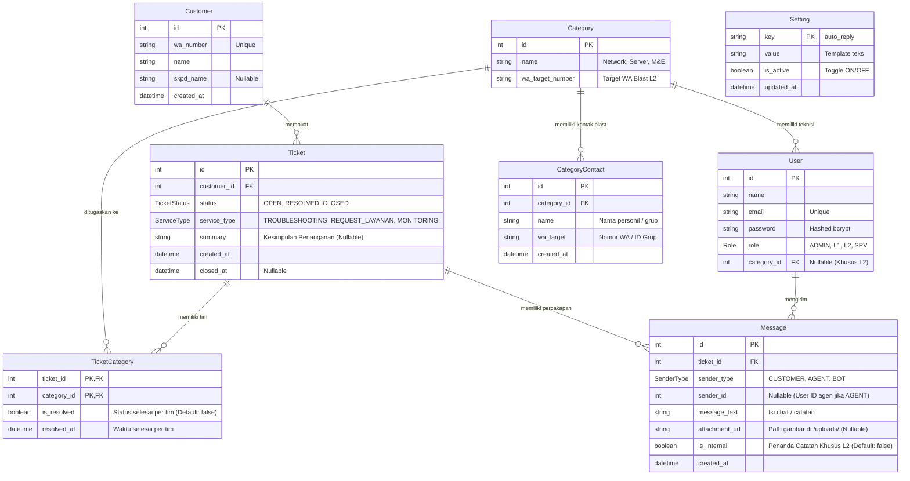

# 🗄️ Rancangan Database & Skema Relasional (ERD)
**Proyek:** HTS Chat Integration (WhatsApp Helpdesk to Web Ticketing System)  
**Database Engine:** PostgreSQL 15 (Prisma ORM)  
**Status:** Produksi / Workflow V2 (Multi-Assign & Service Type)

---

## 1. Entity Relationship Diagram (ERD)



---

## 2. Struktur Tabel & Rincian Kolom

### A. Tabel `Customer` (Pelanggan / Pelapor)
Menyimpan identitas kontak WhatsApp yang menghubungi sistem.
| Kolom | Tipe Data | Atribut | Keterangan |
|---|---|---|---|
| `id` | `Int` | PK, Auto Increment | ID unik pelanggan |
| `wa_number` | `String` | Unique, Not Null | Nomor WhatsApp tanpa simbol (misal `628123456789`) |
| `name` | `String` | Not Null | Nama pelapor / *Push Name* dari WhatsApp |
| `skpd_name` | `String` | Nullable | Nama instansi / dinas pelapor |
| `created_at` | `DateTime` | Default `now()` | Waktu pertama kali kontak dibuat |

---

### B. Tabel `Category` (Tim Teknisi / Kategori Masalah)
Menggantikan model *Division* lama. Merepresentasikan 3 pilar utama tim penanganan teknis L2.
| Kolom | Tipe Data | Atribut | Keterangan |
|---|---|---|---|
| `id` | `Int` | PK, Auto Increment | ID kategori tim |
| `name` | `String` | Not Null | Nama tim (`Network`, `Server`, `Mechanical & Electrical (M&E)`) |
| `wa_target_number` | `String` | Nullable | Nomor WhatsApp teknisi/grup untuk notifikasi otomatis (*Blast*) |

---

### C. Tabel `User` (Pengguna Tim Helpdesk)
Menyimpan data akun petugas Helpdesk (Admin, Dispatcher L1, Teknisi L2, dan Supervisor).
| Kolom | Tipe Data | Atribut | Keterangan |
|---|---|---|---|
| `id` | `Int` | PK, Auto Increment | ID unik akun |
| `name` | `String` | Not Null | Nama lengkap pengguna |
| `email` | `String` | Unique, Not Null | Alamat email untuk login |
| `password` | `String` | Not Null | Password yang dienkripsi menggunakan `bcryptjs` (salt 10) |
| `role` | `Role` (Enum) | Default `L2` | Peran pengguna: `ADMIN`, `L1`, `L2`, `SPV` |
| `category_id` | `Int` | FK, Nullable | Relasi ke `Category` (Wajib diisi untuk teknisi L2) |

---

### D. Tabel `Ticket` (Tiket Aduan)
Entitas pusat penanganan keluhan pelanggan dari awal masuk hingga selesai dan ditutup.
| Kolom | Tipe Data | Atribut | Keterangan |
|---|---|---|---|
| `id` | `Int` | PK, Auto Increment | Nomor referensi tiket |
| `customer_id` | `Int` | FK, Not Null | Relasi ke `Customer` |
| `status` | `TicketStatus` | Default `OPEN` | Status siklus hidup: `OPEN`, `RESOLVED`, `CLOSED` |
| `service_type` | `ServiceType` | Nullable | Jenis layanan: `TROUBLESHOOTING`, `REQUEST_LAYANAN`, `MONITORING` |
| `summary` | `String` | Nullable | Kesimpulan akhir penanganan kendala yang diisi L1 saat penutupan |
| `created_at` | `DateTime` | Default `now()` | Waktu aduan masuk |
| `closed_at` | `DateTime` | Nullable | Waktu tiket resmi ditutup oleh L1 |

---

### E. Tabel `TicketCategory` (Relasi Many-to-Many Multi-Assign & Status Per-Tim)
Tabel pivot yang menghubungkan satu tiket dengan satu atau lebih Tim L2, sekaligus mencatat penyelesaian mandiri masing-masing tim.
| Kolom | Tipe Data | Atribut | Keterangan |
|---|---|---|---|
| `ticket_id` | `Int` | PK, FK | Relasi ke `Ticket` |
| `category_id` | `Int` | PK, FK | Relasi ke `Category` |
| `is_resolved` | `Boolean` | Default `false` | Menandakan apakah tim spesifik ini sudah menyelesaikan tugasnya |
| `resolved_at` | `DateTime` | Nullable | Waktu teknisi tim terkait menandai selesai |

> **Logika Status Tiket:**  
> Ketika tiket ditugaskan ke beberapa tim (misal `Network` dan `Server`), tiket utama tetap `OPEN` selama masih ada `is_resolved = false`. Begitu **seluruh** tim terkait telah mengubah `is_resolved = true`, status tiket utama otomatis berubah menjadi `RESOLVED`.

---

### F. Tabel `Message` (Histori Percakapan & Catatan Internal)
Menyimpan seluruh jejak komunikasi, baik pesan masuk pelapor, pesan keluar agen, pesan bot, lampiran gambar, dan catatan internal L2.
| Kolom | Tipe Data | Atribut | Keterangan |
|---|---|---|---|
| `id` | `Int` | PK, Auto Increment | ID pesan |
| `ticket_id` | `Int` | FK, Not Null | Relasi ke `Ticket` |
| `sender_type` | `SenderType` | Not Null | Tipe pengirim: `CUSTOMER`, `AGENT`, `BOT` |
| `sender_id` | `Int` | FK, Nullable | Relasi ke `User` (`onDelete: SetNull`) untuk mencatat identitas agen/teknisi pengirim |
| `message_text` | `String` | Nullable | Isi teks pesan obrolan atau catatan |
| `attachment_url`| `String` | Nullable | Path relatif file gambar (misal `/uploads/img_1790595960337.jpg`) |
| `is_internal` | `Boolean` | Default `false` | `true` jika pesan adalah **Catatan Internal L2** (tidak dikirim ke WA pelapor) |
| `created_at` | `DateTime` | Default `now()` | Waktu pesan dibuat |

---

### G. Tabel `CategoryContact` (Daftar Kontak WhatsApp Blast Tim L2)
Menyimpan daftar target nomor WhatsApp personil teknisi maupun ID grup WhatsApp untuk broadcast notifikasi penugasan tiket.
| Kolom | Tipe Data | Atribut | Keterangan |
|---|---|---|---|
| `id` | `Int` | PK, Auto Increment | ID unik kontak |
| `category_id` | `Int` | FK, Not Null | Relasi ke `Category` (`onDelete: Cascade`) |
| `name` | `String` | Not Null | Nama personil teknisi (misal: "Budi") atau nama grup (misal: "Grup WA Network") |
| `wa_target` | `String` | Not Null | Nomor WhatsApp format internasional (`628xxx`) atau ID grup (`xxx@g.us`) |
| `created_at` | `DateTime` | Default `now()` | Waktu pendaftaran kontak |

---

### H. Tabel `Setting` (Konfigurasi Dinamis Sistem)
Menyimpan konfigurasi dinamis yang dapat diubah dari dasbor web tanpa merestart server.
| Kolom | Tipe Data | Atribut | Keterangan |
|---|---|---|---|
| `key` | `String` | PK | Kunci konfigurasi unik (misal: `auto_reply`) |
| `value` | `String (Text)`| Not Null | Nilai konfigurasi (template teks sambutan bot) |
| `is_active` | `Boolean` | Default `true` | Sakelar status ON / OFF |
| `updated_at` | `DateTime` | Auto Update | Waktu terakhir konfigurasi diubah |

---

## 3. Rincian Enum (Tipe Data Konstan)

1. **`Role`**:
   - `ADMIN`: Hak akses penuh (melihat antrean L1 & L2, CRUD User, CRUD Kontak Tim L2, Hapus Rekap Aduan).
   - `L1`: Dispatcher (chat ke pelapor, assign ke L2, kustomisasi Auto-Reply Bot, menutup tiket resmi).
   - `L2`: Teknisi lapangan (mode baca aduan, catatan internal tim, resolve per-tim, return penugasan).
   - `SPV`: Supervisor (monitoring antrean dan laporan rekap).
2. **`TicketStatus`**:
   - `OPEN`: Tiket aktif baru masuk atau sedang dalam penanganan teknisi L2.
   - `RESOLVED`: Seluruh tim L2 yang ditugaskan telah menandai pekerjaan selesai; menunggu L1 menutup tiket.
   - `CLOSED`: Tiket telah resmi diselesaikan dan ditutup oleh L1 beserta kesimpulan penanganan.
3. **`SenderType`**:
   - `CUSTOMER`: Pesan masuk dari WhatsApp pelapor.
   - `AGENT`: Pesan keluar yang diketik oleh petugas Helpdesk atau notifikasi catatan sistem.
   - `BOT`: Pesan balasan otomatis sambutan (*Auto-Reply*).
4. **`ServiceType`**:
   - `TROUBLESHOOTING`: Penanganan gangguan atau kerusakan teknis.
   - `REQUEST_LAYANAN`: Permintaan konfigurasi, instalasi, atau permohonan akses.
   - `MONITORING`: Pemantauan rutin performa jaringan atau server.

---

## 4. Pengelolaan Sequence & Reset Nomor ID
Untuk keperluan pembersihan data testing (*Fresh State Cleanup*), PostgreSQL menggunakan urutan *Sequence*:
- `Ticket_id_seq`
- `Message_id_seq`
- `Customer_id_seq`

Saat Admin mengeksekusi fitur **"Hapus Semua Data"**, selain menghapus seluruh baris data, sistem menjalankan:
```sql
ALTER SEQUENCE "Ticket_id_seq" RESTART WITH 1;
ALTER SEQUENCE "Message_id_seq" RESTART WITH 1;
ALTER SEQUENCE "Customer_id_seq" RESTART WITH 1;
```
Hal ini memastikan tiket dan aduan baru berikutnya akan **selalu mengulang penomoran mulai dari ID 1**.
