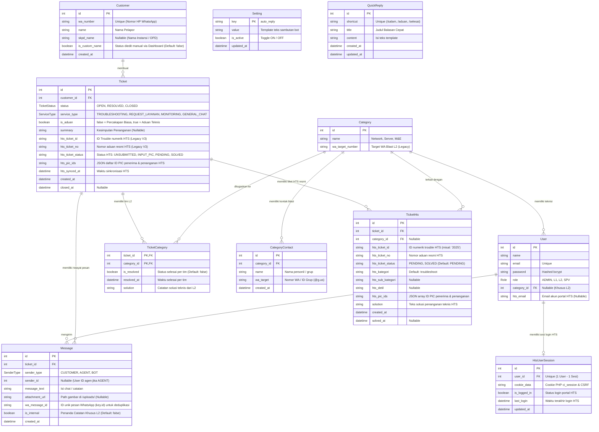

# 🗄️ Rancangan Database & Skema Relasional (ERD)
**Proyek:** HTS Chat Integration (WhatsApp Helpdesk to Web Ticketing System)  
**Database Engine:** PostgreSQL 15 (Prisma ORM)  
**Status:** Produksi / Workflow V4.0 (Multi-HTS, General Chat, Multimedia L2, Quick Replies & Disaster Recovery)  
**Terakhir Diperbarui:** 01 Oktober 2026  

---

## 1. Entity Relationship Diagram (ERD)

---

## 2. Struktur Tabel & Rincian Kolom

### A. Tabel `Customer` (Pelanggan / Pelapor)
Menyimpan identitas kontak WhatsApp yang menghubungi sistem.
| Kolom | Tipe Data | Atribut | Keterangan |
|---|---|---|---|
| `id` | `Int` | PK, Auto Increment | ID unik pelanggan |
| `wa_number` | `String` | Unique, Not Null | Nomor WhatsApp tanpa simbol (misal `628123456789`) |
| `name` | `String` | Not Null | Nama pelapor (Prioritas: Web Custom > Kontak HP > pushName WA > waNumber) |
| `skpd_name` | `String` | Nullable | Nama instansi / dinas / SKPD pelapor |
| `is_custom_name` | `Boolean` | Default `false` | Menandai jika identitas telah diedit manual via Dashboard |
| `created_at` | `DateTime` | Default `now()` | Waktu pertama kali kontak dibuat |

---

### B. Tabel `Ticket` (Sesi Percakapan / Tiket Aduan)
Entitas utama penampung riwayat pesan, status pengerjaan, dan klasifikasi layanan.
| Kolom | Tipe Data | Atribut | Keterangan |
|---|---|---|---|
| `id` | `Int` | PK, Auto Increment | ID tiket (dimulai dari #1) |
| `customer_id` | `Int` | FK ke `Customer.id` | Pemilik tiket / pelapor |
| `status` | `TicketStatus` | Default `OPEN` | `OPEN`, `RESOLVED`, `CLOSED` |
| `service_type` | `ServiceType` | Default `GENERAL_CHAT` | `TROUBLESHOOTING`, `REQUEST_LAYANAN`, `MONITORING`, `GENERAL_CHAT` |
| `is_aduan` | `Boolean` | Default `false` | `false`: Percakapan biasa (bebas SLA). `true`: Aduan teknis resmi. |
| `summary` | `String` | Nullable | Kesimpulan akhir penanganan (wajib saat L1 close tiket aduan) |
| `hts_ticket_id` | `String` | Nullable | ID trouble numerik HTS portal utama (Legacy V3) |
| `hts_ticket_no` | `String` | Nullable | Nomor aduan resmi HTS (Legacy V3, misal: `#2026-TShoot-xxx`) |
| `hts_ticket_status` | `String` | Nullable | Status di portal HTS: `UNSUBMITTED`, `INPUT_PIC`, `PENDING`, `SOLVED` |
| `hts_pic_ids` | `String` | Nullable | JSON string daftar ID PIC penerima & penanganan HTS |
| `hts_synced_at` | `DateTime` | Nullable | Waktu terakhir disinkronkan ke portal HTS |
| `created_at` | `DateTime` | Default `now()` | Waktu tiket pertama kali dibuat |
| `closed_at` | `DateTime` | Nullable | Waktu tiket ditutup resmi oleh L1 |

---

### C. Tabel `TicketHts` (Hub Multi-HTS V4)
Menghubungkan 1 tiket chat lokal ke banyak nomor aduan resmi HTS Diskomdigi (One-to-Many).
| Kolom | Tipe Data | Atribut | Keterangan |
|---|---|---|---|
| `id` | `Int` | PK, Auto Increment | ID baris integrasi |
| `ticket_id` | `Int` | FK ke `Ticket.id`, OnDelete Cascade | Tiket Helpdesk induk |
| `category_id` | `Int` | FK ke `Category.id`, OnDelete SetNull | Tim L2 terkait (Network, Server, atau M&E) |
| `hts_ticket_id` | `String` | Not Null | ID numerik trouble portal HTS (misal: `"2038"`) |
| `hts_ticket_no` | `String` | Not Null | Nomor aduan resmi portal HTS |
| `hts_ticket_status`| `String` | Default `"PENDING"` | Status HTS: `"PENDING"` atau `"SOLVED"` |
| `hts_kategori` | `String` | Default `"troubleshoot"` | Kategori HTS: `troubleshoot`, `layanan`, `monitoring` |
| `hts_sub_kategori`| `String` | Nullable | Sub-kategori kendala di portal HTS |
| `hts_detil` | `String` | Nullable, Text | Rincian kendala teknis yang dikirim ke HTS |
| `hts_pic_ids` | `String` | Nullable | JSON string array ID PIC penerima & penanganan |
| `solution` | `String` | Nullable, Text | Solusi teknis penyelesaian di portal HTS |
| `created_at` | `DateTime` | Default `now()` | Waktu penerbitan/penautan tiket HTS |
| `solved_at` | `DateTime` | Nullable | Waktu tiket HTS diselesaikan |

---

### D. Tabel `Message` (Percakapan & Catatan Internal)
Menyimpan riwayat gelembung obrolan pelanggan, balasan helpdesk, pesan sistem, dan catatan internal teknisi.
| Kolom | Tipe Data | Atribut | Keterangan |
|---|---|---|---|
| `id` | `Int` | PK, Auto Increment | ID pesan |
| `ticket_id` | `Int` | FK ke `Ticket.id` | Tiket terkait |
| `sender_type` | `SenderType` | Not Null | `CUSTOMER`, `AGENT`, `BOT` |
| `sender_id` | `Int` | FK ke `User.id`, Nullable | ID staf helpdesk jika pengirim adalah `AGENT` |
| `message_text` | `String` | Nullable | Teks pesan atau ringkasan media |
| `attachment_url`| `String` | Nullable | Lokasi penyimpanan file di server (misal `/uploads/img_xxx.jpg`) |
| `wa_message_id` | `String` | Nullable | ID unik pesan resmi WhatsApp (`key.id`) untuk deduplikasi |
| `is_internal` | `Boolean` | Default `false` | `true`: Catatan internal rahasia L1/L2 (tidak dikirim ke WA). `false`: Chat publik. |
| `created_at` | `DateTime` | Default `now()` | Waktu pengiriman pesan |

---

### E. Tabel `QuickReply` (Balasan Cepat / Canned Responses V4)
Menyimpan template jawaban cepat yang dapat dipanggil dengan shortcut `/` di antarmuka chat.
| Kolom | Tipe Data | Atribut | Keterangan |
|---|---|---|---|
| `id` | `Int` | PK, Auto Increment | ID template |
| `shortcut` | `String` | Unique, Not Null | Kata kunci pemanggilan tanpa tanda garis miring (contoh: `salam`, `progres`, `selesai`) |
| `title` | `String` | Not Null | Judul template untuk navigasi suggester |
| `content` | `String` | Not Null, Text | Teks balasan lengkap yang akan diisikan ke input box |
| `created_at` | `DateTime` | Default `now()` | Waktu dibuat |
| `updated_at` | `DateTime` | Auto Updated | Waktu terakhir disunting |

---

### F. Tabel `Category` & `TicketCategory` (Tim L2 & Multi-Assign)
- **`Category`**: 3 Tim Utama (`Network`, `Server`, `Mechanical & Electrical`).
- **`TicketCategory`**: Menyimpan relasi penugasan tiket ke banyak tim L2 sekaligus, status penyelesaian mandiri per tim (`is_resolved`), dan solusi teknis L2.

### G. Tabel `CategoryContact`
Menyimpan daftar nomor telepon atau grup WA target broadcast notifikasi tugas per tim L2.

### H. Tabel `User` & `HtsUserSession`
- **`User`**: Akun pengguna sistem dengan RBAC (`ADMIN`, `L1`, `L2`, `SPV`).
- **`HtsUserSession`**: Menyimpan cookie PHP `ci_session` portal HTS per petugas untuk integrasi otomatis tanpa login berulang.
