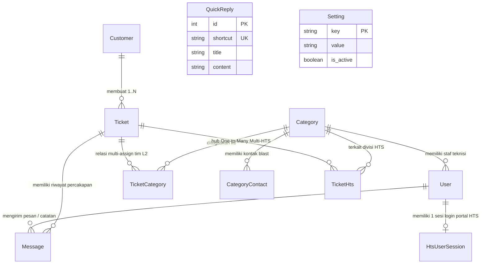

# 🗄️ Skema Database & Kontrak API
**Proyek:** HTS Chat Integration (WhatsApp Helpdesk to Web Ticketing System)  
**Versi:** Workflow V4.2.1 Produksi (Full-Stack SPA Integration & Consolidated Architecture)  
**Engine Basis Data:** PostgreSQL 15 (Prisma ORM) — basis data `wa_helpdesk` (port host `5433`)  
**Audiens Dokumen:** Backend Developer, Frontend Integrator & System Architect  
**Terakhir Diperbarui:** 03 Oktober 2026  

---

## 1. Entity Relationship Diagram (ERD)



---

## 2. Struktur Tabel & Kamus Data

### 2.1 `Customer` (Data Pelapor & Master Data Kontak)
| Kolom | Tipe Data | Atribut | Keterangan |
|---|---|---|---|
| `id` | `Int` | PK, Auto Increment | Pengenal unik pelanggan |
| `wa_number` | `String` | **Unique, Not Null** | Nomor WhatsApp terstandarisasi (format internasional `628xxx`) |
| `name` | `String` | Not Null | Nama lengkap / identitas resmi instansi |
| `skpd_name` | `String?` | Nullable | Asal instansi / Organisasi Perangkat Daerah (OPD) |
| `is_custom_name` | `Boolean` | Default `false` | Menandai jika nama telah disunting manual oleh staf via dasbor |
| `is_imported_contact` | `Boolean` | Default `false` | **Master Data Import Admin (Prioritas Utama, kebal dari penimpaan profil WA)** |
| `wa_push_name` | `String?` | Nullable | Nama asli profil WhatsApp pelapor (data pembanding audit) |
| `created_at` | `DateTime` | Default `now()` | Waktu registrasi awal kontak |
| **Indeks** | `@@index([name])`, `@@index([skpd_name])` | | Indeks komposit pencarian cepat pada direktori buku telepon |

### 2.2 `Category` (3 Pilar Tim Spesialis L2)
| Kolom | Tipe Data | Atribut | Keterangan |
|---|---|---|---|
| `id` | `Int` | PK, Auto Increment | Pengenal divisi tim teknisi L2 |
| `name` | `String` | Not Null | Nama pilar: `Network`, `Server`, `Mechanical & Electrical (M&E)` |
| `wa_target_number`| `String?` | Nullable | Nomor target blast WhatsApp legacy |

### 2.3 `CategoryContact` (Daftar Multi-Kontak WA Blast per Tim L2)
| Kolom | Tipe Data | Atribut | Keterangan |
|---|---|---|---|
| `id` | `Int` | PK, Auto Increment | Pengenal unik kontak blast |
| `category_id` | `Int` | FK, Not Null | Relasi ke `Category` (`onDelete: Cascade`) |
| `name` | `String` | Not Null | Nama teknisi lapangan / nama grup WhatsApp teknisi |
| `wa_target` | `String` | Not Null | Nomor WhatsApp personal (`628xxx`) atau ID grup (`xxx@g.us`) |
| `created_at` | `DateTime` | Default `now()` | Waktu penambahan kontak |

### 2.4 `Setting` (Konfigurasi Dinamis Sistem)
| Kolom | Tipe Data | Atribut | Keterangan |
|---|---|---|---|
| `key` | `String` | PK | Kunci konfigurasi sistem (misal: `auto_reply`) |
| `value` | `String @db.Text` | Not Null | Isi teks narasi balasan otomatis bot sambutan |
| `is_active` | `Boolean` | Default `true` | Sakelar toggle status aktif pesan bot sambutan |
| `updated_at` | `DateTime` | UpdatedAt | Waktu perubahan konfigurasi terakhir |

### 2.5 `User` (Akun Staf & Petugas Helpdesk)
| Kolom | Tipe Data | Atribut | Keterangan |
|---|---|---|---|
| `id` | `Int` | PK, Auto Increment | Pengenal unik akun staf |
| `name` | `String` | Not Null | Nama lengkap staf helpdesk |
| `email` | `String` | **Unique, Not Null** | Alamat email login akun |
| `password` | `String` | Not Null | Hash kata sandi `bcryptjs` (salt rounds 10) |
| `role` | `Role` | Enum | Nilai enum: `ADMIN`, `SPV`, `L1`, `L2` |
| `category_id` | `Int?` | FK, Nullable | Divisi tim spesialis (wajib untuk peran `L2`) |
| `hts_email` | `String?` | Nullable | Alamat email akun resmi portal HTS petugas |

### 2.6 `HtsUserSession` (Sesi Login Portal Resmi HTS)
| Kolom | Tipe Data | Atribut | Keterangan |
|---|---|---|---|
| `id` | `Int` | PK, Auto Increment | Pengenal sesi HTS |
| `user_id` | `Int` | FK, **Unique** | Relasi 1:1 ke `User` (`onDelete: Cascade`) |
| `cookie_data` | `String @db.Text`| Not Null | Payload JSON berisi cookie PHP `ci_session` dan CSRF token |
| `is_logged_in` | `Boolean` | Default `false` | Status keaktifan sesi di portal HTS |
| `last_login` | `DateTime` | Default `now()` | Waktu login terakhir |
| `updated_at` | `DateTime` | UpdatedAt | Waktu ping keep-alive terakhir |

### 2.7 `Ticket` (Percakapan Pelanggan & Aduan Teknis)
| Kolom | Tipe Data | Atribut | Keterangan |
|---|---|---|---|
| `id` | `Int` | PK, Auto Increment | Nomor unik tiket percakapan |
| `customer_id` | `Int` | FK, Not Null | Relasi ke `Customer` |
| `status` | `TicketStatus` | Default `OPEN` | Siklus status: `OPEN`, `RESOLVED`, `CLOSED` |
| `service_type` | `ServiceType?`| Default `GENERAL_CHAT`| `TROUBLESHOOTING`, `REQUEST_LAYANAN`, `MONITORING`, `GENERAL_CHAT` |
| `is_aduan` | `Boolean` | Default `false` | `false` = Percakapan Biasa (bebas SLA), `true` = Aduan Teknis Resmi |
| `summary` | `String?` | Nullable | Ringkasan wajib saat penutupan tiket (*Mandatory Summary*) |
| `hts_ticket_id` | `String?` | Nullable | ID numerik trouble portal HTS (mirror legacy V3) |
| `hts_ticket_no` | `String?` | Nullable | Nomor aduan resmi HTS (mirror legacy V3) |
| `hts_ticket_status`| `String?`| Nullable | Status HTS mirror: `PENDING`, `SOLVED` |
| `hts_pic_ids` | `String?` | Nullable | JSON array ID PIC penerima & penanganan |
| `hts_synced_at` | `DateTime?`| Nullable | Waktu sinkronisasi awal ke HTS |
| `created_at` | `DateTime` | Default `now()` | Waktu pesan pertama tiba dari pelanggan |
| `closed_at` | `DateTime?`| Nullable | Waktu penutupan resmi tiket |
| **Indeks** | `@@index([customer_id])`<br/>`@@index([status])`<br/>`@@index([is_aduan])`<br/>`@@index([customer_id, status])`<br/>`@@index([status, is_aduan, created_at(sort: Desc)])` | | Indeks komposit performa query antrean L1/L2 |

### 2.8 `TicketHts` (Hub Multi-HTS — One-to-Many Relasi Tiket Portal)
| Kolom | Tipe Data | Atribut | Keterangan |
|---|---|---|---|
| `id` | `Int` | PK, Auto Increment | Pengenal relasi tiket HTS |
| `ticket_id` | `Int` | FK, Not Null | Relasi ke `Ticket` (`onDelete: Cascade`) |
| `category_id` | `Int?` | FK, Nullable | Relasi ke divisi tim `Category` (`onDelete: SetNull`) |
| `hts_ticket_id` | `String` | Not Null | ID numerik trouble portal HTS (misal: `"2041"`) |
| `hts_ticket_no` | `String` | Not Null | Nomor aduan resmi portal (misal: `"2041-TShoot-2026-jateng-10"`) |
| `hts_ticket_status`| `String` | Default `"PENDING"` | Status tiket portal HTS: `PENDING` atau `SOLVED` |
| `hts_kategori` | `String` | Default `"troubleshoot"`| Kategori gangguan di portal HTS |
| `hts_sub_kategori`| `String?`| Nullable | Sub-kategori gangguan teknis di portal HTS |
| `hts_detil` | `String? @db.Text`| Nullable | Uraian kendala teknis resmi |
| `hts_pic_ids` | `String?` | Nullable | JSON array PIC penerima dan teknisi penanganan |
| `solution` | `String? @db.Text`| Nullable | Uraian solusi perbaikan penanganan portal HTS |
| `created_at` | `DateTime` | Default `now()` | Waktu penerbitan/penautan tiket HTS |
| `solved_at` | `DateTime?`| Nullable | Waktu penutupan tiket di portal HTS |
| **Indeks** | `@@index([ticket_id])`, `@@index([hts_ticket_no])` | | Indeks lookup cepat status Multi-HTS |

### 2.9 `TicketCategory` (Relasi Penugasan Many-to-Many Tim L2)
| Kolom | Tipe Data | Atribut | Keterangan |
|---|---|---|---|
| `ticket_id` | `Int` | PK (Composite) | Relasi ke `Ticket` (`onDelete: Cascade`) |
| `category_id` | `Int` | PK (Composite) | Relasi ke `Category` (`onDelete: Cascade`) |
| `is_resolved` | `Boolean` | Default `false` | Status selesai pekerjaan tim pilar bersangkutan |
| `resolved_at` | `DateTime?`| Nullable | Waktu teknisi L2 mengklik selesai |
| `solution` | `String? @db.Text`| Nullable | Catatan solusi teknis penanganan perbaikan lapangan |
| **Indeks** | `@@index([category_id])` | | Indeks filter antrean kerja teknisi per divisi |

### 2.10 `Message` (Percakapan WhatsApp & Catatan Internal Staf)
| Kolom | Tipe Data | Atribut | Keterangan |
|---|---|---|---|
| `id` | `Int` | PK, Auto Increment | Pengenal unik pesan |
| `ticket_id` | `Int` | FK, Not Null | Relasi ke `Ticket` (`onDelete: Cascade`) |
| `sender_type` | `SenderType` | Enum | `CUSTOMER`, `AGENT`, `BOT` |
| `sender_id` | `Int?` | FK, Nullable | Relasi ke `User` pengirim jika dari agen (`onDelete: SetNull`) |
| `message_text` | `String?` | Nullable | Isi percakapan / narasi pesan |
| `attachment_url`| `String?` | Nullable | Jalur berkas lampiran fisik (misal: `/uploads/img_*.jpg`) |
| `wa_message_id` | `String?` | **Unique, Nullable** | ID unik pesan dari WhatsApp Gateway (`key.id`) untuk deduplikasi atomik |
| `is_internal` | `Boolean` | Default `false` | `true` = Catatan internal staf (100% rahasia, tidak terkirim ke WhatsApp) |
| `created_at` | `DateTime` | Default `now()` | Waktu pengiriman pesan |
| **Indeks** | `@@index([ticket_id])`, `@@index([ticket_id, created_at])` | | Indeks rendering cepat riwayat obrolan |

### 2.11 `QuickReply` (Template Balasan Cepat / Slash Commands)
| Kolom | Tipe Data | Atribut | Keterangan |
|---|---|---|---|
| `id` | `Int` | PK, Auto Increment | Pengenal template balasan cepat |
| `shortcut` | `String` | **Unique, Not Null** | Kata kunci pemicu keyboard tanpa slash (misal: `salam`) |
| `title` | `String` | Not Null | Judul deskriptif template |
| `content` | `String @db.Text`| Not Null | Teks template lengkap yang disisipkan ke kotak pesan |
| `created_at` | `DateTime` | Default `now()` | Waktu pembuatan |
| `updated_at` | `DateTime` | UpdatedAt | Waktu pembaruan template |

---

## 3. Spesifikasi Lengkap Kontrak REST API

**Basis URL:** `/api`  
**Otentikasi:** Header HTTP `Authorization: Bearer <TOKEN_JWT>` (kecuali rute webhook dan login publik).

### 3.1 Pemeriksaan Kesehatan (Health Probe)
* **`GET /api/health`** (Publik)  
  * **Output:** `{"status":"ok","message":"HTS Chat Integration API is running","timestamp":"..."}`

### 3.2 Webhook WhatsApp (`/api/webhook`)
* **`POST /api/webhook/whatsapp`** (Publik - Terlindungi Shared Secret Header)  
  * **Header Wajib:** `apikey: <WEBHOOK_SECRET>` atau `x-api-key: <WEBHOOK_SECRET>`  
  * **Payload:** Standar webhook `messages.upsert` dari Evolution API v2.  
  * **Output:** HTTP 200 OK `{ "status": "processed" }` (diproses secara serial per nomor via `perNumberLock`).

### 3.3 Otentikasi Pengguna (`/api/auth`)
* **`POST /api/auth/login`** (Publik)  
  * **Body:** `{ "email": "admin@helpdesk.go.id", "password": "password123" }`  
  * **Output:** `{ "token": "...", "user": { "id": 1, "name": "...", "email": "...", "role": "ADMIN", "category_id": null } }`
* **`GET /api/auth/me`** (Semua Pengguna Terotentikasi)  
  * **Output:** Data profil pengguna aktif dari verifikasi token JWT.

### 3.4 Manajemen Percakapan & Tiket (`/api/chat`)
* **`GET /api/chat/tickets`** (ADMIN, SPV, L1, L2)  
  * Mengambil antrean tiket (filter query opsional: `?status=OPEN`). Teknisi L2 hanya menerima tiket yang didelegasikan ke divisinya.
* **`GET /api/chat/tickets/:ticketId/messages`** (ADMIN, SPV, L1, L2)  
  * Mengambil seluruh thread percakapan pesan dan catatan internal tiket terpilih.
* **`POST /api/chat/send`** (ADMIN, SPV, L1)  
  * Mengirimkan balasan teks WhatsApp ke pelanggan: `{ "ticketId": 1, "message": "Halo..." }`.
* **`POST /api/chat/sendMedia`** (ADMIN, SPV, L1)  
  * Mengunggah berkas foto/dokumen dan mengirimkannya ke WhatsApp pelanggan (`multipart/form-data` dengan field `media` dan `ticketId`).
* **`PUT /api/chat/customers/:customerId`** (ADMIN, SPV, L1)  
  * Memperbarui profil kontak pelapor: `{ "name": "Budi Santoso", "skpdName": "Diskominfo" }`.
* **`POST /api/chat/tickets/:ticketId/assign`** (ADMIN, SPV, L1)  
  * Menugaskan tiket ke tim teknisi L2: `{ "categoryIds": [1, 2], "serviceType": "TROUBLESHOOTING" }`. Memancarkan event WebSocket `ticket_updated`.
* **`POST /api/chat/tickets/:ticketId/resolve`** (ADMIN, SPV, L2)  
  * Teknisi L2 menandai selesai tugas timnya: `{ "solution": "Kabel FO telah disambung ulang..." }`.
* **`POST /api/chat/tickets/:ticketId/return`** (ADMIN, SPV, L2)  
  * Teknisi L2 melepas / mengembalikan tugas timnya: `{ "reason": "Bukan ranah server, kendala ada di jaringan..." }`.
* **`POST /api/chat/tickets/:ticketId/close`** (ADMIN, SPV, L1)  
  * Menutup tiket resmi (Mandatory Summary) + eksekusi dual-close seluruh tiket HTS terkait yang masih pending.
* **`POST /api/chat/tickets/:ticketId/close-general`** (ADMIN, SPV, L1)  
  * Menyelesaikan percakapan biasa secara instan (bebas beban formulir HTS dan bebas metrik SLA MTTR).
* **`PATCH /api/chat/tickets/:ticketId/toggle-aduan`** (ADMIN, SPV, L1)  
  * Mengubah kelas tiket antara Percakapan Biasa dan Aduan Teknis Resmi (`is_aduan`).
* **`POST /api/chat/tickets/:ticketId/internal-note`** (ADMIN, SPV, L1, L2)  
  * Menyimpan catatan internal rahasia antar staf helpdesk: `{ "message": "..." }`.
* **`POST /api/chat/tickets/:ticketId/internal-media`** (ADMIN, SPV, L1, L2)  
  * Mengunggah foto bukti lapangan internal L2 (Multipart `media`).
* **`GET /api/chat/tickets/:ticketId/internal-media`** (ADMIN, SPV, L1, L2)  
  * Mengambil daftar lampiran gambar internal untuk dipilih sebagai bukti penutupan tiket portal HTS.
* **`GET /api/chat/tickets/:ticketId/hts`** (ADMIN, SPV, L1, L2)  
  * Mengambil daftar seluruh kartu tiket resmi HTS yang terhubung pada sesi ini (`TicketHts[]`).
* **`POST /api/chat/tickets/:ticketId/hts`** (ADMIN, SPV, L1)  
  * Menerbitkan tiket baru ke portal HTS (Multipart form-data: `opd_name`, `kategori`, `detil`, `pic_ids`, `lampiran[]`).
* **`POST /api/chat/tickets/:ticketId/hts/:htsId/solve`** (ADMIN, SPV, L1)  
  * Menyelesaikan salah satu nomor tiket HTS secara mandiri: `{ "solusi": "...", "pic_penanganan": [...] }`.
* **`POST /api/chat/tickets/:ticketId/link-hts`** (ADMIN, SPV, L1)  
  * Menautkan manual nomor tiket HTS yang sudah ada: `{ "htsTicketNo": "...", "categoryId": 1, "force": false }`.
* **`POST /api/chat/tickets/:ticketId/hts/:htsTicketId/complete-pic`** (ADMIN, SPV, L1)  
  * Melengkapi penugasan PIC untuk tiket HTS berstatus `INPUT_PIC`.
* **`DELETE /api/chat/tickets/:ticketId/hts/:htsTicketId/unlink`** (ADMIN, SPV, L1)  
  * Melepas tautan (*unlink*) nomor HTS dari percakapan.
* **`GET /api/chat/contacts/search`** (ADMIN, SPV, L1)  
  * Pencarian direktori buku telepon dengan paginasi server: `?q={query}&limit={limit}&offset={offset}`.  
  * **Output:** `{ "contacts": [...], "total": 1300, "offset": 0, "hasMore": true }`
* **`POST /api/chat/start-new-chat`** (ADMIN, SPV, L1)  
  * Memulai percakapan keluar baru (outbound): `{ "waNumber": "628xxx", "name": "...", "skpdName": "...", "sendInitialMessage": true, "initialMessage": "Halo..." }`.
* **`POST /api/chat/tickets/:ticketId/reopen`** (ADMIN, SPV, L1)  
  * Mengaktifkan kembali tiket yang telah `CLOSED` menjadi `OPEN` secara transaksional: `{ "reason": "Pelanggan kembali komplain..." }`.
* **`POST /api/chat/tickets/:ticketId/wa-history`** (ADMIN, SPV, L1)  
  * Menarik hingga 20 riwayat pesan langsung dari memori WhatsApp via Evolution API.
* **`CRUD /api/chat/quick-replies`** (ADMIN, SPV, L1)  
  * `GET`, `POST`, `PUT /:id`, dan `DELETE /:id` untuk pengelolaan template pesan instan balasan cepat.

### 3.5 Integrasi Portal Resmi HTS (`/api/hts`)
* **`GET /api/hts/status`** (ADMIN, SPV, L1) — Memeriksa status keaktifan sesi portal HTS petugas.
* **`GET /api/hts/captcha`** (ADMIN, SPV, L1) — Mengambil live streaming buffer gambar visual CAPTCHA dari portal HTS.
* **`POST /api/hts/login`** (ADMIN, SPV, L1) — Login sesi portal HTS: `{ "email", "password", "captcha_code" }`.
* **`POST /api/hts/logout`** (ADMIN, SPV, L1) — Menghapus cookie sesi HTS petugas dari database.
* **`GET /api/hts/master-data`** (ADMIN, SPV, L1) — Mengambil referensi kategori, sub-kategori, dan daftar PIC teknisi portal HTS.

### 3.6 Pengaturan Bot Sambutan (`/api/setting`)
* **`GET /api/setting/auto_reply`** (ADMIN, L1) — Mengambil konfigurasi status aktif dan teks bot sambutan.
* **`POST /api/setting/auto_reply`** (ADMIN, L1) — Memperbarui pengaturan bot: `{ "value": "Halo, selamat datang di Helpdesk SPBE...", "is_active": true }`.

### 3.7 Laporan & Ekspor Data (`/api/reports`)
* **`GET /api/reports/tickets`** (ADMIN, SPV, L1) — Rekapitulasi tiket dengan filter tanggal, kategori, dan status disertai metrik durasi FRT dan MTTR murni.
* **`DELETE /api/reports/tickets`** (ADMIN) — Menghapus data tiket aduan (pilihan ID `{ "ids": [...] }` atau pembersihan seluruh data testing `{ "all": true }` yang me-reset sequence `Ticket_id_seq`).

### 3.8 Administrasi Pengguna & Kontak Tim (`/api/admin`)
* **`CRUD /api/admin/users`** (ADMIN) — Pengelolaan akun staf: pembuatan akun, pembaruan profil/password, dan penonaktifan akun.
* **`CRUD /api/admin/categories/:id/contacts`** (ADMIN) — Pengelolaan nomor WhatsApp personal atau ID grup WA blast pilar tim L2 (`Network`, `Server`, `M&E`).
* **`POST /api/admin/contacts/import`** (ADMIN) — Unggah berkas Master Data Kontak (`multipart/form-data` file Excel `.xlsx/.xls`, CSV Google Contacts, atau vCard `.vcf`).
* **`DELETE /api/admin/contacts/clear-all`** (ADMIN) — Menghapus seluruh data master kontak dan me-reset auto-increment sequence `Customer_id_seq` ke angka 1 (`{ "force": true }`).

---

## 4. Spesifikasi Kontrak WebSocket (Socket.io)

### 4.1 Handshake Autentikasi & Partisi Ruang (*Rooms*)
Frontend menginisialisasi koneksi dengan menyertakan token JWT pada callback `auth`:
```javascript
const socket = io(SOCKET_URL, {
  auth: (cb) => { cb({ token: localStorage.getItem('token') || '' }); },
  autoConnect: Boolean(localStorage.getItem('token'))
});
```
Klien yang terverifikasi secara otomatis dikelompokkan ke dalam 3 ruang terisolasi di sisi server:
1. `user_{userId}` — Menerima notifikasi personal spesifik petugas.
2. `role_{role}` — Menerima pembaruan sesuai tingkatan peran (`ADMIN`, `SPV`, `L1`, `L2`).
3. `category_{categoryId}` — Menerima pembaruan khusus pilar tim teknisi terkait (`Network`, `Server`, `M&E`).

### 4.2 Matriks Event Real-Time (Payload & Konsumen Frontend)

| Nama Event | Transmisi | Struktur Payload | Tanggung Jawab & Reaksi Sisi Klien |
|---|---|---|---|
| **`new_message`** | Server $\rightarrow$ Klien | `{ ticketId: Int, waNumber: String, senderName: String, text: String, attachmentUrl: String, isInternal: Boolean, createdAt: DateTime }` | Menyisipkan pesan ke thread chat aktif jika `activeTicket.id === ticketId`. Memperbarui preview teks di antrean tiket. Memainkan chime audio Web Audio API dan memicu HTML5 Desktop Notification jika tab sedang terminimalkan. |
| **`ticket_assigned`**| Server $\rightarrow$ Klien | `{ ticketId: Int }` | Memperbarui daftar antrean tiket. Menampilkan tiket di antrean teknisi L2 yang baru didelegasikan. |
| **`ticket_updated`** | Server $\rightarrow$ Klien | `{ ticketId: Int, ticket: Object }` | Memperbarui data tiket aktif tanpa mengosongkan state (krusial untuk menjamin drawer Auto-Open HTS tidak kehilangan referensi tiket aktif). |
| **`ticket_closed`**  | Server $\rightarrow$ Klien | `{ ticketId: Int }` | Memindahkan kartu tiket ke tab filter *Selesai*. Mengosongkan viewport chat jika tiket yang ditutup sedang dibuka. |
| **`customer_updated`**| Server $\rightarrow$ Klien | `{ customerId: Int }` | Memperbarui nama dan instansi OPD pada panel profil pelanggan di sebelah kanan. |
| **`hts_ticket_created`**| Server $\rightarrow$ Klien | `{ ticketId: Int, ticketHts: Object }` | Menambahkan kartu tiket resmi baru pada kartu Multi-HTS di panel kanan. |
| **`hts_ticket_updated`**| Server $\rightarrow$ Klien | `{ ticketId: Int, ticketHts: Object }` | Memperbarui status kartu HTS menjadi `SOLVED` atau memperbarui alokasi PIC penanganan. |
| **`hts_ticket_deleted`**| Server $\rightarrow$ Klien | `{ ticketId: Int, htsTicketId: Int }` | Menghapus kartu nomor aduan HTS dari panel kanan pasca pelepasan tautan (*unlink*). |
