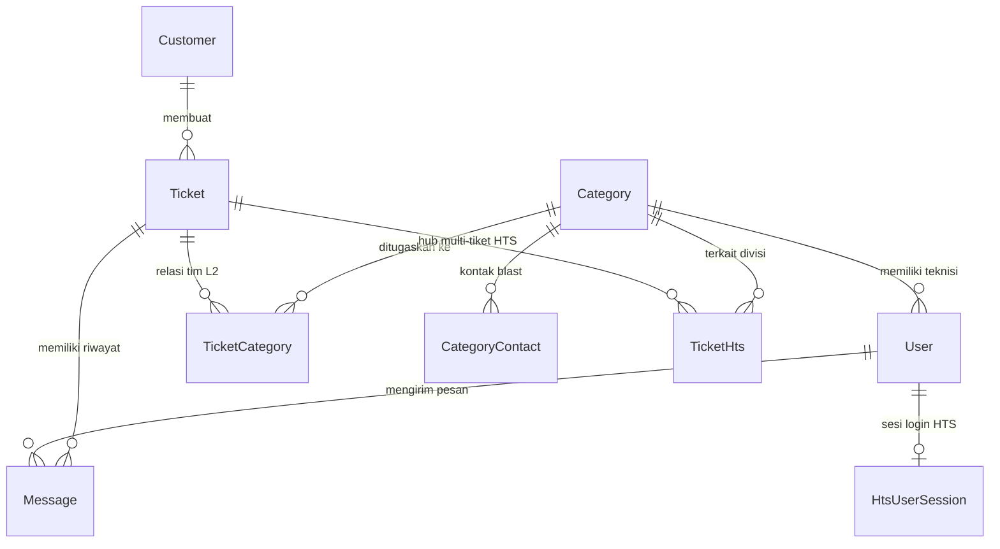

# 🗄️ Skema Database & Kontrak API
**Proyek:** HTS Chat Integration (WhatsApp Helpdesk to Web Ticketing System)  
**Versi:** Workflow V4.2 Produksi  
**Engine Basis Data:** PostgreSQL 15 (Prisma ORM) — basis data `wa_helpdesk` (port host `5433`)  
**Audiens Dokumen:** Developer & Integrator API  
**Terakhir Diperbarui:** 03 Oktober 2026  

---

## 1. Entity Relationship Diagram (ERD)



---

## 2. Struktur Tabel & Kamus Data

### 2.1 `Customer` (Data Pelapor & Master Data Kontak)
| Kolom | Tipe Data | Atribut | Keterangan |
|---|---|---|---|
| `id` | `Int` | PK, Auto Increment | Pengenal unik pelanggan |
| `wa_number` | `String` | **Unique, Not Null** | Nomor WhatsApp terstandarisasi (format `628xxx`) |
| `name` | `String` | Not Null | Nama lengkap / identitas resmi |
| `skpd_name` | `String?` | Nullable | Asal instansi / OPD / SKPD |
| `is_custom_name` | `Boolean` | Default `false` | Menandai jika nama telah diedit manual via dasbor |
| `is_imported_contact` | `Boolean` | Default `false` | **Master Data Import Admin (Prioritas Utama, tidak tertimpa nama profil WA)** |
| `wa_push_name` | `String?` | Nullable | Nama asli profil WhatsApp pelapor (data pembanding) |
| `created_at` | `DateTime` | Default `now()` | Waktu registrasi awal kontak |
| **Indeks** | `@@index([name])`, `@@index([skpd_name])` | | Indeks pencarian cepat pada direktori kontak |

### 2.2 `Category` (3 Pilar Tim Spesialis L2)
| Kolom | Tipe Data | Atribut | Keterangan |
|---|---|---|---|
| `id` | `Int` | PK, Auto Increment | Pengenal tim L2 |
| `name` | `String` | Not Null | Nama pilar: `Network`, `Server`, `Mechanical & Electrical (M&E)` |
| `wa_target_number`| `String?` | Nullable | Target nomor blast WhatsApp legacy |

### 2.3 `CategoryContact` (Daftar Multi-Kontak WA Blast per Tim L2)
| Kolom | Tipe Data | Atribut | Keterangan |
|---|---|---|---|
| `id` | `Int` | PK, Auto Increment | Pengenal kontak |
| `category_id` | `Int` | FK, Not Null | Relasi ke `Category` (`onDelete: Cascade`) |
| `name` | `String` | Not Null | Nama teknisi lapangan / nama grup WhatsApp |
| `wa_target` | `String` | Not Null | Nomor WhatsApp pribadi (`628xxx`) atau ID grup (`xxx@g.us`) |
| `created_at` | `DateTime` | Default `now()` | Waktu penambahan kontak |

### 2.4 `Setting` (Konfigurasi Dinamis Sistem)
| Kolom | Tipe Data | Atribut | Keterangan |
|---|---|---|---|
| `key` | `String` | PK | Kunci pengaturan (contoh: `auto_reply`) |
| `value` | `String @db.Text` | Not Null | Isi teks balasan otomatis bot |
| `is_active` | `Boolean` | Default `true` | Sakelar toggle status aktif bot |
| `updated_at` | `DateTime` | UpdatedAt | Waktu pembaruan konfigurasi |

### 2.5 `User` (Akun Staf & Petugas Helpdesk)
| Kolom | Tipe Data | Atribut | Keterangan |
|---|---|---|---|
| `id` | `Int` | PK, Auto Increment | Pengenal staf |
| `name` | `String` | Not Null | Nama lengkap staf |
| `email` | `String` | **Unique, Not Null** | Alamat email login |
| `password` | `String` | Not Null | Hash password `bcryptjs` (salt rounds 10) |
| `role` | `Role` | Enum | `ADMIN`, `SPV`, `L1`, `L2` |
| `category_id` | `Int?` | FK, Nullable | Kategori tim (wajib untuk peran L2) |
| `hts_email` | `String?` | Nullable | Email akun resmi portal HTS petugas |

### 2.6 `HtsUserSession` (Sesi Login Portal Resmi HTS)
| Kolom | Tipe Data | Atribut | Keterangan |
|---|---|---|---|
| `id` | `Int` | PK, Auto Increment | Pengenal sesi |
| `user_id` | `Int` | FK, **Unique** | Relasi 1:1 ke `User` (`onDelete: Cascade`) |
| `cookie_data` | `String @db.Text`| Not Null | Payload JSON berisi cookie PHP `ci_session` dan CSRF token |
| `is_logged_in` | `Boolean` | Default `false` | Indikator status keaktifan sesi di portal HTS |
| `last_login` | `DateTime` | Default `now()` | Waktu login terakhir |
| `updated_at` | `DateTime` | UpdatedAt | Waktu heartbeat ping terakhir |

### 2.7 `Ticket` (Percakapan Pelanggan & Aduan Teknis)
| Kolom | Tipe Data | Atribut | Keterangan |
|---|---|---|---|
| `id` | `Int` | PK, Auto Increment | Nomor ID tiket percakapan |
| `customer_id` | `Int` | FK, Not Null | Relasi ke `Customer` |
| `status` | `TicketStatus` | Default `OPEN` | Status tiket: `OPEN`, `RESOLVED`, `CLOSED` |
| `service_type` | `ServiceType?`| Default `GENERAL_CHAT`| `TROUBLESHOOTING`, `REQUEST_LAYANAN`, `MONITORING`, `GENERAL_CHAT` |
| `is_aduan` | `Boolean` | Default `false` | `false` = Percakapan Biasa (bebas SLA), `true` = Aduan Teknis Resmi |
| `summary` | `String?` | Nullable | Ringkasan wajib saat penutupan tiket (*Mandatory Summary*) |
| `hts_ticket_id` | `String?` | Nullable | ID numerik trouble portal HTS (mirror legacy V3) |
| `hts_ticket_no` | `String?` | Nullable | Nomor aduan resmi HTS (mirror legacy V3) |
| `hts_ticket_status`| `String?`| Nullable | Status HTS mirror: `PENDING`, `SOLVED` |
| `hts_pic_ids` | `String?` | Nullable | JSON array ID PIC penerima & penanganan |
| `hts_synced_at` | `DateTime?`| Nullable | Waktu sinkronisasi awal ke HTS |
| `created_at` | `DateTime` | Default `now()` | Waktu penerimaan pesan pertama |
| `closed_at` | `DateTime?`| Nullable | Waktu penyelesaian resmi tiket |
| **Indeks** | `@@index([customer_id])`<br/>`@@index([status])`<br/>`@@index([is_aduan])`<br/>`@@index([customer_id, status])`<br/>`@@index([status, is_aduan, created_at(sort: Desc)])` | | Indeks komposit performa antrean antarmuka L1/L2 |

### 2.8 `TicketHts` (Hub Multi-HTS — One-to-Many Relasi Tiket Resmi)
| Kolom | Tipe Data | Atribut | Keterangan |
|---|---|---|---|
| `id` | `Int` | PK, Auto Increment | Pengenal relasi tiket HTS |
| `ticket_id` | `Int` | FK, Not Null | Relasi ke `Ticket` (`onDelete: Cascade`) |
| `category_id` | `Int?` | FK, Nullable | Relasi ke tim `Category` (`onDelete: SetNull`) |
| `hts_ticket_id` | `String` | Not Null | ID numerik trouble portal HTS (misal: `"2041"`) |
| `hts_ticket_no` | `String` | Not Null | Nomor aduan resmi (misal: `"2041-TShoot-2026-jateng-10"`) |
| `hts_ticket_status`| `String` | Default `"PENDING"` | Status tiket portal HTS: `PENDING` atau `SOLVED` |
| `hts_kategori` | `String` | Default `"troubleshoot"`| Kategori gangguan di portal HTS |
| `hts_sub_kategori`| `String?`| Nullable | Sub-kategori gangguan teknis |
| `hts_detil` | `String? @db.Text`| Nullable | Uraian kendala teknis |
| `hts_pic_ids` | `String?` | Nullable | JSON array PIC penerima dan teknisi penanganan |
| `solution` | `String? @db.Text`| Nullable | Uraian solusi teknis penanganan HTS |
| `created_at` | `DateTime` | Default `now()` | Waktu penerbitan/penautan tiket HTS |
| `solved_at` | `DateTime?`| Nullable | Waktu penutupan tiket di portal HTS |
| **Indeks** | `@@index([ticket_id])`, `@@index([hts_ticket_no])` | | Indeks lookup cepat status Multi-HTS |

### 2.9 `TicketCategory` (Relasi Multi-Assign Many-to-Many Tim L2)
| Kolom | Tipe Data | Atribut | Keterangan |
|---|---|---|---|
| `ticket_id` | `Int` | PK (Composite) | Relasi ke `Ticket` (`onDelete: Cascade`) |
| `category_id` | `Int` | PK (Composite) | Relasi ke `Category` (`onDelete: Cascade`) |
| `is_resolved` | `Boolean` | Default `false` | Status selesai pilar teknisi bersangkutan |
| `resolved_at` | `DateTime?`| Nullable | Waktu klik selesai oleh teknisi L2 |
| `solution` | `String? @db.Text`| Nullable | Teks solusi perbaikan teknis lapangan |
| **Indeks** | `@@index([category_id])` | | Indeks filter antrean teknisi per pilar |

### 2.10 `Message` (Percakapan & Catatan Internal Staf)
| Kolom | Tipe Data | Atribut | Keterangan |
|---|---|---|---|
| `id` | `Int` | PK, Auto Increment | Pengenal pesan |
| `ticket_id` | `Int` | FK, Not Null | Relasi ke `Ticket` (`onDelete: Cascade`) |
| `sender_type` | `SenderType` | Enum | `CUSTOMER`, `AGENT`, `BOT` |
| `sender_id` | `Int?` | FK, Nullable | Relasi ke `User` pengirim (`onDelete: SetNull`) |
| `message_text` | `String?` | Nullable | Isi percakapan / teks pesan |
| `attachment_url`| `String?` | Nullable | Jalur berkas lampiran (misal: `/uploads/img_*.jpg`) |
| `wa_message_id` | `String?` | **Unique, Nullable** | ID unik pesan dari WhatsApp Gateway (`key.id`) untuk deduplikasi atomik |
| `is_internal` | `Boolean` | Default `false` | `true` = Catatan internal staf (100% rahasia, tidak terkirim ke WhatsApp) |
| `created_at` | `DateTime` | Default `now()` | Waktu pengiriman pesan |
| **Indeks** | `@@index([ticket_id])`, `@@index([ticket_id, created_at])` | | Indeks rendering cepat riwayat obrolan |

### 2.11 `QuickReply` (Template Balasan Cepat)
| Kolom | Tipe Data | Atribut | Keterangan |
|---|---|---|---|
| `id` | `Int` | PK, Auto Increment | Pengenal template |
| `shortcut` | `String` | **Unique, Not Null** | Pintasan perintah (dipanggil via keyboard tanpa garis miring, misal: `salam`) |
| `title` | `String` | Not Null | Judul deskriptif template balasan |
| `content` | `String @db.Text`| Not Null | Teks lengkap balasan yang disisipkan ke kotak pesan |
| `created_at` | `DateTime` | Default `now()` | Waktu pembuatan |
| `updated_at` | `DateTime` | UpdatedAt | Waktu pembaruan template |

---

## 3. Kontrak REST API

**Basis URL:** `/api`  
**Mekanisme Autentikasi:** Header HTTP `Authorization: Bearer <TOKEN_JWT>` (kecuali rute webhook dan login).

### 3.1 Pemeriksaan Kesehatan (Health Probe)
| Method | Endpoint | Peran Akses | Deskripsi & Respons |
|---|---|---|---|
| `GET` | `/api/health` | Publik | Health check endpoint untuk monitor uptime peladen.<br/>**Output:** `{"status":"ok","message":"HTS Chat Integration API is running","timestamp":"..."}` |

### 3.2 Webhook WhatsApp (`/api/webhook`)
| Method | Endpoint | Peran Akses | Deskripsi & Respons |
|---|---|---|---|
| `POST` | `/api/webhook/whatsapp` | Gateway Publik (Dilindungi Header Secret) | Menerima event pesan WhatsApp `messages.upsert` dari Evolution API. Memvalidasi header `apikey` terhadap `WEBHOOK_SECRET`. Memproses pesan secara serial melalui `perNumberLock`. Mengembalikan HTTP 200 OK secara instan. |

### 3.3 Otentikasi Pengguna (`/api/auth`)
| Method | Endpoint | Peran Akses | Deskripsi & Respons |
|---|---|---|---|
| `POST` | `/api/auth/login` | Publik | Otentikasi email dan password.<br/>**Output:** `{ "token": "...", "user": { "id", "name", "email", "role", "category_id" } }` |
| `GET` | `/api/auth/me` | Semua User | Verifikasi token JWT dan mengambil profil pengguna aktif. |

### 3.4 Manajemen Percakapan & Tiket (`/api/chat`)
| Method | Endpoint | Peran Akses | Deskripsi & Parameter |
|---|---|---|---|
| `GET` | `/api/chat/tickets` | ADMIN, SPV, L1, L2 | Mengambil antrean tiket (filter status: `OPEN`, `RESOLVED`, `CLOSED`). Teknisi L2 secara otomatis hanya menerima tiket yang didelegasikan ke timnya. |
| `GET` | `/api/chat/tickets/:ticketId/messages` | ADMIN, SPV, L1, L2 | Mengambil riwayat percakapan dan catatan internal pada tiket terpilih. |
| `POST` | `/api/chat/send` | ADMIN, SPV, L1 | Mengirim balasan teks WhatsApp ke pelanggan: `{ "ticketId": 1, "message": "..." }`. |
| `POST` | `/api/chat/sendMedia` | ADMIN, SPV, L1 | Mengunggah gambar dan mengirimkannya ke WhatsApp pelanggan (Multipart `media`). |
| `PUT` | `/api/chat/customers/:customerId` | ADMIN, SPV, L1 | Mengubah nama pelapor dan instansi SKPD. |
| `POST` | `/api/chat/tickets/:ticketId/assign` | ADMIN, SPV, L1 | Menugaskan tim teknisi L2 (`categoryIds: [1, 2]`) dengan smart diffing dan blast WhatsApp. |
| `POST` | `/api/chat/tickets/:ticketId/resolve` | ADMIN, SPV, L2 | Teknisi L2 menandai selesai tugas timnya: `{ "solution": "..." }`. |
| `POST` | `/api/chat/tickets/:ticketId/return` | ADMIN, SPV, L2 | Teknisi L2 mengembalikan penugasan timnya: `{ "reason": "..." }`. |
| `POST` | `/api/chat/tickets/:ticketId/close` | ADMIN, SPV, L1 | Menutup tiket resmi (Mandatory Summary) + verifikasi dual-close seluruh tiket HTS terkait. |
| `POST` | `/api/chat/tickets/:ticketId/close-general` | ADMIN, SPV, L1 | Menutup percakapan biasa secara instan (bebas kewajiban formulir HTS & bebas SLA). |
| `PATCH` | `/api/chat/tickets/:ticketId/toggle-aduan` | ADMIN, SPV, L1 | Mengubah klasifikasi antara Percakapan Biasa dan Aduan Teknis Resmi. |
| `POST` | `/api/chat/tickets/:ticketId/internal-note` | ADMIN, SPV, L1, L2 | Menulis catatan internal rahasia antar staf (teks). |
| `POST` | `/api/chat/tickets/:ticketId/internal-media`| ADMIN, SPV, L1, L2 | Mengunggah gambar catatan internal rahasia teknisi L2 (Multipart `media`). |
| `GET` | `/api/chat/tickets/:ticketId/internal-media` | ADMIN, SPV, L1, L2 | Mengambil daftar lampiran gambar internal untuk bukti penutupan HTS. |
| `GET` | `/api/chat/tickets/:ticketId/hts` | ADMIN, SPV, L1, L2 | Mengambil daftar seluruh kartu tiket resmi HTS yang terhubung (Multi-HTS). |
| `POST` | `/api/chat/tickets/:ticketId/hts` | ADMIN, SPV, L1 | Menerbitkan tiket aduan resmi baru ke portal HTS (Multipart form-data + lampiran multi-foto). |
| `POST` | `/api/chat/tickets/:ticketId/hts/:htsId/solve`| ADMIN, SPV, L1 | Menyelesaikan salah satu tiket HTS secara mandiri. |
| `POST` | `/api/chat/tickets/:ticketId/link-hts` | ADMIN, SPV, L1 | Menautkan manual nomor aduan HTS yang sudah ada (verifikasi live ke portal). |
| `POST` | `/api/chat/tickets/:ticketId/hts/:htsTicketId/complete-pic` | ADMIN, SPV, L1 | Melengkapi penugasan PIC untuk tiket HTS gantung berstatus `INPUT_PIC`. |
| `DELETE`| `/api/chat/tickets/:ticketId/hts/:htsTicketId/unlink` | ADMIN, SPV, L1 | Melepas tautan (*unlink*) nomor HTS dari percakapan. |
| `GET` | `/api/chat/contacts/search` | ADMIN, SPV, L1 | Pencarian direktori kontak dengan **paginasi**: `?q=budi&limit=30&offset=0`.<br/>**Output:** `{ "contacts": [...], "total": 1300, "offset": 0, "hasMore": true }` |
| `POST` | `/api/chat/start-new-chat` | ADMIN, SPV, L1 | Membuka percakapan keluar baru (outbound): `{ "waNumber", "name", "skpdName", "sendInitialMessage": true, "initialMessage": "..." }`. |
| `POST` | `/api/chat/tickets/:ticketId/reopen` | ADMIN, SPV, L1 | Mengaktifkan kembali tiket yang telah `CLOSED` menjadi `OPEN`: `{ "reason": "..." }`. |
| `GET` | `/api/chat/quick-replies` | ADMIN, SPV, L1 | Mengambil daftar seluruh template balasan cepat. |
| `POST` | `/api/chat/quick-replies` | ADMIN, SPV, L1 | Menambahkan template balasan cepat: `{ "shortcut", "title", "content" }`. |
| `PUT` | `/api/chat/quick-replies/:id` | ADMIN, SPV, L1 | Memperbarui template balasan cepat. |
| `DELETE`| `/api/chat/quick-replies/:id` | ADMIN, SPV, L1 | Menghapus template balasan cepat. |

### 3.5 Integrasi Portal Resmi HTS (`/api/hts`)
| Method | Endpoint | Peran Akses | Deskripsi & Respons |
|---|---|---|---|
| `GET` | `/api/hts/status` | ADMIN, SPV, L1 | Memeriksa status keaktifan sesi portal HTS petugas aktif. |
| `GET` | `/api/hts/captcha` | ADMIN, SPV, L1 | Mengambil streaming gambar CAPTCHA visual live dari portal HTS. |
| `POST` | `/api/hts/login` | ADMIN, SPV, L1 | Melakukan login ke portal HTS: `{ "email", "password", "captcha_code" }`. |
| `POST` | `/api/hts/logout` | ADMIN, SPV, L1 | Menghapus sesi cookie login portal HTS petugas. |
| `GET` | `/api/hts/master-data` | ADMIN, SPV, L1 | Mengambil data referensi kategori, sub-kategori, dan PIC HTS. |

### 3.6 Rekapitulasi Laporan (`/api/reports`)
| Method | Endpoint | Peran Akses | Deskripsi & Parameter |
|---|---|---|---|
| `GET` | `/api/reports/tickets` | ADMIN, SPV, L1 | Rekapitulasi data aduan lengkap dengan metrik FRT dan durasi MTTR murni (filter: `status`, `is_aduan`, `categoryId`, `startDate`, `endDate`). |
| `DELETE`| `/api/reports/tickets` | ADMIN | Menghapus data tiket aduan (batch: `{ "ids": [1, 2] }` atau hapus seluruh data testing + reset sequence ID: `{ "all": true }`). |

### 3.7 Administrasi Sistem (`/api/admin`)
| Method | Endpoint | Peran Akses | Deskripsi & Parameter |
|---|---|---|---|
| `GET` | `/api/admin/users` | ADMIN | Mengambil daftar seluruh akun staf helpdesk. |
| `POST` | `/api/admin/users` | ADMIN | Mendaftarkan akun staf baru: `{ "name", "email", "password", "role", "category_id" }`. |
| `PUT` | `/api/admin/users/:id` | ADMIN | Memperbarui data profil, peran, atau reset kata sandi pengguna. |
| `DELETE`| `/api/admin/users/:id` | ADMIN | Menghapus akun pengguna nonaktif. |
| `GET` | `/api/admin/categories/contacts` | ADMIN | Mengambil daftar multi-kontak blast WhatsApp per tim L2. |
| `POST` | `/api/admin/categories/:id/contacts` | ADMIN | Menambahkan nomor personil / ID grup WA blast tim L2. |
| `PUT` | `/api/admin/categories/contacts/:contactId` | ADMIN | Mengubah nama atau nomor target WA blast tim L2. |
| `DELETE`| `/api/admin/categories/contacts/:contactId`| ADMIN | Menghapus target WA blast tim L2. |
| `POST` | `/api/admin/contacts/import` | ADMIN | Mengunggah dan mengimpor file Master Data Kontak (Excel `.xlsx/.xls`, CSV, atau vCard `.vcf`). |
| `DELETE`| `/api/admin/contacts/clear-all` | ADMIN | Menghapus seluruh data master kontak pelanggan dan me-reset urutan auto-increment ID (`Customer_id_seq`) kembali ke 1. Opsional parameter `{ "force": true }` jika terdapat tiket aktif. |

---

## 4. Spesifikasi Event WebSocket (Socket.io)

### 4.1 Handshake & Pengelompokan Ruang (*Rooms*)
Koneksi WebSocket diawali dengan handshake otentikasi JWT:
```javascript
// Konfigurasi koneksi dari klien frontend
const socket = io(SOCKET_URL, {
  auth: (cb) => cb({ token: localStorage.getItem('token') })
});
```
Klien yang berhasil lolos otentikasi akan otomatis dimasukkan ke dalam ruang berikut:
1. `user_{userId}` — Notifikasi personal spesifik petugas.
2. `role_{role}` — Siaran khusus berdasarkan tingkatan wewenang (`ADMIN`, `SPV`, `L1`, `L2`).
3. `category_{categoryId}` — Siaran khusus untuk anggota pilar tim teknisi terkait (`Network`, `Server`, `M&E`).

### 4.2 Matriks Event Real-Time
| Nama Event | Arah Transmisi | Payload Utama | Deskripsi Pemicu |
|---|---|---|---|
| `new_message` | Server $\rightarrow$ Klien | `{ ticketId, waNumber, senderName, text, attachmentUrl, isInternal, createdAt }` | Pesan masuk dari WhatsApp, balasan L1, atau catatan internal tim L2. |
| `ticket_assigned` | Server $\rightarrow$ Klien | `{ ticketId }` | Dispatcher L1 mendelegasikan tiket ke tim teknisi L2. |
| `ticket_closed` | Server $\rightarrow$ Klien | `{ ticketId }` | Tiket diselesaikan oleh L1 (atau batch dihapus oleh Admin). |
| `ticket_updated` | Server $\rightarrow$ Klien | `{ ticketId, ticket }` | Perubahan status tiket, re-open tiket, atau toggle aduan. |
| `customer_updated` | Server $\rightarrow$ Klien | `{ customerId }` | Perubahan identitas nama/SKPD atau pembersihan kontak. |
| `hts_ticket_created` | Server $\rightarrow$ Klien | `{ ticketId, ticketHts }` | Penerbitan tiket resmi baru ke portal HTS atau penautan manual nomor aduan. |
| `hts_ticket_updated` | Server $\rightarrow$ Klien | `{ ticketId, ticketHts }` | Tiket HTS berhasil diselesaikan di portal atau PIC dilengkapi. |
| `hts_ticket_deleted` | Server $\rightarrow$ Klien | `{ ticketId, htsTicketId }` | Tautan nomor HTS dilepas (*unlink*) dari percakapan. |
