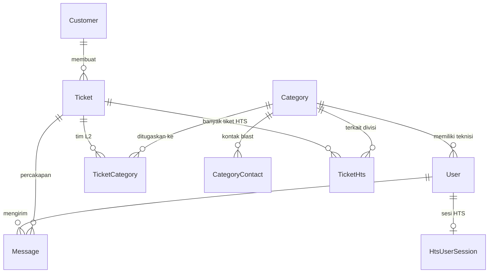

# 🗄️ Skema Database & Kontrak API
**Proyek:** HTS Chat Integration (WhatsApp Helpdesk to Web Ticketing System)  
**Versi:** Workflow V4.1 Produksi  
**Engine:** PostgreSQL 15 (Prisma ORM) — database `wa_helpdesk`  
**Audiens Dokumen:** Developer  

---

## 1. Entity Relationship Diagram (ERD)



---

## 2. Struktur Tabel & Kolom

### 2.1 `Customer` (Pelapor / Master Data Kontak)
| Kolom | Tipe | Atribut | Keterangan |
|---|---|---|---|
| `id` | `Int` | PK auto | ID unik pelapor |
| `wa_number` | `String` | **Unique, Not Null** | Nomor WA normalisasi (`628xxx`) |
| `name` | `String` | Not Null | Nama resmi (lihat hierarki resolusi di `Architecture.md`) |
| `skpd_name` | `String` | Nullable | Instansi / OPD |
| `is_custom_name` | `Boolean` | Default `false` | Nama diedit manual via dashboard |
| `is_imported_contact` | `Boolean` | Default `false` | **Master Data Import Admin — prioritas utama, tidak tertimpa nama WA** |
| `wa_push_name` | `String` | Nullable | Nama profil WhatsApp asli — **data pembanding** |
| `created_at` | `DateTime` | Default `now()` | Waktu pembuatan |

> **Hierarki resolusi nama:** Import Admin > Edit Manual > Kontak HP Evolution > Push Name (`wa_push_name`) > Nomor telepon.

### 2.2 `Category` (3 Pilar Tim L2)
| Kolom | Tipe | Keterangan |
|---|---|---|
| `id` | `Int` PK | ID tim |
| `name` | `String` | `Network`, `Server`, `Mechanical & Electrical (M&E)` |
| `wa_target_number` | `String?` | Legacy target blast |
| Relasi | | `users[]`, `tickets[]`, `contacts[]`, `hts_tickets[]` |

### 2.3 `CategoryContact` (Target WA Blast per Tim)
| Kolom | Tipe | Keterangan |
|---|---|---|
| `id` | `Int` PK | |
| `category_id` | `Int` FK | `onDelete: Cascade` ke `Category` |
| `name` | `String` | Nama personil / grup |
| `wa_target` | `String` | Nomor `628xxx` atau ID grup `xxx@g.us` |
| `created_at` | `DateTime` | |

### 2.4 `Setting` (Konfigurasi Dinamis)
| Kolom | Tipe | Keterangan |
|---|---|---|
| `key` | `String` PK | Misal: `auto_reply` |
| `value` | `String @db.Text` | Template teks bot |
| `is_active` | `Boolean` | Sakelar ON/OFF |
| `updated_at` | `DateTime` | |

### 2.5 `User` (Petugas)
| Kolom | Tipe | Keterangan |
|---|---|---|
| `id` | `Int` PK | |
| `name` | `String` | Nama staf |
| `email` | `String` | **Unique** |
| `password` | `String` | Hash `bcryptjs` salt 10 |
| `role` | `Role` enum | `ADMIN`, `SPV`, `L1`, `L2` |
| `category_id` | `Int?` FK | Kategori tim (khusus L2) |
| `hts_email` | `String?` | Email akun portal HTS |
| `hts_session` | relasi 1:1 | Ke `HtsUserSession` |

### 2.6 `HtsUserSession` (Sesi Login Portal HTS)
| Kolom | Tipe | Keterangan |
|---|---|---|
| `id` | `Int` PK | |
| `user_id` | `Int` FK **Unique** | 1 user – 1 sesi |
| `cookie_data` | `String @db.Text` | Cookie PHP `ci_session` + CSRF |
| `is_logged_in` | `Boolean` | Status koneksi HTS |
| `last_login` / `updated_at` | `DateTime` | |

### 2.7 `Ticket` (Sesi Percakapan / Tiket Aduan)
| Kolom | Tipe | Keterangan |
|---|---|---|
| `id` | `Int` PK | |
| `customer_id` | `Int` FK | Pemilik percakapan |
| `status` | `TicketStatus` enum | `OPEN`, `RESOLVED`, `CLOSED` |
| `service_type` | `ServiceType?` | `TROUBLESHOOTING`, `REQUEST_LAYANAN`, `MONITORING`, `GENERAL_CHAT` |
| `is_aduan` | `Boolean` | `false` = Percakapan Biasa (bebas SLA), `true` = Aduan Teknis |
| `summary` | `String?` | Mandatory summary penutupan |
| `hts_ticket_id` | `String?` | Legacy V3 (ID trouble) |
| `hts_ticket_no` | `String?` | Legacy V3 (nomor aduan HTS) |
| `hts_ticket_status` | `String?` | `UNSUBMITTED`/`INPUT_PIC`/`PENDING`/`SOLVED` |
| `hts_pic_ids` | `String?` | JSON array PIC |
| `hts_synced_at` | `DateTime?` | Waktu sinkronisasi HTS |
| `created_at` / `closed_at` | `DateTime?` | |
| Relasi | | `hts_tickets[]` (Multi-HTS V4), `categories[]`, `messages[]` |
| Index | | `(customer_id)`, `(status)`, `(is_aduan)` |

> **SSOT Multi-HTS (V4.1):** tabel **`TicketHts`** adalah sumber kebenaran utama. Kolom legacy `Ticket.hts_*` hanya mirror dari tiket HTS pertama untuk kompatibilitas.

### 2.8 `TicketHts` (Hub Multi-HTS — 1 chat → banyak tiket HTS)
| Kolom | Tipe | Keterangan |
|---|---|---|
| `id` | `Int` PK | |
| `ticket_id` | `Int` FK | `onDelete: Cascade` ke `Ticket` |
| `category_id` | `Int?` FK | Divisi tim terkait, `onDelete: SetNull` |
| `hts_ticket_id` | `String` Not Null | ID numerik trouble (mis. `2041`) |
| `hts_ticket_no` | `String` Not Null | Nomor aduan resmi |
| `hts_ticket_status` | `String` | Default `PENDING`; `SOLVED` |
| `hts_kategori` | `String` | Default `troubleshoot` |
| `hts_sub_kategori` | `String?` | |
| `hts_detil` | `String? @db.Text` | |
| `hts_pic_ids` | `String?` | JSON array PIC |
| `solution` | `String? @db.Text` | Solusi teknis HTS |
| `created_at` / `solved_at` | `DateTime?` | |
| Index | | `(ticket_id)`, `(hts_ticket_no)` |

### 2.9 `TicketCategory` (Relasi Many-to-Many Tim)
| Kolom | Tipe | Keterangan |
|---|---|---|
| `ticket_id` + `category_id` | `Int` | **Composite PK** |
| `is_resolved` | `Boolean` | Status selesai per-tim |
| `resolved_at` | `DateTime?` | |
| `solution` | `String? @db.Text` | Catatan solusi teknis L2 |
| Relasi | | `ticket` FK **`onDelete: Cascade`**, `category` FK **`onDelete: Cascade`** |
| Index | | `(category_id)` |

### 2.10 `Message` (Percakapan & Catatan Internal)
| Kolom | Tipe | Keterangan |
|---|---|---|
| `id` | `Int` PK | |
| `ticket_id` | `Int` FK | **`onDelete: Cascade`** ke `Ticket` |
| `sender_type` | `SenderType` enum | `CUSTOMER`, `AGENT`, `BOT` |
| `sender_id` | `Int?` FK | `onDelete: SetNull` |
| `message_text` | `String?` | |
| `attachment_url` | `String?` | Path di `/uploads/` |
| `wa_message_id` | `String?` | ID unik WA (`key.id`) — **deduplikasi** |
| `is_internal` | `Boolean` | `true` = catatan internal rahasia |
| `created_at` | `DateTime` | |
| Index | | `(ticket_id)`, `(ticket_id, created_at)`, `(wa_message_id)` |

### 2.11 `QuickReply` (Template Balasan Cepat)
| Kolom | Tipe | Keterangan |
|---|---|---|
| `id` | `Int` PK | |
| `shortcut` | `String` **Unique** | Dipanggil tanpa slash: `salam`, `aduan`, `progres` |
| `title` | `String` | Judul suggester |
| `content` | `String @db.Text` | Isi template |
| `created_at` / `updated_at` | `DateTime` | |

### 2.12 Enum Tipe Data
```prisma
enum Role          { ADMIN SPV L1 L2 }
enum TicketStatus  { OPEN RESOLVED CLOSED }
enum SenderType    { CUSTOMER AGENT BOT }
enum ServiceType   { TROUBLESHOOTING REQUEST_LAYANAN MONITORING GENERAL_CHAT }
```

---

## 3. Kontrak REST API

**Basis URL:** `/api` · **Autentikasi:** Header `Authorization: Bearer <JWT>` (kecuali webhook & login)  
**Middleware:** `verifyToken` (semua rute internal) + `requireRole([...])` (rute berbasis peran)

### 3.1 Webhook WhatsApp (`/api/webhook`)
| Method | Path | Deskripsi |
|---|---|---|
| POST | `/api/webhook/whatsapp` | Event `messages.upsert` dari Evolution. Publik (bypass rate-limit). Aturan: skip grup `@g.us`; dedupe via `wa_message_id`; resolve LID via `remoteJidAlt`; `fromMe=true` disimpan sebagai `AGENT`; race-safe upsert customer + tiket |

### 3.2 Autentikasi (`/api/auth`)
| Method | Path | Deskripsi |
|---|---|---|
| POST | `/api/auth/login` | Login (email+password) $\rightarrow$ JWT 12 jam + profil |
| GET | `/api/auth/me` | Verifikasi token + ambil profil |

### 3.3 Chat & Tiket (`/api/chat`)
| Method | Path | Deskripsi |
|---|---|---|
| GET | `/tickets` | Antrean tiket (filter status/search). L2 difilter per kategori tim |
| GET | `/tickets/:ticketId/messages` | Riwayat pesan tiket |
| POST | `/send` | Balasan teks WA pelapor |
| POST | `/sendMedia` | Upload gambar + kirim WA (multipart `media`) |
| PUT | `/customers/:customerId` | Edit nama & SKPD pelapor |
| POST | `/tickets/:ticketId/assign` | Multi-assign L2 + WA blast (diff & merge tim) |
| POST | `/tickets/:ticketId/resolve` | L2 tandai selesai tim + solusi |
| POST | `/tickets/:ticketId/return` | L2 lepas penugasan + alasan |
| POST | `/tickets/:ticketId/close` | Tutup tiket resmi (mandatory summary). Dual-close HTS: loop seluruh `TicketHts` `PENDING` — **gagal sebagianpun** → `400` berisi daftar `#HTS` + alasan, penutupan lokal dibatalkan; gate & self-healing baca SSOT `TicketHts` |
| POST | `/tickets/:ticketId/close-general` | Selesaikan percakapan biasa instan |
| PATCH | `/tickets/:ticketId/toggle-aduan` | Beralih Percakapan Biasa $\leftrightarrow$ Aduan Teknis |
| POST | `/tickets/:ticketId/internal-note` | Catatan internal teks (rahasia) |
| POST | `/tickets/:ticketId/internal-media` | Catatan internal gambar (multipart `media`) |
| GET | `/tickets/:ticketId/internal-media` | Daftar foto internal (sumber bukti HTS) |

**Integrasi HTS:**
| Method | Path | Deskripsi |
|---|---|---|
| POST | `/tickets/:ticketId/sync-hts` | Terbitkan tiket baru ke portal HTS (pipeline 3 tahap, multi-foto `attachment[]`) |
| POST | `/tickets/:ticketId/sync-solve-hts` | Selesaikan tiket HTS yang sudah ada |
| GET | `/tickets/:ticketId/hts` | Daftar tiket HTS terhubung |
| POST | `/tickets/:ticketId/hts` | Terbitkan tiket HTS tambahan (Multi-HTS) |
| POST | `/tickets/:ticketId/hts/:htsId/solve` | Selesaikan 1 tiket HTS secara mandiri |
| POST | `/tickets/:ticketId/link-hts` | **Manual link** nomor HTS yang sudah ada (verifikasi live, tolak duplikat di percakapan, konfirmasi force link 409, auto-promotion + auto-assign kategori) |
| POST | `/tickets/:ticketId/hts/:htsTicketId/complete-pic` | Recovery tiket gantung status `INPUT_PIC` $\rightarrow$ `PENDING` |
| DELETE | `/tickets/:ticketId/hts/:htsTicketId/unlink` | **Lepas tautan** nomor HTS dari percakapan |

**Riwayat & Balasan Cepat:**
| Method | Path | Deskripsi |
|---|---|---|
| GET | `/customers/:customerId/history-messages` | Riwayat tiket lampau |
| POST | `/customers/:customerId/fetch-wa-history` | Tarik arsip WA on-demand (mendukung LID) |
| GET/POST/PUT/DELETE | `/quick-replies[/:id]` | CRUD template balasan cepat |

**Fitur V4.1 (Kontak & Chat Baru):**
| Method | Path | Deskripsi |
|---|---|---|
| GET | `/contacts/search?q=&limit=&offset=` | Direktori kontak gabungan: DB master data (prioritas) + kontak HP Evolution. **Pagination** (`contacts`, `total`, `offset`, `hasMore`) |
| POST | `/start-new-chat` | Outbound chat baru: upsert customer, buat tiket, kirim pesan pembuka opsional (`sendInitialMessage`) |
| POST | `/tickets/:ticketId/reopen` | Aktifkan kembali tiket `CLOSED` $\rightarrow$ `OPEN` + alasan |

### 3.4 Integrasi Portal HTS (`/api/hts`)
| Method | Path | Deskripsi |
|---|---|---|
| GET | `/status` | Status koneksi sesi HTS petugas |
| GET | `/captcha` | Streaming gambar CAPTCHA live + CSRF |
| POST | `/login` | Login HTS via CAPTCHA (simpan `ci_session`) |
| GET | `/master-data` | Data referensi HTS (OPD, kategori, PIC) |

### 3.5 Laporan (`/api/reports`)
| Method | Path | Deskripsi |
|---|---|---|
| GET | `/tickets` | Rekapitulasi + metrik SLA (FRT, MTTR aduan murni) |
| DELETE | `/tickets` | Hapus rekap terpilih / **semua + reset sequence ID** (ADMIN) |

### 3.6 Administrasi (`/api/admin`) — Khusus `requireRole(['ADMIN'])`
| Method | Path | Deskripsi |
|---|---|---|
| GET/POST/PUT/DELETE | `/users[/:id]` | CRUD pengguna (bcrypt, role, kategori L2) |
| GET/POST/PUT/DELETE | `/categories/contacts[...]` | Kelola kontak & grup WA blast per tim L2 |
| POST | `/contacts/import` | **Import Master Data Kontak** — Excel (`.xlsx/.xls`), CSV, **VCF** (parser vCard manual: `FN`/`N`, `TEL`, `ORG`). Mendukung header Google Contacts (`First/Middle/Last Name`, `Phone 1 - Value`, `Organization Name`) |
| DELETE | `/contacts/clear-all` | Hapus semua master data kontak + reset sequence `Customer_id_seq` (dengan proteksi tiket aktif + opsi `force`) |

---

## 4. Event WebSocket (Socket.io)

| Event | Arah | Keterangan |
|---|---|---|
| `new_message` | Server $\rightarrow$ Client | Gelembung chat baru (publik & internal) |
| `ticket_assigned` | Server $\rightarrow$ Client | Penugasan tim L2 |
| `ticket_closed` | Server $\rightarrow$ Client | Tiket ditutup |
| `ticket_updated` | Server $\rightarrow$ Client | Status tiket berubah (termasuk re-open) |
| `customer_updated` | Server $\rightarrow$ Client | Perubahan identitas pelapor |
| `hts_ticket_created` | Server $\rightarrow$ Client | Tiket HTS baru diterbitkan/ditautkan |
| `hts_ticket_updated` | Server $\rightarrow$ Client | Status tiket HTS berubah |
| `hts_ticket_deleted` | Server $\rightarrow$ Client | Tautan HTS dilepas |
