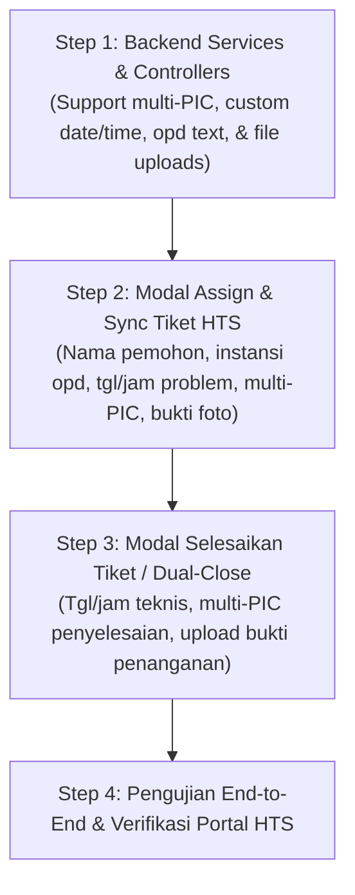

# 📋 Spesifikasi Revisi Input Form Integrasi HTS Diskomdigi (V4)

**Dokumen:** Spesifikasi Teknis & Rencana Implementasi Bertahap (Step-by-Step)  
**Terkait:** Integrasi Helpdesk WhatsApp dengan Portal Resmi HTS Diskomdigi Jawa Tengah  
**Tanggal:** 30 September 2026  
**Status:** Disetujui untuk Implementasi  

---

## 🎯 Latar Belakang & Tujuan
Setelah pengujian end-to-end fitur integrasi HTS (Fase 1 - 4), terdapat kebutuhan penyesuaian (*fine-tuning*) input data pada form pengiriman tiket ke portal HTS Diskomdigi (`https://hts.diskomdigi.jatengprov.go.id`). Penyesuaian ini bertujuan agar data yang dikirimkan oleh Helpdesk L1 maupun Teknisi L2 ke portal HTS lebih fleksibel, akurat, dan mencerminkan kondisi lapangan yang sebenarnya.

---

## 📌 Rincian 6 Poin Revisi Fitur

### 1. Nama Pemohon Editable (`name="cust"`)
- **Masalah Saat Ini:** Nama pemohon otomatis mengambil data nama kontak WhatsApp pelanggan dan tidak dapat diedit secara langsung di dalam modal pembuatan tiket HTS.
- **Solusi Baru:**
  - Menambahkan field input teks **"Nama Pemohon"** di dalam Modal Assign HTS dan Modal Sinkron HTS.
  - Nilai default otomatis terisi dari nama kontak WhatsApp pelapor.
  - Petugas L1 dapat mengoreksi nama pemohon (misal menambahkan gelar atau nama lengkap resmi).
  - Teks yang diketik L1 akan dikirimkan ke parameter `cust` pada form `submit_aduan` HTS.

### 2. Penanganan Instansi Pelapor (`opd` vs `induk_opd_id`)
- **Masalah Saat Ini:** Nama instansi di website HTS berubah menjadi default `"Instansi / Masyarakat"` karena data instansi hanya mengirimkan ID OPD Induk tanpa teks nama instansi/unit kerja spesifik.
- **Solusi Baru:**
  - Di portal HTS terdapat 2 field terkait instansi:
    1. `opd` (*input text*): Nama instansi / unit kerja / sekolah / bidang pemohon.
    2. `induk_opd_id` (*select dropdown*): Pilihan OPD Induk resmi Pemprov Jateng (ID 1-101).
  - Di modal aplikasi, kita sediakan dua input:
    - **Instansi / Unit Kerja Pelapor** (`opd`): Input teks bebas. Nilai default terisi dari `customer.skpd_name` atau nama OPD Induk yang dipilih. L1 bisa mengedit secara spesifik (contoh: *"Bidang E-Gov Dinkominfo"* atau *"SMKN 1 Semarang"*).
    - **OPD Induk** (`induk_opd_id`): Dropdown pilihan OPD Induk.
  - Nilai teks `opd` dikirim ke parameter form `opd` di HTS, mengeliminasi teks default `"Instansi / Masyarakat"`.

### 3. Tanggal dan Jam Problem / Penanganan Editable
- **Masalah Saat Ini:** Tanggal dan jam ter-generate secara otomatis dari `new Date()` saat tombol ditekan, sehingga tidak bisa merefleksikan waktu kejadian kendala yang sebenarnya jika ada keterlambatan pelaporan.
- **Solusi Baru:**
  - **Saat Pembuatan Tiket HTS (Assign / Sync):**
    - 📅 **Tanggal Problem** (`tgltshoot`): `<input type="date">`, default hari ini (`YYYY-MM-DD`), editable.
    - ⏰ **Jam Problem** (`jam_problem`): `<input type="time">`, default jam sekarang (`HH:mm`), editable.
  - **Saat Penyelesaian Tiket HTS (Dual-Close):**
    - 📅 **Tanggal Penanganan** (`tglteknis`): `<input type="date">`, default hari ini, editable.
    - ⏰ **Jam Penanganan** (`jam_problem`): `<input type="time">`, default jam sekarang, editable.

### 4. Sinkronisasi Otomatis Jenis Layanan (Helpdesk <-> HTS)
- **Analisis di HTS:**
  - Dropdown `kategori` pada portal HTS memiliki 3 opsi:
    1. `troubleshoot` ➔ Troubleshooting
    2. `request` ➔ Request Layanan
    3. `monitoring` ➔ Monitoring
- **Solusi Baru:**
  - **Auto-Mapping 2 Arah:**
    - Saat L1 memilih radio button **Jenis Layanan** di aplikasi Helpdesk:
      - `TROUBLESHOOTING` ➔ Kategori HTS otomatis terpilih `troubleshoot`.
      - `REQUEST_LAYANAN` ➔ Kategori HTS otomatis terpilih `request`.
      - `MONITORING` ➔ Kategori HTS otomatis terpilih `monitoring`.
    - Jika L1 mengubah dropdown Kategori HTS secara manual, pilihan Jenis Layanan internal ikut tersinkronisasi.

### 5. Multi-PIC Penanganan & Multi-PIC Penyelesaian (`pic_id[]`)
- **Analisis di HTS:**
  - Pada halaman `submit_pic` dan `submit_teknis`, elemen form menggunakan `<select name="pic_id" multiple>` (*Pilih satu atau lebih PIC yang menangani aduan ini*).
- **Solusi Baru:**
  - Input PIC di modal Helpdesk diubah menjadi **Multi-Select (Checkbox / Badges)**:
    - L1 dapat memilih **satu atau lebih personil PIC HTS** yang menangani penugasan.
    - Pada modal Selesaikan Tiket (*Dual-Close*), L1 juga dapat memilih satu atau lebih PIC yang menyelesaikan tiket tersebut.
  - Backend mengirimkan daftar ID sebagai array form-data (`pic_id[]`).

### 6. Pengunggahan Gambar Bukti Aduan & Bukti Penanganan (`pic[]`)
- **Analisis di HTS:**
  - `submit_aduan`: Field `<input type="file" name="pic[]" multiple accept="image/jpeg,image/jpg,image/png">` (Maks 1MB).
  - `submit_teknis`: Field `<input type="file" name="pic[]" multiple accept="image/jpeg,image/png,image/jpg,application/pdf">` (Maks 1MB).
- **Solusi Baru:**
  - **Saat Pembuatan Tiket HTS (Assign / Sync):**
    - Jika pelapor mengirimkan foto/screenshot kendala via WhatsApp, sistem menampilkan preview foto tersebut dengan checkbox *"Lampirkan foto dari chat ke HTS"*.
    - Disediakan juga tombol upload manual jika L1 ingin mengunggah foto bukti baru dari komputer/laptop.
  - **Saat Penyelesaian Tiket HTS (Dual-Close):**
    - Disediakan tombol upload file bukti penanganan teknis (foto hasil perbaikan di lapangan atau dokumen Berita Acara Penyelesaian / BAP) untuk dilampirkan langsung ke form `submit_teknis` HTS.

---

## 🚀 Rencana Implementasi Bertahap (Step-by-Step)

### 🔹 Step 1: Penyesuaian Backend Service & Controller
1. **`htsClientService.js`**:
   - Update `createTicketHts`:
     - Terima parameter: `cust`, `opd`, `tgltshoot`, `jam_problem`, `pic_ids` (array), `files` (array buffer/path).
     - Masukkan `opd` ke form data (bukan fallback default).
     - Iterasi array `pic_ids` ke `formData.append('pic_id[]', id)`.
     - Lampirkan file/gambar jika ada.
   - Update `solveTicketHts`:
     - Terima parameter: `tglteknis`, `jam_problem`, `pic_ids` (array), `attachmentFile` (buffer/path file baru).
     - Iterasi array `pic_ids` ke `formData.append('pic_id[]', id)`.
2. **`chatController.js`**:
   - Parse parameter baru dari `req.body` pada `assignTicket`, `syncTicketToHts`, dan `closeTicket`.
   - Menangani upload file lampiran melalui middleware multer.

### 🔹 Step 2: Implementasi Frontend Modal Assign & Sync Tiket HTS
1. Tambahkan state form HTS:
   - `assignHtsCust` (default: `activeTicket.customer.name`)
   - `assignHtsOpd` (default: `activeTicket.customer.skpd_name` || nama OPD Induk)
   - `assignHtsTanggal` (default: tanggal hari ini `YYYY-MM-DD`)
   - `assignHtsJam` (default: jam sekarang `HH:mm`)
   - `assignHtsPicIds` (array ID, multi-select)
   - `assignHtsFile` (file manual) & `assignHtsUseChatImage` (boolean)
2. Buat antarmuka UI input yang rapi di dalam Modal Assign dan Modal Sync HTS.
3. Hubungkan sinkronisasi auto-mapping Jenis Layanan <-> Kategori HTS.

### 🔹 Step 3: Implementasi Frontend Modal Selesaikan Tiket (Dual-Close)
1. Tambahkan state form penyelesaian HTS:
   - `closeHtsTanggal` (default: tanggal hari ini `YYYY-MM-DD`)
   - `closeHtsJam` (default: jam sekarang `HH:mm`)
   - `closeHtsPicIds` (array ID, multi-select)
   - `closeHtsProofFile` (file lampiran bukti penanganan teknis)
2. Perbarui antarmuka UI Modal Selesaikan Tiket agar L1 dapat mengatur waktu penanganan, memilih multi-PIC penyelesaian, dan mengunggah bukti foto/dokumen.

### 🔹 Step 4: Verifikasi & Uji Coba Lapangan
1. Jalankan `npm run build` frontend untuk memastikan tidak ada error sintaks.
2. Buat tiket baru dari WhatsApp, assign ke L2 dengan data kustom (nama, instansi spesifik, jam, multi-PIC, dan gambar).
3. Verifikasi apakah data yang muncul di portal HTS Diskomdigi sudah 100% sesuai dengan yang diinput.
4. Lakukan penanganan L2 dan Dual-Close L1 dengan bukti penanganan, verifikasi status tiket di HTS menjadi `solved`.
