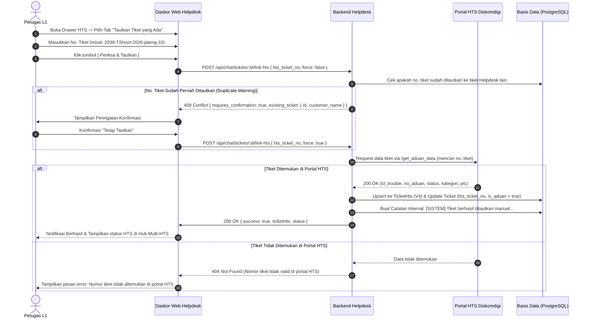

# 📑 Spesifikasi Teknis: Penautan Manual & Pemulihan Tiket HTS (Manual Link & Disaster Recovery)

**Versi:** 1.0 (Ekstensi Arsitektur V4)  
**Status:** Disetujui (Siap Implementasi)  
**Terakhir Diperbarui:** 1 Oktober 2026  
**Penulis:** Antigravity AI & Tim Pengembang Helpdesk Diskomdigi Jawa Tengah  

---

## 📌 1. Latar Belakang & Masalah Bisnis

Dalam integrasi dua arah antara sistem Helpdesk WhatsApp dan portal resmi **HTS Diskomdigi Jawa Tengah** (`https://hts.diskomdigi.jatengprov.go.id`), pembuatan tiket HTS melibatkan alur multi-tahap:
1. Pengiriman formulir aduan ke endpoint `/submit_aduan` di server HTS.
2. Pengambilan ID trouble numerik (`id_trouble`) via `/get_aduan_data`.
3. Pemindahan status tiket dari `unsubmitted` ke `input-pic`, lalu penetapan PIC teknisi (`/submit_pic`) menjadi `pending`.
4. Penyimpanan nomor tiket resmi (misal: `#2038-TShoot-2026-jateng-10`) ke database lokal Helpdesk.

### Skenario Kegagalan Nyata (*Edge Case*):
Terkadang terjadi gangguan jaringan (*network timeout*, koneksi terputus saat respon HTS kembali, atau kendala transaksi basis data lokal). Pada situasi ini:
* **Tiket di portal resmi HTS sebenarnya SUDAH BERHASIL DIBUAT** dan telah mendapatkan nomor aduan resmi.
* Namun, **database Helpdesk belum sempat mencatat nomor tersebut** karena proses terhenti sebelum data tersimpan ke tabel lokal.
* **Dampak Buruk:** Jika petugas L1 mengklik tombol *"Terbitkan ke HTS"* ulang, sistem akan mengirimkan aduan baru ke portal HTS, menghasilkan **tiket duplikat** yang merusak nomor urut aduan OPD dan mengacaukan statistik SLA di Diskomdigi.

---

## 🎯 2. Tujuan & Nilai Tambah Fitur

1. **Pencegahan Tiket Duplikat (*Zero-Duplicate Guarantee*):** Petugas dapat langsung mengaitkan nomor tiket yang sudah terbit tanpa perlu menerbitkan ulang.
2. **Validasi Otomatis ke Portal HTS:** Sistem langsung menghubungi portal HTS untuk memverifikasi keaslian nomor tiket, mengambil status real-time, nama kategori, PIC, dan ID Trouble.
3. **Penyelamat Tiket Gantung (*Partial Submission Recovery*):** Jika tiket di HTS terputus pada status `unsubmitted` atau `input-pic`, sistem menyediakan tombol cepat **`[ ⚡ Lengkapi Penugasan PIC di HTS ]`** untuk menaikkannya ke status `PENDING`.
4. **Dukungan Multi-HTS (V4):** Penautan ini dapat digunakan untuk tiket HTS pertama, kedua, atau ketiga pada satu sesi percakapan yang sama.
5. **Pencegahan Human-Error:** Dilengkapi deteksi jika nomor tiket HTS tersebut sudah pernah ditautkan ke tiket chat pelanggan lain di masa lalu dengan dialog konfirmasi persetujuan.
6. **Auto-Promotion:** Jika percakapan berstatus obrolan biasa (`is_aduan = false`), penautan nomor tiket resmi HTS otomatis mempromosikan tiket menjadi Aduan Teknis (`is_aduan = true`).

---

## 🔄 3. Diagram Alur Proses (Flowchart & Sequence)



---

## 🔌 4. Spesifikasi API Endpoint

### 4.1. Endpoint Penautan Tiket HTS
* **URL:** `POST /api/chat/tickets/:ticketId/link-hts`
* **Headers:** `Authorization: Bearer <JWT_TOKEN>`
* **Request Body:**
  ```json
  {
    "hts_ticket_no": "2038-TShoot-2026-jateng-10",
    "category_id": 1,
    "force": false
  }
  ```
* **Logika Backend:**
  1. Bersihkan format string `hts_ticket_no` (hapus simbol `#` dan spasi di awal/akhir).
  2. Periksa apakah nomor HTS ini sudah ada di tabel `TicketHts` milik tiket lain:
     * Jika ada dan `force == false`, kembalikan HTTP `409 Conflict`:
       ```json
       {
         "requires_confirmation": true,
         "message": "Nomor HTS 2038-TShoot-2026-jateng-10 sudah ditautkan ke Tiket #12 (Pelapor: Budi Santoso). Tetap lanjutkan penautan?",
         "existingTicket": { "id": 12, "customerName": "Budi Santoso" }
       }
       ```
  3. Lakukan pencarian data ke portal HTS menggunakan sesi petugas L1 yang aktif (`htsClientService.lookupTicketByNumber(noTrouble)`).
  4. Ambil `id_trouble`, `status` (`unsubmitted` / `input-pic` / `pending` / `solved`), `kategori`, `sub_kategori`, `detil`, dan `pic_ids`.
  5. Simpan ke tabel `TicketHts`:
     * `ticket_id`: ID tiket chat saat ini.
     * `category_id`: Kategori tim L2 terkait (opsional).
     * `hts_ticket_id`: String ID numerik trouble.
     * `hts_ticket_no`: String nomor aduan resmi.
     * `hts_ticket_status`: Status dari portal HTS (`PENDING` / `INPUT_PIC` / `SOLVED`).
     * `hts_pic_ids`: JSON array ID PIC terkait.
  6. Perbarui tiket utama:
     * `is_aduan = true` (Auto-promotion).
     * Jika tiket utama belum memiliki `hts_ticket_no`, set nilai legacy `hts_ticket_no` dan `hts_ticket_id`.
  7. Catat pesan log sistem internal di gelembung obrolan:  
     `"[SISTEM] Nomor tiket HTS #2038-TShoot-2026-jateng-10 berhasil ditautkan secara manual oleh Petugas."`
  8. Kirim respon sukses dan siarkan event Socket.io `hts_ticket_created`.

---

### 4.2. Endpoint Melengkapi PIC Tiket Gantung (Recovery PIC)
* **URL:** `POST /api/chat/tickets/:ticketId/hts/:htsTicketId/complete-pic`
* **Headers:** `Authorization: Bearer <JWT_TOKEN>`
* **Request Body:**
  ```json
  {
    "pic_ids": ["14", "8"]
  }
  ```
* **Logika Backend:**
  1. Jika status di HTS masih `unsubmitted`, jalankan `/submit_aduan_status`.
  2. Kirim penetapan PIC via `/submit_pic`.
  3. Perbarui `hts_ticket_status = 'PENDING'` pada tabel `TicketHts` lokal.
  4. Siarkan event Socket.io `hts_ticket_updated`.

---

## 🎨 5. Spesifikasi Antarmuka Pengguna (UI/UX)

Di dalam panel **Slide-Over Drawer** penerbitan HTS, bagian header menyediakan 2 tab navigasi:

```text
┌──────────────────────────────────────────────────────────────┐
│  📑 Sinkronisasi Portal HTS Diskomdigi             [ ✕ ]     │
│  ──────────────────────────────────────────────────────────  │
│   [ ➕ Terbitkan Tiket Baru ]   [ 🔗 Tautkan yang Sudah Ada ] │
└──────────────────────────────────────────────────────────────┘
```

### Ketika Tab "Tautkan yang Sudah Ada" Dipilih:
1. **Kotak Input Nomor Tiket HTS:**
   * Placeholder: `Contoh: 2038-TShoot-2026-jateng-10`
   * Label: *"Nomor Aduan Resmi HTS"*
   * Helper text: *"Masukkan nomor aduan yang telah terbit di portal resmi HTS untuk ditautkan ke percakapan ini tanpa menerbitkan tiket baru."*
2. **Pilihan Kategori Tim Terkait (Opsional):**
   * Dropdown memilih pilar divisi (`Network`, `Server`, atau `M&E`).
3. **Tombol Aksi Sticky Footer:**
   * Tombol Batal `[ Batal ]`
   * Tombol Eksekusi: **`[ 🔗 Verifikasi & Tautkan Tiket ]`** (dengan indikator loading spinner saat menghubungi HTS).

### Tampilan di Tab Hub Multi-HTS Jika Status Gantung (`INPUT_PIC`):
Jika tiket HTS yang ditautkan belum selesai penetapan PIC-nya di portal HTS:
* Badge status berwarna oranye: **`[ ⏳ INPUT PIC DI HTS ]`**
* Terdapat tombol aksi cepat: **`[ ⚡ Lengkapi PIC ke HTS ]`** untuk memilih teknisi dan menyelesaikan tiket ke status `PENDING`.

---

## 🧪 6. Checklist Rencana Pengujian (Test Matrix)

- [ ] **Uji Coba Valid:** Memasukkan nomor tiket HTS valid yang ada di portal $\rightarrow$ data berhasil ditarik dan muncul di daftar Multi-HTS.
- [ ] **Uji Coba Tidak Valid:** Memasukkan nomor sembarang (misal: `9999-Fals-99`) $\rightarrow$ sistem menampilkan pesan error *"Nomor tiket tidak ditemukan di portal HTS"*.
- [ ] **Uji Coba Konfirmasi Duplikasi:** Memasukkan nomor HTS yang sudah ada di tiket lokal lain $\rightarrow$ muncul dialog konfirmasi nama pelapor lama $\rightarrow$ jika dikonfirmasi, penautan berhasil.
- [ ] **Uji Coba Auto-Promotion:** Menautkan nomor HTS pada percakapan santai (`is_aduan = false`) $\rightarrow$ tiket otomatis berubah menjadi Aduan Teknis (`is_aduan = true`) dan muncul di laporan teknis.
- [ ] **Uji Coba Multi-HTS:** Menautkan 2 nomor tiket HTS berbeda pada 1 percakapan chat.
- [ ] **Uji Coba Tiket Gantung (`INPUT_PIC`):** Menautkan tiket yang belum ada PIC di HTS $\rightarrow$ klik tombol *"Lengkapi PIC"* $\rightarrow$ status berhasil naik ke `PENDING`.
