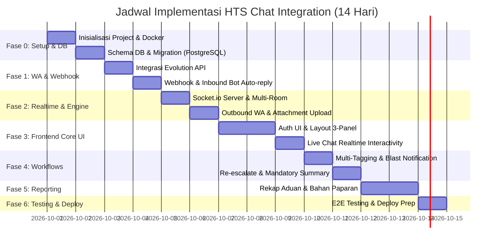

# 📋 Implementation Plan: HTS Chat Integration (WhatsApp to Web Helpdesk)

**Status:** Proposed / Ready for Execution  
**Target Rilis:** 14 Hari Kerja (Sprint)  
**Dokumen Referensi:** [PRD](PRD_WhatsApp_Helpdesk.md), [Arsitektur](Tech_Stack_Architecture.md), [Database Schema](Database_Schema.md), [API Endpoints](API_Endpoints_Spec.md), [UI Wireframe](UI_Wireframe_Concept.md)

---

## 1. Ringkasan Proyek & Arsitektur Solusi

Sistem ini mengintegrasikan WhatsApp dengan Web Helpdesk untuk instansi pemerintah/klien (SKPD). Aduan dari WhatsApp diterima secara otomatis, didisposisikan ke Agen L1 (Dispatcher) dan Agen L2 (Teknis spesifik: Server, Jaringan, Aplikasi), dikolaborasikan dalam *Many-to-One Live Chat*, dan dirangkum untuk laporan manajemen.

### Struktur Repositori Terpadu (Monorepo)
```text
hts-chat-integration/
├── docs/                      # Dokumentasi Teknis & Spesifikasi
│   ├── PRD_WhatsApp_Helpdesk.md
│   ├── Tech_Stack_Architecture.md
│   ├── Database_Schema.md
│   ├── API_Endpoints_Spec.md
│   ├── UI_Wireframe_Concept.md
│   ├── Implementation_Plan.md
│   ├── Deployment_Guide.md
│   ├── Security_Specification.md
│   └── System_Flowcharts.md
├── backend/                   # Node.js + Express + Socket.io + Prisma/PostgreSQL
│   ├── src/
│   │   ├── config/            # DB & Environment Config
│   │   ├── controllers/       # Webhook, Ticket, Message, Report, Auth
│   │   ├── middlewares/       # Auth (JWT), RBAC, Upload (Multer)
│   │   ├── services/          # Evolution API Service, Socket Service, Bot Service
│   │   ├── routes/            # Express Route Handlers
│   │   └── index.js           # Server & Socket.io Entry point
│   ├── prisma/                # Prisma Schema & Migrations / Seeds
│   ├── uploads/               # Local Media Storage
│   ├── .env.example
│   └── package.json
├── frontend/                  # React (Vite) + Tailwind CSS + Lucide
│   ├── src/
│   │   ├── components/        # 3-Panel Chat, Modals, Navbar, Badges
│   │   ├── context/           # Socket Context & Auth Context
│   │   ├── pages/             # Login, Dashboard, LiveChat, Reporting
│   │   ├── services/          # Axios API Client & Socket.io Listeners
│   │   └── App.jsx
│   ├── .env.example
│   └── package.json
├── docker/                    # Konfigurasi Container
│   └── docker-compose.yml     # PostgreSQL, Evolution API, Backend, Nginx
└── README.md
```

---

## 2. Rincian Fase & Jadwal Pelaksanaan (14 Hari Sprint)



---

### 🔹 Fase 0: Project Setup & Fondasi Database (Hari 1 - 2)
*Tujuan: Menyiapkan struktur direktori, Docker compose, schema database, dan seeding data.*

1. **Inisialisasi Environment & Monorepo:**
   - Setup folder `backend/`, `frontend/`, dan konfigurasi `docker/docker-compose.yml` (PostgreSQL 15 + Evolution API).
   - Inisialisasi Node.js backend dengan dependencies (`express`, `socket.io`, `cors`, `dotenv`, `pg` / `prisma`, `jsonwebtoken`, `bcryptjs`, `multer`).
   - Inisialisasi Frontend dengan Vite + React + Tailwind CSS + Lucide Icons + Axios + Socket.io-client.
2. **Implementasi Database Schema (PostgreSQL):**
   - Buat tabel: `customers`, `divisions`, `users`, `tickets`, `ticket_divisions`, `messages`.
   - Setup index pada `customers.wa_number`, `tickets.status`, `messages.ticket_id`.
   - Buat file seed master data:
     - Divisi default: `Server`, `Network`, `Aplikasi`, `Data Center`.
     - Akun default: 1 SPV, 1 Agen L1, 3 Agen L2 per divisi.

---

### 🔹 Fase 1: Integrasi WhatsApp Gateway & Webhook (Hari 3 - 4)
*Tujuan: Menerima pesan WhatsApp via Evolution API, auto-create tiket/kontak, dan auto-reply bot.*

1. **Evolution API Service Integration:**
   - Konfigurasi koneksi ke Evolution API via Axios/HTTP client.
   - Endpoint status koneksi WA / QR Code pairing (jika diperlukan untuk verifikasi instansi).
2. **Webhook Inbound Processing (`POST /api/webhook/whatsapp`):**
   - Terima payload pesan teks & gambar dari WhatsApp.
   - Normalisasi nomor HP (`from` -> 62xxx).
   - Lookup atau `UPSERT` data kontak di tabel `customers`.
   - Pengecekan tiket aktif (`status = 'OPEN'`):
     - **Kasus A (Belum ada tiket aktif):**
       - Buat tiket baru di tabel `tickets`.
       - Kirim **Auto-Reply Bot (F1)**: *"Baik untuk aduan akan kami cek dahulu mohon ditunggu"*.
       - Simpan pesan bot ke tabel `messages` (`sender_type = 'BOT'`).
     - **Kasus B (Ada tiket aktif):**
       - Periksa rule **Jeda Bot (F6)**: Jika bot tidak dipause dan belum pernah dibalas agen, atau sesuai konfigurasi.
       - Masukkan pesan ke tabel `messages` terkait `ticket_id` yang sedang aktif.

---

### 🔹 Fase 2: Real-time Communication & Messaging Engine (Hari 5 - 6)
*Tujuan: Backend Socket.io, pengiriman balasan agen ke WhatsApp, dan penanganan attachment.*

1. **Socket.io Event Architecture:**
   - Room per tiket: `ticket:${ticketId}` untuk broadcast pesan baru ke seluruh agen yang sedang membuka tiket tersebut.
   - Room per divisi: `division:${divisionId}` untuk blast notifikasi tiket baru.
   - Room global L1: `role:L1` untuk notifikasi aduan masuk baru yang butuh routing.
2. **Outbound WA Messaging (`POST /api/tickets/:id/messages`):**
   - Validasi sesi agen (Many-to-One F5).
   - Simpan pesan dengan `sender_type = 'AGENT'`, `sender_id = req.user.id`.
   - Teruskan pesan ke WhatsApp via Evolution API (`POST /message/sendText`).
   - Trigger matikan auto-reply bot otomatis untuk tiket ini (Jeda Bot F6).
   - Emit event Socket.io `new_message` ke client web.
3. **Attachment Upload Service (`POST /api/media/upload`):**
   - Setup Multer dengan sanitasi nama file & validasi MIME type (JPEG, PNG, PDF, DOCX).
   - Simpan ke direktori `uploads/` (static serve).
   - Fitur forward dokumen/gambar ke Evolution API (`POST /message/sendMedia`).

---

### 🔹 Fase 3: Frontend 3-Panel Workspace & Live Chat (Hari 7 - 9)
*Tujuan: Dashboard interaktif responsive sesuai spesifikasi UI Wireframe.*

1. **Autentikasi & Routing:**
   - Halaman Login (JWT Token disimpan di secure cookie/localStorage).
   - State management auth & Socket.io connection lifecycle.
2. **Implementasi UI 3-Panel (Three-Pane Layout):**
   - **Panel Kiri (Inbox / List Tiket):**
     - Tab filter: `[Semua Tiket]`, `[Divisi Saya]`, `[Belum Ditangani]`.
     - Kartu tiket: Nama SKPD/Nomor WA, preview chat terakhir, badges divisi, status tag.
     - Real-time update saat ada chat/tiket baru tanpa reload.
   - **Panel Tengah (Conversation Canvas):**
     - Header: Nama Pelapor, SKPD, Status Bot toggle (On/Off).
     - Bubble Chat:
       - Chat Pelapor (kiri, abu-abu/putih).
       - Chat Agen (kanan, warna aksen, menampilkan identitas nama agen & divisi).
       - Chat Sistem/Bot (tengah, badge info).
     - Input bar: Textarea dengan autosize, tombol upload lampiran, tombol Send.
   - **Panel Kanan (Ticket Inspector & Actions):**
     - Rincian pelapor (Nama, Nomor, SKPD, Tanggal Lapor).
     - Action Dispatcher L1: Multi-select dropdown divisi (F3).
     - Action L2: Tombol `Close Ticket`.

---

### 🔹 Fase 4: Division Workflows, Blast, & Ticket Closure (Hari 10 - 11)
*Tujuan: F3 (Multi-Kendala), F4 (Blast Notification), F2 (Re-escalate), F7 (Mandatory Summary).*

1. **Penanganan Multi-Kendala (F3) & Blast (F4):**
   - Form update divisi tiket: `PUT /api/tickets/:id/divisions`.
   - Logika multi-insert ke tabel `ticket_divisions`.
   - Blast notifikasi via Socket.io ke agen di divisi terkait.
   - Notifikasi Toast pop-up di layar agen: *"Tiket Baru: [SKPD] - [Kendala]. Klik untuk membuka"*.
2. **Re-escalate to Ticket (F2):**
   - Opsi re-escalate untuk menghubungkan/menggabungkan aduan baru dengan riwayat tiket terdahulu jika masalah terulang.
3. **Penutupan Tiket dengan Mandatory Summary (F7):**
   - Modal konfirmasi penutupan tiket:
     - Form textarea "Kesimpulan & Tindakan Penanganan" (wajib diisi, min. 10 karakter).
   - Endpoint `POST /api/tickets/:id/close` menolak jika `summary` kosong.
   - Tiket ditandai `CLOSED` dengan timestamp `closed_at`.

---

### 🔹 Fase 5: Reporting, Analytics & Bahan Paparan (Hari 12 - 13)
*Tujuan: Fitur laporan R1 (Rekap Akhir) dan R2 (Bahan Paparan Manajemen).*

1. **Rekap Hasil Akhir Aduan (R1):**
   - Halaman tabel pelaporan dengan filter rentang tanggal, status, dan divisi.
   - Kolom data: ID Tiket, Waktu Masuk, Waktu Selesai, Durasi Penanganan, SKPD, Jenis Kendala, Divisi, Kesimpulan (Summary).
   - Fitur Export ke format Excel (.xlsx) / CSV.
2. **Laporan Bahan Paparan Manajemen (R2):**
   - Tampilan komparasi per instansi/kategori: "Masalah Terdahulu vs Tindak Lanjut Terkini".
   - Tombol "Copy Format Paparan" untuk kemudahan presentasi eksekutif.

---

### 🔹 Fase 6: End-to-End Testing, Security & Deployment (Hari 14)
*Tujuan: Uji integrasi penuh, pengamanan sistem, dan verifikasi deployment.*

1. **Uji Skenario End-to-End:**
   - Skenario 1: Pesan WA masuk -> Auto-reply Bot -> Dispatcher L1 tag multi-divisi -> Notifikasi blast muncul di L2.
   - Skenario 2: Many-to-One reply (Agen Network & Server membalas bersamaan) -> Pesan terkirim ke WA user.
   - Skenario 3: Agen menutup tiket -> Validasi summary -> Status CLOSED -> Muncul di Rekap Laporan.
2. **Security & Deployment Verification:**
   - Rate limiting pada webhook & login.
   - CORS setup dan Nginx WebSocket reverse proxy configuration.
   - Penyiapan dokumentasi operasional ringkas untuk serah terima.

---

## 3. Matriks Kebutuhan vs Implementasi Teknis

| Fitur PRD | Kebutuhan | Komponen Backend | Komponen Frontend |
|---|---|---|---|
| **F1** | Auto-Reply Inbound | `whatsappController.js`, `botService.js` | Real-time chat list update |
| **F2** | Create, Forward, Re-escalate | `ticketController.js` | Dropdown Re-escalate & Forward di Panel Kanan |
| **F3** | Multi-Kendala (Tag Multi-Divisi) | `ticket_divisions` table, `updateDivisions` API | Checklist Tag Divisi di Panel Kanan |
| **F4** | Blast Broadcast Notification | Socket.io room per divisi | Toast notification pop-up dengan direct link |
| **F5** | Many-to-One Live Chat | `messageController.js`, `evolutionService.js` | 3-Panel Chat view, identitas agen pada balon chat |
| **F6** | Jeda Rule (Pause Bot) | `bot_paused` flag di DB & API toggle | Switch toggle di Chat Header |
| **F7** | Mandatory Summary on Close | Validasi `summary` tidak boleh null pada `POST /close` | Modal form penutupan dengan validasi wajib isi |
| **R1** | Rekap Laporan | `reportController.js` (Export xlsx/csv) | Halaman Filter & Tabel Rekap |
| **R2** | Bahan Paparan | Query aggregasi komparasi | Tab View Bahan Paparan dengan copy helper |

---

## 4. Langkah Segera (Immediate Next Steps)

1. **Persetujuan Rencana Implementasi:** Konfirmasi persetujuan timeline & struktur di atas.
2. **Eksekusi Fase 0:**
   - Membangun boilerplate backend & frontend di root repo.
   - Menyiapkan Docker Compose untuk PostgreSQL dan Evolution API.
   - Menjalankan migrasi database PostgreSQL.
