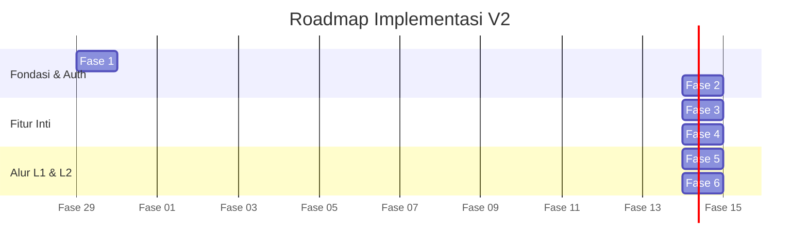

# 🚀 Implementation Plan - Workflow V2 (HTS Chat Integration)

Dokumen ini adalah *Roadmap* untuk mengeksekusi Workflow V2 yang fokus pada **Role-Based Access Control (L1 vs L2)**, **Sistem Notifikasi Blast**, **Internal Notes**, dan **Dukungan Media Gambar**.

---

## 🗺️ Gambaran Fase Pengembangan

---

## 📋 Detail Langkah per Fase

### 🔹 Fase 1: Perombakan Database (Schema & Migration)
*Fokus: Mengubah struktur Prisma agar mendukung kategori baru, nomor teknisi, dan pesan internal.*
- [ ] Membuat tabel `Category` (Troubleshooting, Request, Monitoring).
- [ ] Menambahkan kolom `wa_target_number` pada `Category` (untuk Blast Notifikasi ke Teknisi).
- [ ] Menyesuaikan tabel `Message` dengan tipe baru `INTERNAL_NOTE`.
- [ ] Memperbarui `seed.js` untuk membuat akun dengan *Role* spesifik (L1_DISPATCHER, L2_TECHNICIAN).

### 🔹 Fase 2: Sistem Autentikasi & Keamanan Backend
*Fokus: Mengamankan API dan memastikan sistem tahu siapa yang sedang mengakses data.*
- [ ] Membuat endpoint `POST /api/auth/login` menggunakan enkripsi `bcrypt` dan `jsonwebtoken` (JWT).
- [ ] Membuat `authMiddleware.js` untuk memproteksi semua akses API (kecuali webhook).
- [ ] Mengubah controller chat agar menyimpan `sender_id` yang dinamis dari token JWT, bukan sekadar hardcode.

### 🔹 Fase 3: Dukungan Media Gambar (Inbound & Outbound)
*Fokus: Sistem bisa menerima dan mengirim gambar.*
- [ ] Memodifikasi `webhookController.js` agar mendeteksi `imageMessage`.
- [ ] Logika mengunduh media dari WA ke folder lokal `backend/uploads/` dan menyimpan URL-nya di database.
- [ ] Menambahkan endpoint `POST /api/chat/sendMedia` menggunakan Evolution API.

### 🔹 Fase 4: Frontend UI - Login & Hak Akses (RBAC)
*Fokus: Mengubah App React menjadi sistem Multi-Halaman berdasarkan Role.*
- [ ] Instalasi `react-router-dom` untuk memisahkan Halaman Login (`/login`) dan Halaman Dashboard (`/`).
- [ ] Membuat Halaman Login UI.
- [ ] Memisahkan UI Chat:
  - **Jika L1 (Dispatcher):** Muncul form *Reply WA*, tombol "Assign ke Kategori".
  - **Jika L2 (Teknisi):** Form Reply WA disembunyikan. Diganti dengan tab *Internal Notes* dan tombol "Tandai Selesai".

### 🔹 Fase 5: Dispatcher Assignment & Blast Notification
*Fokus: L1 melempar tiket, L2 menerima pesan di WhatsApp.*
- [ ] Membuat Modal "Assign to L2" di UI L1 (pilih kategori).
- [ ] Endpoint `POST /api/tickets/:id/assign` yang secara otomatis memicu Evolution API mengirim pesan Blast ke `wa_target_number` teknisi.
  - *Format Pesan Blast:* "Tiket Baru Kategori [Server]. Cek detail disini: http://localhost:5173/ticket/123".

### 🔹 Fase 6: Siklus Tiket (Mark Resolved & Re-Assign)
*Fokus: Serah terima kembali tiket dari L2 ke L1.*
- [ ] L2 UI: Tombol **"Tandai Pekerjaan Selesai"**. Saat diklik, tiket berubah menjadi status `RESOLVED`.
- [ ] L2 UI: Tombol **"Kembalikan ke L1"** jika salah kamar.
- [ ] Notifikasi Socket.io kembali mem-ping L1 bahwa L2 sudah selesai, sehingga L1 bisa melakukan *Mandatory Summary* (Fitur V1) untuk menutup tiket secara final menjadi `CLOSED`.

---
*Siap dieksekusi pada iterasi pengembangan (sprint) berikutnya.*
