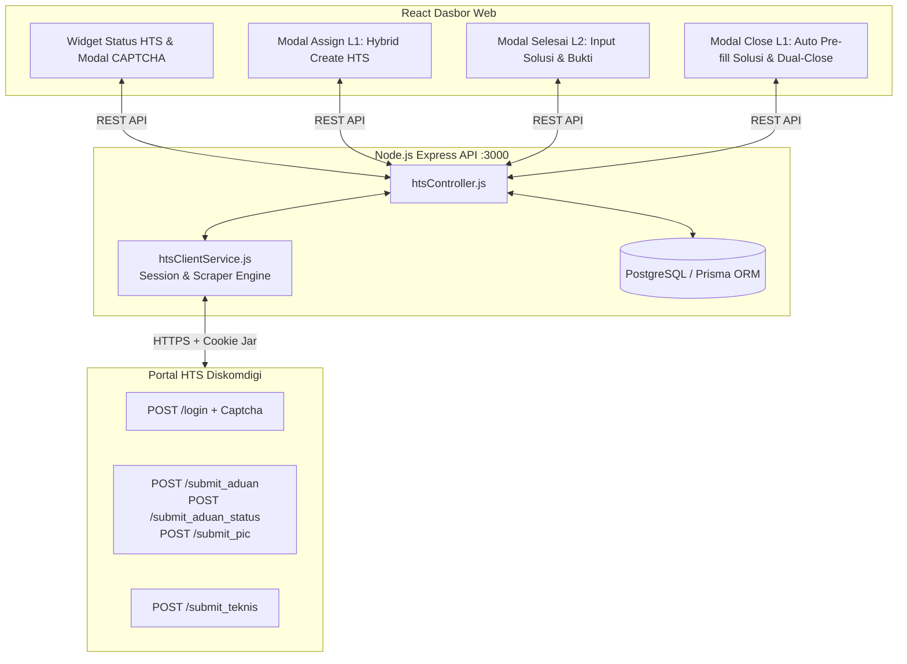

# 🚀 Implementation Plan V3: Integrasi Otomasi Portal HTS Diskomdigi Jateng

**Dokumen:** Rencana Implementasi Teknis & Panduan Pengembangan Bertahap  
**Target:** Integrasi Penuh Sistem Helpdesk WhatsApp dengan Portal HTS Diskomdigi (`https://hts.diskomdigi.jatengprov.go.id`)  
**Basis Dokumen:** [`docs/user-stories-v2.md`](./user-stories-v2.md)  
**Status:** Fase 1 Selesai, Menuju Fase 2  
**Tanggal Diperbarui:** 29 September 2026  

---

## 📌 1. Ikhtisar Arsitektur Teknis



---

## 🗄️ 2. Penyesuaian Skema Database (`schema.prisma`)

Perubahan skema Prisma untuk mengelola sesi akun HTS individual per-petugas L1 serta menyimpan status tiket HTS:

```prisma
// 1. Relasi sesi HTS pada User
model User {
  id           Int              @id @default(autoincrement())
  name         String
  email        String           @unique
  password     String
  role         Role             @default(L2)
  category_id  Int?
  category     Category?        @relation(fields: [category_id], references: [id])
  messages     Message[]
  hts_email    String?          // Email akun HTS petugas (opsional)
  hts_session  HtsUserSession?  // Sesi aktif HTS petugas
}

// 2. Model Sesi Login HTS individual per-user (L1/Admin)
model HtsUserSession {
  id           Int      @id @default(autoincrement())
  user_id      Int      @unique
  user         User     @relation(fields: [user_id], references: [id], onDelete: Cascade)
  cookie_data  String   @db.Text   // Simpan cookie PHP ci_session
  is_logged_in Boolean  @default(false)
  last_login   DateTime @default(now())
  updated_at   DateTime @updatedAt
}

// 3. Kolom tracking HTS pada Ticket
model Ticket {
  id                 Int              @id @default(autoincrement())
  customer_id        Int
  customer           Customer         @relation(fields: [customer_id], references: [id])
  status             TicketStatus     @default(OPEN)
  service_type       ServiceType?
  summary            String?
  hts_ticket_id      String?          // ID internal HTS (contoh: "2025")
  hts_ticket_no      String?          // Nomor aduan resmi HTS (contoh: "2025-TShoot-2026-jateng-09")
  hts_ticket_status  String?          // Status HTS: "UNSUBMITTED" | "INPUT_PIC" | "PENDING" | "SOLVED"
  hts_synced_at      DateTime?        // Waktu terakhir sinkronisasi HTS
  created_at         DateTime         @default(now())
  closed_at          DateTime?
  categories         TicketCategory[]
  messages           Message[]
}

// 4. Kolom solusi pada relasi TicketCategory (Penyelesaian Mandiri L2)
model TicketCategory {
  ticket_id   Int
  category_id Int
  is_resolved Boolean   @default(false)
  resolved_at DateTime?
  solution    String?   @db.Text  // Teks solusi teknis dari L2 saat klik Tandai Selesai
  ticket      Ticket    @relation(fields: [ticket_id], references: [id])
  category    Category  @relation(fields: [category_id], references: [id])

  @@id([ticket_id, category_id])
}
```

---

## 🗺️ 3. Rencana Eksekusi Bertahap (Fase 1 s/d Fase 4)

### ✅ FASE 1: Gateway Sesi Portal HTS, Solver CAPTCHA & Layanan Backend (SELESAI)
**Tujuan:** Memungkinkan setiap petugas L1 menghubungkan akun portal HTS pribadinya ke Helpdesk dan mempertahankan sesi aktif.

#### Rincian Penyelesaian:
1. **Modul Layanan `backend/src/services/htsClientService.js`:**
   - [x] Parsing dan serialization cookie PHP `ci_session` & `csrf_cookie_name`.
   - [x] `getCaptchaStream(userId)`: Mengambil live image captcha dari HTS dan mengonversi ke base64 data URL.
   - [x] `login(userId, email, password, captchaCode)`: Melakukan POST login ke HTS dan menyimpan sesi cookie ke database.
   - [x] `checkSession(userId)`: Verifikasi status sesi aktif.
   - [x] `logout(userId)`: Putus sambungan sesi.
2. **Endpoint API di `backend/src/routes/hts.js` & `htsController.js`:**
   - [x] `GET /api/hts/status`: Status sesi user saat ini.
   - [x] `GET /api/hts/captcha`: Live captcha base64 & token CSRF.
   - [x] `POST /api/hts/login`: Login akun HTS per-petugas.
   - [x] `POST /api/hts/logout`: Logout sesi HTS.
3. **Database Prisma:**
   - [x] Migrasi model `HtsUserSession`, kolom `hts_*` di `Ticket`, dan `solution` di `TicketCategory` via `prisma db push`.
4. **Antarmuka Frontend Dasbor (`frontend/src/App.jsx`):**
   - [x] Card status koneksi HTS di panel kanan dasbor (khusus L1 & Admin) dengan indikator Terhubung / Belum Login.
   - [x] Modal popup login HTS dengan preview live image captcha, tombol refresh, dan validasi form.
   - [x] Build frontend sukses tanpa error.

---

### 📋 FASE 2: Master Data Caching & Otomasi Pembuatan Tiket L1 (Modal Assign Hybrid)
**Tujuan:** L1 dapat mendelegasikan tiket ke L2 internal sekaligus membuatkan tiket resmi di HTS dalam 1 klik.

#### Rencana Tugas:
1. **Master Data Cache di Backend:**
   - Endpoint `GET /api/hts/master-data` (97 OPD Induk, Kategori, 6 Sub-kategori, 17 PIC).
2. **Fungsi Otomasi Pipeline di `htsClientService.js`:**
   - `createTicketPipeline(userId, ticketData, attachmentFile)`:
     - `POST /submit_aduan` ➔ `POST /submit_aduan_status` ➔ `POST /submit_pic`.
     - Simpan `hts_ticket_id`, `hts_ticket_no`, dan status `PENDING`.
3. **Pembaruan Modal Assign L2 di Frontend:**
   - Checkbox toggle: `[✔] Sekaligus Buat Tiket Resmi di Portal HTS Diskomdigi`.
   - Dropdown pencarian OPD Induk, Kategori, dan Sub-kategori.
   - Tombol susulan `[+ Sinkronkan ke HTS]` pada detail tiket.

---

### 🔧 FASE 3: Penyelesaian Teknis L2 & Penutupan Ganda L1 (Dual-Close)
**Tujuan:** L2 mengisi solusi teknis di modal "Tandai Selesai" internal, dan L1 menutup tiket sekaligus mengeksekusi `submit_teknis` di portal HTS.

#### Rencana Tugas:
1. **Modal Penyelesaian Teknis L2 di Frontend:**
   - Modal saat L2 klik *"Tandai Selesai"*: Input solusi perbaikan + upload foto bukti.
   - Auto-posting ke Catatan Internal bertag tim L2.
2. **Fungsi Penyelesaian HTS di `htsClientService.js`:**
   - `solveTicketHts(userId, htsTicketId, { solutionText, picId, solvedDate, solvedTime, proofFile })`:
     - `POST /submit_input_teknis` ➔ `POST /submit_teknis`.
3. **Pembaruan Modal "Selesaikan Tiket" L1:**
   - Auto pre-fill solusi dari catatan internal L2 terakhir.
   - Dropdown PIC teknisi penanganan HTS.
   - Eksekusi serentak penutupan tiket lokal (`CLOSED`) dan tiket HTS (`SOLVED`).

---

### ✅ FASE 4: Pengujian Menyeluruh (End-to-End) & Penanganan Kasus Kendala
- [ ] Fallback sesi kedaluwarsa & retry mechanism.
- [ ] Kolom Nomor Tiket HTS pada Laporan Rekapitulasi & Export CSV.

