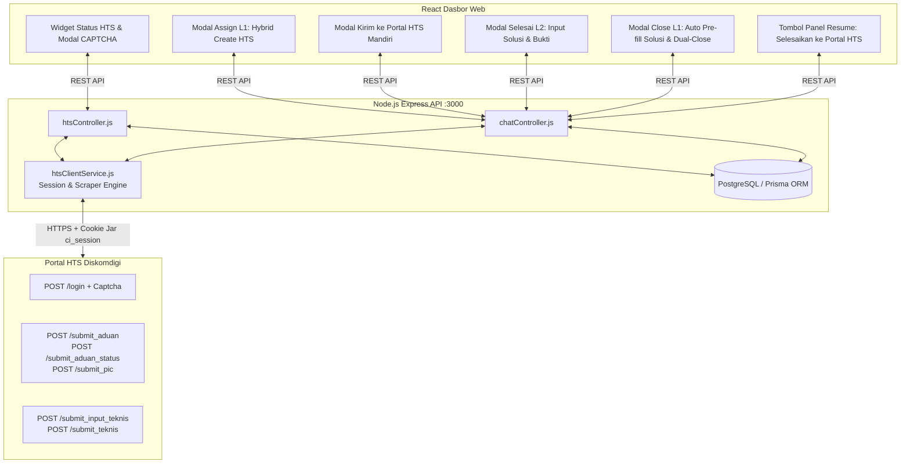

# 🚀 Implementation Plan V3: Integrasi Otomasi Portal HTS Diskomdigi Jateng
**Dokumen:** Rencana Implementasi Teknis & Panduan Pengembangan Bertahap  
**Target:** Integrasi Penuh Sistem Helpdesk WhatsApp dengan Portal HTS Diskomdigi (`https://hts.diskomdigi.jatengprov.go.id`)  
**Basis Dokumen:** [`docs/user-stories-v2.md`](./user-stories-v2.md)  
**Status:** ✅ Selesai 100% (Seluruh Fase Terimplementasi & Teruji)  
**Tanggal Diperbarui:** 30 September 2026  

---

## 📌 1. Ikhtisar Arsitektur Teknis



---

## 🗄️ 2. Skema Database Final (`schema.prisma`)

```prisma
// 1. Relasi sesi HTS pada User
model User {
  id           Int              @id @default(autoincrement())
  name         String
  email        String           @unique
  password     String
  role         Role             @default(L2)
  category_id  Int?
  category     Category?        @relation(fields: [category_id], references: [id])
  messages     Message[]
  hts_email    String?          // Email akun HTS petugas (opsional)
  hts_session  HtsUserSession?  // Sesi aktif HTS petugas
}

// 2. Model Sesi Login HTS individual per-user (L1/Admin)
model HtsUserSession {
  id           Int      @id @default(autoincrement())
  user_id      Int      @unique
  user         User     @relation(fields: [user_id], references: [id], onDelete: Cascade)
  cookie_data  String   @db.Text   // Simpan cookie PHP ci_session
  is_logged_in Boolean  @default(false)
  last_login   DateTime @default(now())
  updated_at   DateTime @updatedAt
}

// 3. Kolom tracking HTS pada Ticket
model Ticket {
  id                 Int              @id @default(autoincrement())
  customer_id        Int
  customer           Customer         @relation(fields: [customer_id], references: [id])
  status             TicketStatus     @default(OPEN)
  service_type       ServiceType?
  summary            String?
  hts_ticket_id      String?          // ID internal HTS (contoh: "2025")
  hts_ticket_no      String?          // Nomor aduan resmi HTS (contoh: "2025-TShoot-2026-jateng-09")
  hts_ticket_status  String?          // Status HTS: "UNSUBMITTED" | "INPUT_PIC" | "PENDING" | "SOLVED"
  hts_pic_ids        String?          // JSON array ID PIC penerima & penanganan HTS
  hts_synced_at      DateTime?        // Waktu terakhir sinkronisasi HTS
  created_at         DateTime         @default(now())
  closed_at          DateTime?
  categories         TicketCategory[]
  messages           Message[]
}

// 4. Kolom solusi pada relasi TicketCategory (Penyelesaian Mandiri L2)
model TicketCategory {
  ticket_id   Int
  category_id Int
  is_resolved Boolean   @default(false)
  resolved_at DateTime?
  solution    String?   @db.Text  // Teks solusi teknis dari L2 saat klik Tandai Selesai
  ticket      Ticket    @relation(fields: [ticket_id], references: [id])
  category    Category  @relation(fields: [category_id], references: [id])

  @@id([ticket_id, category_id])
}
```

---

## 🗺️ 3. Rekapitulasi Eksekusi Bertahap (Fase 1 s/d Fase 4)

### ✅ FASE 1: Gateway Sesi Portal HTS, Solver CAPTCHA & Layanan Backend (SELESAI)
- [x] Parsing dan serialization cookie PHP `ci_session` & `csrf_cookie_name`.
- [x] `getCaptchaStream(userId)`: Mengambil live image captcha numerik dari HTS dan mengonversi ke base64 data URL.
- [x] `login(userId, email, password, captchaCode)`: Melakukan POST login ke HTS dan menyimpan sesi cookie ke database.
- [x] `checkSession(userId)`: Verifikasi status sesi aktif via ping ringan `/api/notif`.
- [x] `logout(userId)`: Putus sambungan sesi.
- [x] Endpoint API di `backend/src/routes/hts.js` & `htsController.js` (`/status`, `/captcha`, `/login`, `/logout`).
- [x] Widget status koneksi HTS di panel kanan dasbor (khusus L1 & Admin) dengan indikator Terhubung / Belum Login.
- [x] Modal popup login HTS dengan preview live image captcha, tombol refresh, dan validasi form.

---

### ✅ FASE 2: Master Data Caching & Otomasi Pembuatan Tiket L1 (SELESAI)
- [x] Master data JSON cache `htsMasterData.json` (OPD Induk, Kategori, Sub-kategori, PIC teknisi) diekspos via `GET /api/hts/master-data`.
- [x] Fungsi Otomasi Pipeline di `htsClientService.js`:
  - `createTicketPipeline(userId, ticketData)` mengeksekusi urutan 3 endpoint HTS:
    1. `POST /submit_aduan` (menerbitkan nomor aduan resmi HTS).
    2. Lookup `id_trouble` numerik asli database HTS via `POST /get_aduan_data` (status: `unsubmitted`).
    3. `POST /submit_aduan_status` (memindahkan status dari unsubmitted ke input-pic).
    4. `POST /submit_pic` (menetapkan PIC awal penerima aduan).
- [x] Modal Penugasan L2 Hybrid: Checkbox toggle sinkronisasi HTS langsung saat assign.
- [x] Modal Mandiri "Kirim ke Portal HTS": Form khusus pada tiket aktif untuk sinkronisasi kapan saja.
- [x] Penyempurnaan Form HTS:
  - Sub-kategori HTS dinonaktifkan jika kategori bukan *Troubleshoot*.
  - OPD Induk bersifat opsional dengan pencarian typeahead interaktif.
  - Validasi detil permasalahan minimal 10 karakter dengan live counter.

---

### ✅ FASE 3: Penyelesaian Teknis L2 & Penutupan Ganda L1 (Dual-Close) (SELESAI)
- [x] Modal Penyelesaian Teknis L2: Input teks solusi perbaikan saat L2 klik *"Tandai Selesai"*, disimpan ke `TicketCategory.solution`.
- [x] Auto-agregasi teks solusi teknis dari seluruh tim L2 ke draf kesimpulan penutupan L1.
- [x] Fungsi Penyelesaian HTS di `htsClientService.js` (`solveTicketHts`):
  - `POST /submit_input_teknis` ➔ `POST /submit_teknis` (mengirim detil penanganan, array PIC koma `"14,8"`, waktu, dan lampiran bukti).
- [x] Modal Penutupan Tiket L1:
  - Checkbox Dual-Close: Menyelesaikan tiket lokal sekaligus tiket HTS.
  - Lampiran bukti penanganan teknis (dukungan format `.jpg`, `.jpeg`, `.png`, `.pdf`).
  - Proteksi Integritas: Jika penyelesaian HTS gagal, penutupan tiket lokal dibatalkan agar percakapan tetap terbuka.
- [x] Fitur Tombol "Selesaikan ke Portal HTS" di panel resume kanan untuk tiket yang berstatus lokal closed tetapi di HTS masih pending.

---

### ✅ FASE 4: Sinkronisasi & Penyambungan PIC Penerima & PIC Penanganan (SELESAI)
- [x] Kolom `hts_pic_ids` pada basis data `Ticket` untuk mencatat riwayat ID PIC awal.
- [x] Pre-fill & Auto-check PIC Penerima awal saat modal penutupan tiket dibuka oleh L1.
- [x] Pembeda visual pada daftar PIC modal close: Badge hijau **`PIC Penerima`** vs Badge biru **`PIC Penanganan`**.
- [x] Penggabungan (*Merge tanpa duplikat*) antara PIC Penerima awal dan PIC Penanganan akhir di backend sebelum dikirim ke HTS.
- [x] Pengiriman format string koma (`pic_id = "14,8"`) yang sesuai dengan spesifikasi form script portal HTS Diskomdigi.
