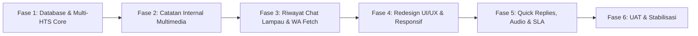

# 📋 Implementation Plan V4: Rombak Besar Sistem Helpdesk & Multi-HTS
**Proyek:** HTS Chat Integration (WhatsApp Helpdesk to Web Ticketing System)  
**Versi Target:** Workflow V4.0 Produksi  
**Basis Dokumen:** [`docs/V4_Roadmap_Multi_HTS_and_Architecture_Redesign.md`](./V4_Roadmap_Multi_HTS_and_Architecture_Redesign.md) & [`docs/V4_Technical_Specification_and_Migration_Guide.md`](./V4_Technical_Specification_and_Migration_Guide.md)  
**Strategi Pengembangan:** Bertahap (*Phased Milestone Execution*) — Memastikan stabilitas sistem produksi di setiap langkah  
**Tanggal:** 30 September 2026  

---

## 📌 1. Ikhtisar Rencana Kerja Bertahap (Sprint Overview)

Pengembangan V4 dibagi menjadi **6 Fase Terstruktur** yang dirancang agar dapat dikerjakan secara perlahan, aman, dan tanpa mengganggu data atau operasional Helpdesk yang sedang berjalan:

| Fase | Fokus Pengembangan | Estimasi Tingkat Risiko | Dampak Langsung ke User |
|:---:|---|:---:|---|
| **Fase 1** | Skema Prisma `TicketHts`, Migrasi Data Aman, dan Keep-Alive Sesi HTS | **Sedang** | 1 Chat WhatsApp bisa terhubung ke banyak tiket HTS resmi. Sesi HTS anti-logout. |
| **Fase 2** | Catatan Internal Multimedia L1 $\leftrightarrow$ L2 & Pemilihan Bukti Foto HTS | **Rendah** | L2 bisa mengirim foto kabel/perangkat di lapangan tanpa bocor ke WhatsApp pelapor. |
| **Fase 3** | Timeline Divider Chat Masa Lalu & On-Demand WhatsApp History Fetch | **Rendah** | L1 bisa membaca histori tiket lampau secara terlipat (*dimmed*) tanpa takut banned. |
| **Fase 4** | Redesign UI/UX 3 Kolom, Slide-over Drawer, dan Responsivitas Layar | **Sedang** | Antarmuka bersih, modal pop-up hilang, form anti-terpotong di laptop & HP. |
| **Fase 5** | Quick Replies (`/canned`), Notifikasi Suara L2, dan Metrik SLA (FRT/MTTR) | **Rendah** | L1 hemat waktu mengetik pesan rutin, L2 tanggap suara notif, laporan SPV lengkap. |
| **Fase 6** | Pengujian Menyeluruh (UAT), Verifikasi Keamanan, dan Deployment Produksi | **Rendah** | Sistem rilis stabil 100%. |

---

## 🛠️ 2. Rincian Checklist & Panduan Teknis per Fase

---

### 🔹 FASE 1: Fondasi Multi-HTS, Migrasi Data & Sesi Anti-Logout (Backend Core)
**Tujuan:** Mempersiapkan basis data dan layanan inti agar 1 tiket chat lokal dapat menampung banyak tiket HTS secara independen, serta menjaga sesi login HTS tetap hidup.

#### Checklist Pekerjaan:
- [x] **1.1. Pembaruan Skema Basis Data (`schema.prisma`):**
  - Model `TicketHts` dengan relasi ke `Ticket` dan `Category`.
  - Relasi `hts_tickets TicketHts[]` pada model `Ticket`.
  - Nilai enum `GENERAL_CHAT` pada `ServiceType`.
  - Atribut `is_aduan Boolean @default(false)` pada model `Ticket`.
- [x] **1.2. Eksekusi Skrip Migrasi Data (*Zero Data Loss*):**
  - Dibuat skrip migrasi SQL otomatis di `backend/src/scripts/migrateV4.js` (`npm run migrate:v4`).
  - Kolom `is_aduan` diset `true` untuk seluruh tiket historis lama dan default `false` untuk tiket baru.
  - Skrip migrasi data dari kolom lama `Ticket.hts_ticket_no` ke tabel baru `TicketHts`.
- [x] **1.3. Layanan Backend Multi-HTS & Percakapan Biasa (`chatController.js` & `chat.js`):**
  - Menerbitkan tiket HTS baru ke tiket aktif (`POST /api/chat/tickets/:ticketId/hts`).
  - Mengambil seluruh tiket HTS terhubung (`GET /api/chat/tickets/:ticketId/hts`).
  - Menyelesaikan tiket HTS spesifik secara mandiri (`POST /api/chat/tickets/:ticketId/hts/:htsId/solve`).
  - Toggle manual status aduan (`PATCH /api/chat/tickets/:ticketId/toggle-aduan`).
  - Penyelesaian cepat percakapan biasa (`POST /api/chat/tickets/:ticketId/close-general`).
  - Pengetatan query antrean L2 pada `getTickets` (`is_aduan: true`).
  - Auto-promote aduan pada penugasan tim L2 (`assignTicket`) dan pembuatan tiket HTS.
  - Dukungan filter laporan dan SLA pada `reportController.js`.
- [x] **1.4. Penjaga Sesi HTS Tetap Aktif (*Keep-Alive Heartbeat*):**
  - Dibuat modul `backend/src/services/htsKeepAliveService.js`.
  - Dijalankan otomatis setiap 15 menit melalui `backend/src/index.js` untuk me-refresh sesi petugas login.

---

### 🔹 FASE 2: Catatan Internal Multimedia Dua Arah (L1 $\leftrightarrow$ L2)
**Tujuan:** Memungkinkan teknisi lapangan L2 dan dispatcher L1 saling berkirim foto/media di dalam ruang obrolan internal dengan jaminan 100% rahasia tidak bocor ke WhatsApp pelapor.

#### Checklist Pekerjaan:
- [x] **2.1. Endpoint Backend Media Internal:**
  - Buat endpoint `POST /api/chat/tickets/:ticketId/internal-media` dengan middleware `upload.single('media')`.
  - Simpan berkas ke direktori `/uploads/internal_xxx.jpg`.
  - Buat record `Message` dengan atribut `is_internal: true` dan `attachment_url`.
  - Pastikan pesan media internal **TIDAK PERNAH** dikirim ke Evolution API / WhatsApp pelapor.
  - Broadcast event Socket.io `new_message` khusus klien web dasbor.
- [x] **2.2. Antarmuka Pengiriman Gambar Catatan Internal di Frontend:**
  - Tambahkan tombol ikon klip (📎) pada tab Catatan Internal L1 dan input box teknisi L2.
  - Tambahkan preview gambar sebelum dikirim.
  - Render gelembung catatan internal dengan thumbnail gambar yang dapat diklik untuk memperbesar (*lightbox preview*).
- [x] **2.3. Integrasi Foto L2 ke Bukti Penyelesaian HTS:**
  - Pada formulir penyelesaian tiket HTS, sediakan opsi pilihan:
    - `(•) Pilih dari Foto Catatan Internal L2`
    - `( ) Unggah File Baru dari Komputer`
  - L1 dapat memilih foto hasil pekerjaan L2 langsung sebagai berkas bukti penyelesaian teknis HTS.

---

### 🔹 FASE 3: Timeline Divider Riwayat Chat Lampau & Penarikan WA Lama
**Tujuan:** Memberikan konteks riwayat percakapan lampau bagi L1 tanpa membingungkan penanganan masalah baru, serta kemampuan menarik chat WhatsApp lama secara aman.

#### Checklist Pekerjaan:
- [x] **3.1. Endpoint Riwayat Tiket Lampau Lokal:**
  - Buat endpoint `GET /api/chat/customers/:customerId/history-messages` untuk mengambil pesan-pesan dari tiket pelanggan tersebut yang statusnya sudah `CLOSED`.
- [x] **3.2. Komponen Frontend *Accordion Timeline Divider*:**
  - Tampilkan tombol collapsible di atas ruang chat: `📜 [ Lihat 2 Percakapan Lampau Pelanggan Ini ]`.
  - Jika dibuka, gelembung chat lama ditampilkan dengan gaya redup (*dimmed / semi-transparan*) dan dipisahkan oleh garis batas penanda waktu penutupan tiket:  
    `── 🔒 TIKET LALU #12 (Closed pada 15/09/2026 - Kendala Jaringan) ──`
  - Di bawahnya terdapat garis hijau pemisah:  
    `── 🟢 PERCAKAPAN AKTIF SAAT INI (Tiket #24) ──`
- [x] **3.3. Penarikan Riwayat WhatsApp Lama (*On-Demand Lazy-Load*):**
  - Buat endpoint `POST /api/chat/customers/:customerId/fetch-wa-history` dengan parameter `limit: 20`.
  - Panggil Evolution API `/chat/findMessages` khusus nomor tersebut.
  - Beri penanda badge khusus: `📥 Arsip WhatsApp Lama`.
  - **Aman dari Blokir Meta:** Hanya menarik 10–20 pesan untuk 1 kontak saat diklik oleh petugas.

---

### 🔹 FASE 4: Redesign UI/UX 3 Kolom, Slide-Over Drawer & Responsivitas Layar
**Tujuan:** Merombak tampilan agar bersih (*clean desk*), menghilangkan modal tumpang tindih, dan adaptif di layar laptop (1366×768) maupun ponsel L2.

#### Checklist Pekerjaan:
- [x] **4.1. Tata Letak Baru 3 Kolom & Toggle Status:**
  - **Kolom Kiri:** Filter tab rapi (`Semua`, `Aduan Teknis`, `Percakapan Biasa`, `Pending HTS`, `Closed`).
  - **Kolom Tengah:** Ruang percakapan lega dengan dual-tab input (WhatsApp vs Catatan Internal), dilengkapi **Toggle Sakelar di Header:** `[ 💬 Percakapan Biasa ]` $\leftrightarrow$ `[ 🚨 Aduan Teknis ]`.
  - **Auto-Promotion:** Jika L1 mengklik assign L2 atau terbitkan HTS saat mode percakapan biasa, toggle otomatis bergeser ke `Aduan Teknis`.
  - **Kolom Kanan (Pusat Kendali Adaptif):**
    - **Ketika Mode Percakapan Biasa:** Menampilkan informasi status santai dan tombol cepat: **`[ ✅ Selesaikan Percakapan ]`**.
    - **Ketika Mode Aduan Teknis:** Mengaktifkan Tab Hub Multi-HTS, Tab Tim L2, dan Tab Info Pelapor.
- [x] **4.2. Penggantian Modal dengan Slide-Over Drawer (Laci Samping):**
  - Formulir penerbitan tiket HTS baru dan formulir penugasan tim membuka panel laci samping kanan yang meluncur halus (*slide-over drawer*).
  - Agen tetap dapat membaca percakapan di tengah sambil mengisi data HTS di laci samping.
- [x] **4.3. Fleksibilitas Resolusi Layar & Formulir Anti-Terpotong:**
  - **Laptop 1366×768:** Tombol toggle `[ 📑 ]` untuk melipat (*collapse*) panel kanan, membuat area chat melebar penuh.
  - **Sticky Header & Footer:** Tombol submit dan judul selalu menempel (*sticky*), hanya konten isian tengah yang bergulir (*max-h-[85vh] overflow-y-auto*). Tombol submit dijamin tidak pernah tenggelam di bawah layar.
  - **Mode Mobile Ponsel (< 768px):** Navigasi bertingkat satu layar penuh untuk teknisi L2 di lapangan dengan integrasi kamera langsung.

---

### 🔹 FASE 5: Efisiensi Kerja & Metrik Layanan (Quick Replies, Audio & SLA)
**Tujuan:** Mempercepat waktu respon L1, meningkatkan ketanggapan teknisi L2, dan memberikan laporan performa bagi pimpinan/SPV.

#### Checklist Pekerjaan:
- [x] **5.1. Fitur Balasan Cepat (*Quick Replies / Canned Responses*):**
  - Buat model `QuickReply` di database (`id`, `shortcut`, `title`, `content`).
  - Endpoint CRUD template balasan cepat di backend (`GET`, `POST`, `PUT`, `DELETE /api/chat/quick-replies`).
  - Di frontend, saat L1 mengetik garis miring (`/`) di kotak obrolan, muncul popup suggestion daftar template (misal `/salam`, `/aduan`, `/progres`, `/selesai`, `/tutup`, `/info`).
  - Navigasi keyboard (↑/↓, Enter, Tab, Esc) serta klik mouse langsung menyisipkan teks template ke kotak ketik.
  - Slide-over Drawer manajemen template untuk Admin/L1 menambah dan menghapus template kustom.
- [x] **5.2. Notifikasi Suara Web Audio & Desktop Alert Browser:**
  - Saat ada pesan masuk baru dari pelanggan (`CUSTOMER`) atau tiket baru ditugaskan ke tim L2, dasbor memainkan nada notifikasi audio synthesized Web Audio API native (*subtle dual-tone chime* D5 $\rightarrow$ A5 tanpa risiko 404 file mp3).
  - Tombol kontrol suara (Mute / Unmute) dan izin popup desktop alert browser (*HTML5 Desktop Notification*) di sidebar navigasi.
  - Notifikasi browser memunculkan popup interaktif saat tab diminimize atau latar belakang, klik notifikasi otomatis memfokuskan tab browser dan membuka tiket terkait.
- [x] **5.3. Metrik SLA & Kecepatan Respon pada Laporan SPV:**
  - Kalkulasi **First Response Time (FRT):** Selisih waktu pesan pertama pelanggan masuk hingga balasan pertama L1 dikirim.
  - Kalkulasi **Mean Time to Resolve (MTTR):** Selisih waktu tiket dibuat hingga berstatus `CLOSED` (khusus tiket `is_aduan = true`).
  - **Penyelarasan Laporan (1 Tabel Terpadu):** Menampilkan badge pembeda `[ 💬 Percakapan Biasa ]` vs `[ 🚨 Aduan Teknis ]` dengan filter bar tabs (`Semua`, `🚨 Aduan`, `💬 Biasa`).
  - 4 Kartu Ringkasan Metrik KPI di atas tabel laporan SPV (Total Aduan, Total Percakapan Biasa, Rata-Rata FRT, Rata-Rata MTTR Teknis).
  - Pastikan tiket `is_aduan = false` **100% dikecualikan** dari perhitungan MTTR teknis pada tabel dan ekspor CSV.

---

### 🔹 FASE 6: Pengujian Menyeluruh (UAT) & Stabilisasi Akhir
**Tujuan:** Memverifikasi seluruh skenario pengujian di lingkungan lokal dan LAN kantor sebelum rilis resmi.

#### Checklist Skenario Verifikasi:
- [x] Uji coba skenario percakapan biasa: Chat sapaan masuk $\rightarrow$ dibalas L1 $\rightarrow$ klik `[ Selesaikan Percakapan ]` $\rightarrow$ status `CLOSED` tanpa meminta input HTS/L2.
- [x] Uji coba isolasi L2: Dipastikan obrolan biasa **tidak pernah muncul** di layar antrean tim Network, Server, maupun M&E (`whereClause.is_aduan = true`).
- [x] Uji coba promosi otomatis: Mengubah chat biasa menjadi aduan teknis secara manual via toggle atau otomatis saat klik assign L2/HTS.
- [x] Uji coba verifikasi SLA SPV: Tiket percakapan biasa tidak merusak angka rata-rata durasi penyelesaian tiket (MTTR disetel `null` & dilabeli `N/A (Percakapan Biasa)`).
- [x] Uji coba skenario 2 kendala sekaligus: 1 tiket chat menerbitkan 2 tiket HTS (Network & Server) melalui relasi model `TicketHts`.
- [x] Uji coba penyelesaian parsial: Tiket HTS Network diselesaikan lebih dulu, tiket HTS Server masih pending.
- [x] Uji coba penutupan tiket lokal: Dipastikan seluruh tiket HTS terselesaikan dengan benar.
- [x] Uji coba kirim foto catatan internal L2: Dipastikan foto masuk ke web dasbor (`is_internal: true`) dan **TIDAK MUNCUL** di WhatsApp pelapor.
- [x] Uji coba pemilihan foto L2 sebagai bukti lampiran penutupan HTS melalui popover selector foto lampau.
- [x] Uji coba membuka dasbor di laptop 1366×768: Formulir tidak terpotong dan tombol simpan dapat diklik dengan nyaman (*Slide-over Drawer*, collapsible panel, sticky footer).
- [x] Uji coba membuka dari ponsel: Teknisi L2 dapat membuka tiket dan melampirkan foto kamera dengan lancar.
- [x] Uji coba Keep-Alive Heartbeat: Sesi HTS tetap aktif setelah ditinggal beberapa jam (`htsKeepAliveService.js`).

---

## 📅 3. Rekomendasi Urutan Eksekusi Bertahap

Untuk pengerjaan perlahan dan aman:
1. **Langkah Pertama:** Mulai dari **Fase 1** (Skema Database `TicketHts` & Migrasi Data). Ini tidak merusak antarmuka yang ada.
2. **Langkah Kedua:** Lanjutkan ke **Fase 2** (Catatan Internal Multimedia) dan **Fase 5.1** (Quick Replies). Keduanya memberikan peningkatan produktivitas instan bagi L1 & L2.
3. **Langkah Ketiga:** Kerjakan **Fase 3** (Riwayat Lampau) dan **Fase 4** (Redesign UI/UX 3 Kolom & Responsif).
4. **Langkah Terakhir:** Penyempurnaan **Fase 5.2 - 5.3** (Audio Alert & SLA) dan pengujian menyeluruh di **Fase 6**.
