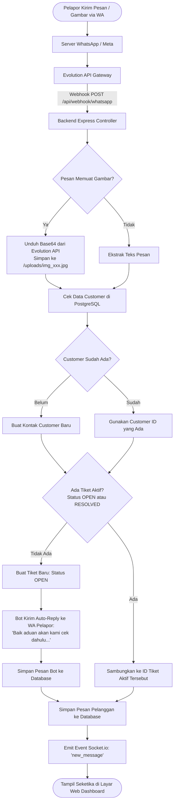
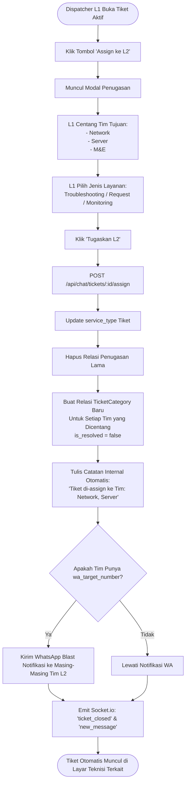
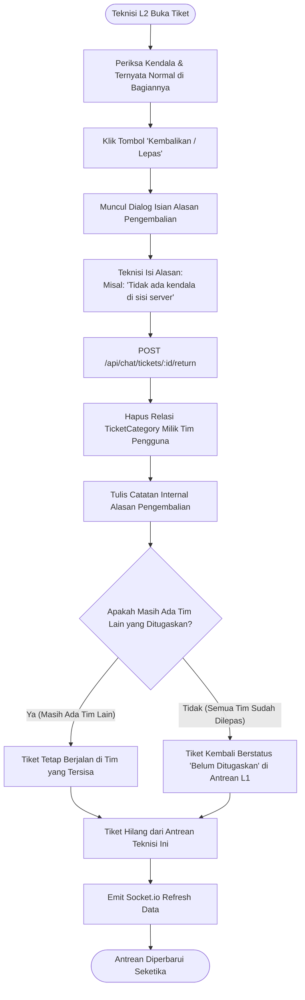
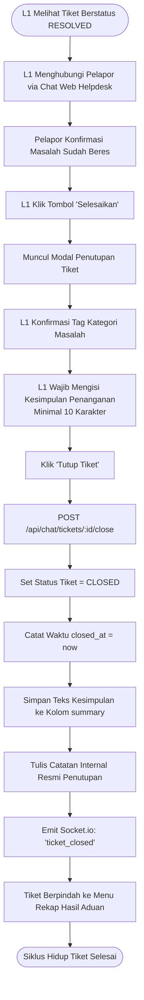

# 🔄 Diagram Alur Sistem (System Flowcharts)
**Proyek:** HTS Chat Integration (WhatsApp Helpdesk to Web Ticketing System)  
**Status:** Produksi / Workflow V2 (Multi-Assign, Per-Team Resolve, Return)

Dokumen ini memuat diagram alur proses (*Flowchart*) komprehensif menggunakan notasi Mermaid untuk seluruh skenario operasional sistem.

---

## 1. Alur Pesan Masuk Pelanggan (Inbound WhatsApp to Webhook)

Menjelaskan perjalanan pesan dari HP pelanggan, diterima Evolution API, diolah backend, disambungkan ke tiket aktif, hingga muncul di Web Dashboard secara *real-time*.



---

## 2. Alur Pendelegasian Multi-Assign L1 ke Tim L2 & WhatsApp Blast

Menjelaskan ketika Dispatcher L1 menugaskan satu atau lebih tim teknisi L2 (misal Network dan Server sekaligus).



---

## 3. Alur Penyelesaian Mandiri Per-Tim (Per-Team Resolution)

Menjelaskan bagaimana masing-masing tim L2 menyelesaikan bagiannya sendiri hingga tiket berstatus `RESOLVED`.

```mermaid
flowchart TD
    A([Teknisi L2 Buka Tiket di Antreannya]) --> B[Teknisi Selesai Menangani Masalah Bagiannya]
    B --> C[Klik Tombol 'Tandai Selesai']
    C --> D[POST /api/chat/tickets/:id/resolve]
    
    D --> E[Set is_resolved = true & resolved_at = now\nKhusus untuk Kategori Tim Pengguna Tersebut]
    E --> F[Tulis Catatan Internal:\n'Tim X telah menandai kendala di bagiannya selesai']
    
    F --> G{Apakah SEMUA Tim yang Ditugaskan\nSudah is_resolved = true?}
    
    G -- Belum (Ada Tim Lain yang Masih Kerja) --> H[Status Tiket Utama TETAP OPEN]
    H --> I[Layar Tampilkan Badge Status:\n✓ Tim Selesai | ⏳ Tim Masih Kerja]
    
    G -- Ya (Semua Tim Sudah Selesai) --> J[Ubah Status Tiket Utama Menjadi RESOLVED]
    J --> K[Tulis Catatan Internal:\n'Seluruh tim telah selesai menangani. Siap ditutup L1.']
    
    I --> L[Emit Socket.io Refresh Data]
    K --> L
    L --> M([Tiket Siap Ditindaklanjuti L1])
```

---

## 4. Alur Pengembalian Tiket / Pelepasan Tim Mandiri (Self-Unassign Return)

Menjelaskan jika teknisi mendapati kendala bukan di bagiannya dan ingin melepas penugasan tanpa mengganggu tim lain.



---

## 5. Alur Penutupan Tiket Resmi oleh Dispatcher L1 (Official Closure)

Menjelaskan tahapan akhir di mana L1 mengonfirmasi ke pelanggan dan menutup tiket dengan kesimpulan resmi.


