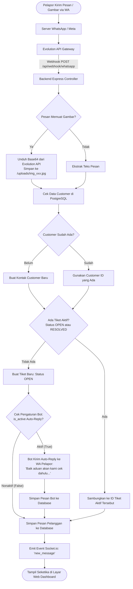
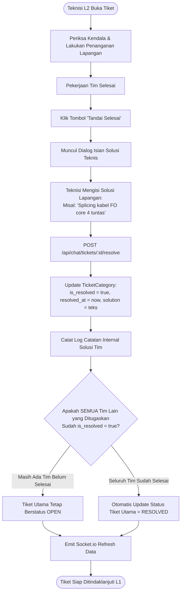
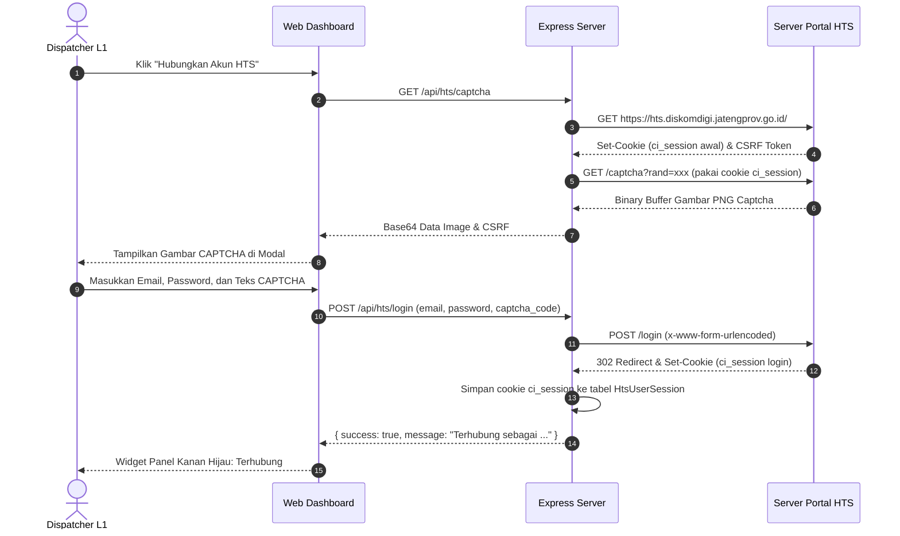
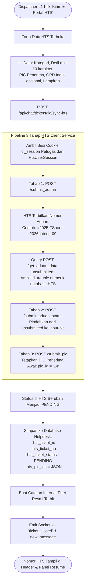

# 🔄 Diagram Alur Sistem (System Flowcharts)
**Proyek:** HTS Chat Integration (WhatsApp Helpdesk to Web Ticketing System)  
**Status:** Produksi / Workflow V3.0 (Full HTS Diskomdigi Integration, Smart Assign, Dual-Close & PIC Sync)

Dokumen ini memuat diagram alur proses (*Flowchart*) komprehensif menggunakan notasi Mermaid untuk seluruh skenario operasional sistem.

---

## 1. Alur Pesan Masuk Pelanggan (Inbound WhatsApp to Webhook)

Menjelaskan perjalanan pesan dari HP pelanggan, diterima Evolution API, diolah backend, disambungkan ke tiket aktif, hingga muncul di Web Dashboard secara *real-time*.



---

## 2. Alur Pendelegasian Smart Multi-Assign L1 ke Tim L2 & WhatsApp Blast

Menjelaskan ketika Dispatcher L1 menugaskan atau mengubah penugasan tim teknisi L2 (Network, Server, M&E). Sistem menggunakan *Smart Diffing* sehingga penugasan tim yang sudah berjalan tidak ter-reset atau terhapus secara tidak sengaja.

```mermaid
flowchart TD
    A([Dispatcher L1 Buka Tiket Aktif]) --> B[Klik Tombol 'Assign ke L2']
    B --> C[Muncul Modal Penugasan]
    C --> D[L1 Centang Tim Tujuan:\n- Network\n- Server\n- M&E]
    D --> E[L1 Pilih / Update Jenis Layanan:\nTroubleshooting / Request / Monitoring]
    E --> F[Klik 'Simpan Penugasan']
    
    F --> G[POST /api/chat/tickets/:id/assign]
    G --> H[Update service_type Tiket]
    H --> I[Hitung Diff Penugasan:\n- Existing (pertahankan status & is_resolved)\n- Added (buat TicketCategory baru)\n- Removed (hapus tim yang di-uncheck)]
    I --> J[Simpan Perubahan ke Database]
    
    J --> K[Tulis Catatan Internal Otomatis:\n'Tiket di-assign ke Tim: ...']
    K --> L{Cek Daftar Kontak di CategoryContact\nUntuk Tim yang Ditugaskan}
    
    L -- Ada Kontak Terdaftar --> M[Loop Kirim WhatsApp Blast ke Nomor / Grup Tim L2]
    L -- Tidak Ada Kontak --> N[Lewati Notifikasi WA]
    
    M --> O[Emit Socket.io: 'ticket_closed' & 'new_message']
    N --> O
    O --> P([Antrean Dashboard L2 & L1 Terupdate Seketika])
```

---

## 3. Alur Penyelesaian Mandiri Per-Tim (Per-Team Resolution by L2)

Menjelaskan alur saat masing-masing teknisi L2 menyelesaikan bagian tugasnya disertai catatan solusi teknis.



---

## 4. Alur Autentikasi Sesi HTS Petugas (Bypass CAPTCHA Visual)

Menjelaskan cara Dispatcher L1 menghubungkan akun resmi HTS Diskomdigi ke aplikasi Helpdesk.



---

## 5. Alur Penerbitan Tiket ke Portal HTS (Pipeline 3-Tahap)

Menjelaskan bagaimana sebuah tiket aduan di Helpdesk diproses hingga resmi terdaftar di portal HTS dengan nomor aduan dan PIC.



---

## 6. Alur Penutupan Tiket Resmi & Dual-Close HTS (PIC Sync)

Menjelaskan proses saat L1 menutup tiket di Helpdesk dan menyelesaikan tiket di portal HTS secara bersamaan.

```mermaid
flowchart TD
    A([L1 Klik Tombol 'Selesaikan Tiket']) --> B[Modal Penutupan Tiket Terbuka]
    B --> C[Draf Kesimpulan Terisi Otomatis dari Solusi L2]
    C --> D[PIC Penerima Awal Otomatis Tercentang\nBadge Hijau: PIC Penerima]
    D --> E[L1 Centang Teknisi L2 Tambahan jika Ada\nBadge Biru: PIC Penanganan]
    E --> F[L1 Lampirkan Foto Bukti Penyelesaian / Form Teknis]
    F --> G[Klik 'Tutup Tiket']
    
    G --> H[POST /api/chat/tickets/:id/close]
    H --> I{Apakah Tiket Terhubung ke HTS & closeHtsTicket = true?}
    
    I -- Ya --> J[Merge PIC Penerima Awal + PIC Penanganan Akhir\nContoh: ['14', '8']]
    J --> K[Tahap 1 HTS: POST /submit_input_teknis]
    K --> L[Tahap 2 HTS: POST /submit_teknis\npic_id = '14,8', detil solusi, foto bukti]
    
    L --> M{Apakah HTS Berhasil Merespon Success?}
    M -- Gagal / Error HTS --> N[BATALKAN Penutupan Tiket Lokal!\nKembalikan Error ke UI agar Chat Tetap Aman]
    M -- Berhasil --> O[Update Status HTS = SOLVED]
    
    I -- Tidak (Tiket Non-HTS) --> P[Lewati Submit Teknis HTS]
    
    O --> Q[Update Tiket Lokal: status = CLOSED, summary, closed_at]
    P --> Q
    Q --> R[Catat Catatan Internal Penutupan]
    R --> S[Emit Socket.io: 'ticket_closed']
    S --> T([Tiket Selesai & Berpindah ke Menu Rekap])
```
