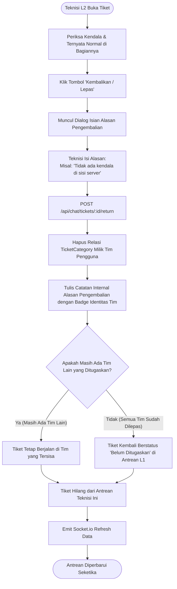
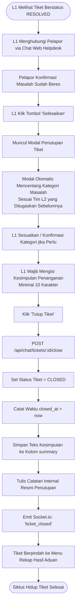

# 🔄 Diagram Alur Sistem (System Flowcharts)
**Proyek:** HTS Chat Integration (WhatsApp Helpdesk to Web Ticketing System)  
**Status:** Produksi / Workflow V2.2 (Multi-Assign, Per-Team Resolve, Return, Auto-Reply Toggle, Smart Assign, Multi-Contact Blast, Sequence Reset)

Dokumen ini memuat diagram alur proses (*Flowchart*) komprehensif menggunakan notasi Mermaid untuk seluruh skenario operasional sistem.

---

## 1. Alur Pesan Masuk Pelanggan (Inbound WhatsApp to Webhook)

Menjelaskan perjalanan pesan dari HP pelanggan, diterima Evolution API, diolah backend, disambungkan ke tiket aktif, hingga muncul di Web Dashboard secara *real-time*.


---

## 2. Alur Pendelegasian Smart Multi-Assign L1 ke Tim L2 & WhatsApp Blast

Menjelaskan ketika Dispatcher L1 menugaskan atau mengubah penugasan tim teknisi L2 (Network, Server, M&E). Sistem menggunakan *Smart Diffing* sehingga penugasan tim yang sudah berjalan tidak ter-reset atau terhapus secara tidak sengaja.

```mermaid
flowchart TD
    A([Dispatcher L1 Buka Tiket Aktif]) --> B[Klik Tombol 'Assign ke L2']
    B --> C[Muncul Modal Penugasan]
    C --> D[L1 Centang Tim Tujuan:\n- Network\n- Server\n- M&E]
    D --> E[L1 Pilih / Update Jenis Layanan:\nTroubleshooting / Request / Monitoring]
    E --> F[Klik 'Tugaskan L2']
    
    F --> G[POST /api/chat/tickets/:id/assign]
    G --> H[Update service_type Tiket]
    H --> I[Hitung Diff Penugasan:\n- Existing (tetap dipertahankan status & is_resolved)\n- Added (buat TicketCategory baru)\n- Removed (hapus tim yang tidak dicentang lagi)]
    I --> J[Simpan Perubahan ke Database]
    
    J --> K[Tulis Catatan Internal Otomatis:\n'Tiket di-assign ke Tim: ...']
    K --> L{Cek Daftar Kontak di CategoryContact\nUntuk Masing-Masing Tim yang Ditugaskan}
    
    L -- Ada Kontak Terdaftar --> M[Loop Kirim WhatsApp Blast Notifikasi ke Semua Nomor / Grup Tim L2]
    L -- Tidak Ada Kontak --> N[Lewati Notifikasi WA]
    
    M --> O[Emit Socket.io: 'ticket_closed' & 'new_message']
    N --> O
    O --> P([Tiket Otomatis Muncul di Layar Teknisi Terkait])
```

---

## 3. Alur Penyelesaian Mandiri Per-Tim (Per-Team Resolution)

Menjelaskan bagaimana masing-masing tim L2 menyelesaikan bagiannya sendiri hingga tiket berstatus `RESOLVED`.

```mermaid
flowchart TD
    A([Teknisi L2 Buka Tiket di Antreannya]) --> B[Teknisi Selesai Menangani Masalah Bagiannya]
    B --> C[Klik Tombol 'Tandai Selesai']
    C --> D[POST /api/chat/tickets/:id/resolve]
    
    D --> E[Set is_resolved = true & resolved_at = now\nKhusus untuk Kategori Tim Pengguna Tersebut]
    E --> F[Tulis Catatan Internal dengan Badge Identitas Tim:\n'[Tim Network] Tim Network telah menandai kendala selesai']
    
    F --> G{Apakah SEMUA Tim yang Ditugaskan\nSudah is_resolved = true?}
    
    G -- Belum (Ada Tim Lain yang Masih Kerja) --> H[Status Tiket Utama TETAP OPEN]
    H --> I[Layar Tampilkan Badge Status:\n✓ Tim Selesai | ⏳ Tim Masih Kerja]
    
    G -- Ya (Semua Tim Sudah Selesai) --> J[Ubah Status Tiket Utama Menjadi RESOLVED]
    J --> K[Tulis Catatan Internal:\n'Seluruh tim telah selesai menangani. Siap ditutup L1.']
    
    I --> L[Emit Socket.io Refresh Data]
    K --> L
    L --> M([Tiket Siap Ditindaklanjuti L1])
```

---

## 4. Alur Pengembalian Tiket / Pelepasan Tim Mandiri (Self-Unassign Return)

Menjelaskan jika teknisi mendapati kendala bukan di bagiannya dan ingin melepas penugasan tanpa mengganggu tim lain.



---

## 5. Alur Penutupan Tiket Resmi oleh Dispatcher L1 (Official Closure)

Menjelaskan tahapan akhir di mana L1 mengonfirmasi ke pelanggan dan menutup tiket dengan kesimpulan resmi serta auto pre-fill kategori masalah.



---

## 6. Alur Penghapusan Rekap Hasil Aduan & Reset Penomoran ID (Admin Only)

Menjelaskan pembersihan rekap tiket selesai oleh Administrator untuk keperluan maintenance atau reset data testing.

```mermaid
flowchart TD
    A([Admin Buka Menu Rekap Hasil Aduan]) --> B[Admin Pilih Tiket Tertentu atau Klik 'Hapus Semua']
    B --> C[Muncul Konfirmasi Peringatan Penghapusan Permanen]
    C --> D[Admin Menyetujui Penghapusan]
    
    D --> E[DELETE /api/reports/tickets]
    E --> F{Hapus Semua atau Terpilih?}
    
    F -- Terpilih (ids: [1, 2, ...]) --> G[Hapus Tiket CLOSED yang Dipilih Saja Beserta Pesan & Kategorinya]
    F -- Hapus Semua (all: true) --> H[Hapus SEMUA Tiket CLOSED Beserta Pesan & Kategorinya]
    H --> I[Cek Jumlah Tiket Aktif Tersisa]
    I --> J[Reset PostgreSQL Auto-Increment Sequence:\nALTER SEQUENCE tickets_id_seq RESTART WITH 1]
    
    G --> K[Kirim Response Berhasil]
    J --> K
    K --> L[Tabel Rekap Segera Kosong & Tiket Baru Berikutnya Mulai dari ID #1]
