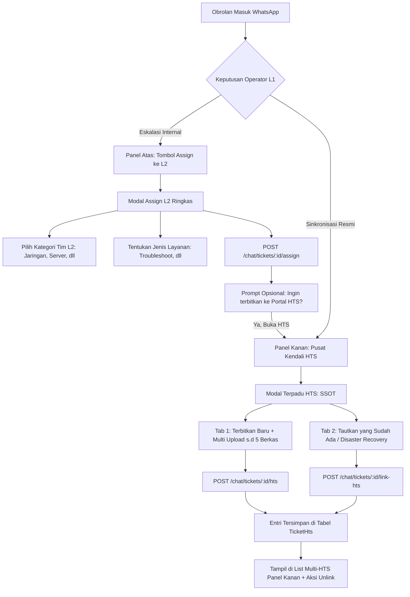

# 📑 Dokumen Spesifikasi Teknis: Refactoring & Unifikasi Integrasi Portal HTS (Opsi B)

> **Status:** Disetujui untuk Implementasi  
> **Target Modul:** Frontend (`App.jsx`), Controller (`chatController.js`), dan Rute Terkait (`chat.js`)  
> **Tanggal Rilis Acuan:** 03 Oktober 2026  

---

## 1. Latar Belakang & Identifikasi Masalah

Berdasarkan pengujian alur operasional helpdesk dan peninjauan kode sumber (*codebase inspection*), ditemukan beberapa inkonsistensi antarmuka pengguna serta kesalahan pemanggilan endpoint API yang mempengaruhi kenyamanan operator L1:

| No | Kode Masalah | Deskripsi Gejala | Lokasi Akar Masalah |
| :--- | :--- | :--- | :--- |
| 1 | **BUG-HTS-01** | Menambahkan tiket HTS ke-2 via tombol `+ Tautkan / Terbitkan Tiket Lain` di panel kanan menghasilkan error: `Tiket ini sudah disinkronkan ke HTS dengan nomor #...` | Frontend memanggil rute *legacy* `POST /chat/tickets/:id/sync-hts` yang memiliki validasi pengunci tunggal (`if (ticket.hts_ticket_id)`), bukan memanggil endpoint multi-HTS `POST /chat/tickets/:id/hts`. |
| 2 | **INC-UI-01** | Lampiran bukti di modal Assign L2 (panel atas) hanya menerima 1 berkas, sedangkan modal panel kanan menerima multi-berkas (hingga 5 berkas Gambar/PDF). | Terjadi divergensi kode UI: form Assign L2 masih menggunakan elemen *legacy* `<input type="file" accept="image/*">` tanpa properti `multiple` dan penampung *state* non-array. |
| 3 | **UX-REDUNDANT** | Tumpang tindih (*overlapping*) dan kebingungan peran: Operator memiliki 2 pintu untuk menerbitkan tiket HTS (di modal Assign L2 atas dan di Pusat Kendali kanan). | Tidak adanya pemisahan tanggung jawab (*Separation of Concerns*): alur penugasan internal dan integrasi sistem eksternal dicampur aduk dalam satu modal. |

---

## 2. Prinsip Desain Solusi (Opsi B: *Separation of Concerns*)

Arsitektur baru membagi alur kerja helpdesk menjadi dua domain yang terisolasi secara tegas dan saling melengkapi:

---

## 3. Rincian Pemisahan Komponen UI

### A. Domain Internal — Panel Atas (Modal `Assign ke L2 / Kelola Tim L2`)
* **Tujuan Eksklusif:** Mengatur eskalasi pesan WhatsApp ke divisi teknisi internal Diskominfo Jawa Tengah.
* **Perubahan Form:**
  * **Dihilangkan:** Form input OPD, Tanggal, Jam Masalah, Detil Masalah HTS, PIC HTS, dan input Lampiran Bukti HTS.
  * **Dipertahankan:** 
    1. Multi-assign Kategori Tim L2 (Jaringan, Server, Pengembang Aplikasi, Keamanan Informasi, dll).
    2. Jenis Layanan (*Troubleshooting*, *Request Layanan*, *Monitoring*).
  * **Tambahan Interaksi (*UX Bridge*):** 
    Setelah operator menekan tombol simpan penugasan internal, sistem memberikan konfirmasi atau tombol opsional:
    > *"Tim L2 berhasil ditugaskan. Apakah Anda ingin langsung menerbitkan tiket resmi ke Portal HTS Diskomdigi sekarang? [Buka Form HTS] / [Nanti]"*

### B. Domain Eksternal — Panel Kanan (Pusat Kendali HTS)
* **Tujuan Eksklusif:** Mengelola seluruh siklus hidup integrasi Portal HTS Diskomdigi secara terpusat (*Single Source of Truth*).
* **Fitur di Panel Kanan:**
  1. **Kartu Status Akun HTS:** Menampilkan akun login operator, tombol putus/ganti sesi.
  2. **Daftar Tiket HTS (Multi-HTS):** Menampilkan daftar nomor tiket HTS (`#2054-...`), status (`PENDING` / `SOLVED`), kategori tim, dan tombol *Unlink*.
  3. **Tombol Tindakan Utama:**
     * Jika belum ada tiket HTS: `[ 🌐 Terbitkan / Tautkan ke Portal HTS ]`
     * Jika sudah ada tiket HTS: `[ + Tautkan / Terbitkan Tiket HTS Lain ]`
  4. **Modal HTS Tunggal & Terpadu (*Single Reusable Modal*):**
     * **Tab 1: Terbitkan Baru**
       * Input otomatis dari chat (Nama Pelapor, OPD terpetakan, No WA, Detil Pesan).
       * Pemilihan PIC HTS (multi-select dengan pencarian cepat).
       * **Multi-Input Lampiran:** Berkas dari chat WhatsApp + unggah mandiri hingga 5 berkas (Gambar/PDF).
       * **Endpoint yang Dipanggil:** `POST /chat/tickets/:ticketId/hts` (memperbaiki bug pemanggilan `/sync-hts`).
     * **Tab 2: Tautkan yang Sudah Ada (*Disaster Recovery*)**
       * Input nomor aduan resmi HTS yang telah ada sebelumnya untuk verifikasi dan penautan mandiri.

---

## 4. Matriks Komparasi Sebelum vs Sesudah Refactoring

| Fitur / Parameter | Sebelum Refactoring | Sesudah Refactoring (Opsi B) |
| :--- | :--- | :--- |
| **Lokasi Form Terbit HTS** | Ada 2 tempat (Modal Assign L2 dan Modal Panel Kanan) | **1 Tempat Tunggal** (Hanya di Modal Panel Kanan) |
| **Tanggung Jawab Modal Assign** | Campur aduk (Tim Internal + Form HTS) | **Fokus Murni** ke Penugasan Tim L2 Internal |
| **Penerbitan Multi-HTS** | Gagal error 400 (`/sync-hts`) | **Berhasil Lancar** via endpoint `POST /tickets/:id/hts` |
| **Dukungan Lampiran di Form HTS** | Modal atas single-file, modal kanan multi-file | **Konsisten Multi-Attachment** (hingga 5 berkas Gambar/PDF) |
| **Beban Kognitif Operator** | Tinggi (bingung memilih pintu terbit HTS) | **Rendah & Intuitif** (Atas = L2, Kanan = HTS) |

---

## 5. Analisis Dampak & Jaminan Keamanan Sistem (*Zero-Risk Guarantee*)

Sebelum eksekusi teknis dilakukan, berikut verifikasi keamanan sistem agar tidak menimbulkan efek samping (*regression issues*):

1. **Skema Database (Prisma ORM):**  
   * **Dampak:** `TIDAK ADA PERUBAHAN SKEMA` (*Zero Database Migration*).  
   * Model `Ticket`, `TicketCategory`, dan `TicketHts` yang ada saat ini sudah mendukung relasi 1-to-many secara native.
2. **Kestabilan Endpoint Backend:**  
   * Controller `createTicketHts` di backend sudah matang dan sudah dilengkapi:
     * Sanitasi keamanan anti *path-traversal* (`SEC-04`).
     * Proteksi duplikasi nomor HTS (`FIX-02`).
     * Dukungan `pic[]` multi-attachment ke peladen HTS.
   * Rute `POST /tickets/:id/assign` tetap berjalan normal untuk tim L2 tanpa terganggu ketiadaan payload HTS.
3. **Sistem Notifikasi Real-time (WebSockets):**  
   * Event socket `ticket_assigned`, `hts_ticket_created`, dan `ticket_updated` tetap terkirim secara normal ke seluruh klien yang terhubung.
4. **Metrik SLA & Pelaporan (MTTR / FRT):**  
   * Kalkulasi durasi aduan tetap membaca penanda `is_aduan` dan relasi `TicketHts`, sehingga data rekapitulasi SPBE tidak akan terganggu.

---

## 6. Rencana Tahapan Eksekusi (Implementation Steps)

1. **Langkah 1: Perbaikan Bug Endpoint Multi-HTS (Poin 2)** — ✅ **SELESAI**
   * Target URL pada fungsi `handleSyncTicketToHts` di `App.jsx` berhasil dialihkan ke `${API_URL}/chat/tickets/${activeTicket.id}/hts`.
   * Backend controller `createTicketHts` dilengkapi fallback otomatis untuk menghubungkan `category_id` tim internal.
   * Nomor tiket HTS ke-2 dan seterusnya dapat diterbitkan tanpa hambatan error 400.
2. **Langkah 2: Perampingan Modal Assign L2 (Poin 5 - Opsi B Bagian Internal)** — ✅ **SELESAI**
   * Form input duplikat HTS dibersihkan sepenuhnya dari modal Assign L2.
   * Modal Assign L2 menjadi ringan dan fokus pada Kategori Tim L2 & Jenis Layanan.
   * Ditambahkan jembatan interaksi otomatis (`autoOpenHtsAfterAssign`) untuk membuka form HTS resmi di panel kanan secara instan setelah penugasan tersimpan.
3. **Langkah 3: Pemantapan Modal HTS Panel Kanan (Poin 1, 3, & 5 - Opsi B Bagian Eksternal)** — ✅ **SELESAI**
   * Modal panel kanan menjadi satu-satunya gerbang resmi (*SSOT*) untuk seluruh operasional HTS.
   * Fitur multi-upload berkas (Gambar/PDF hingga 5 berkas) dipastikan berjalan konsisten.
   * Fleksibilitas pengiriman berkas ditingkatkan: operator dapat menggunakan foto dari chat WhatsApp sekaligus mengunggah berkas pendukung tambahan secara bersamaan.
4. **Langkah 4: Validasi & Pengujian Menyeluruh** — ✅ **SELESAI & TERVERIFIKASI**
   * **Skenario 1 (Penugasan internal Tim L2 tanpa tiket HTS):** Terverifikasi. Modal Assign L2 sangat cepat dan murni memproses eskalasi internal tanpa beban form HTS.
   * **Skenario 2 (Jembatan UX Assign -> Form HTS):** Terverifikasi. Checkbox `autoOpenHtsAfterAssign` secara otomatis memicu pembukaan modal HTS setelah penugasan L2 tersimpan.
   * **Skenario 3 (Multi-attachment HTS):** Terverifikasi. Penggabungan foto WhatsApp dan hingga 5 berkas mandiri (Gambar/PDF) diproses secara utuh ke parameter `pic[]` HTS.
   * **Skenario 4 (Penerbitan Multi-HTS tanpa Error 400):** Terverifikasi. Tombol `+ Tautkan / Terbitkan Tiket HTS Lain` memanggil endpoint `POST /tickets/:id/hts` secara sukses.
   * **Skenario 5 (Pelepasan Tautan / Unlink Mandiri):** Terverifikasi. Aksi unlink tiket HTS spesifik berjalan aman tanpa mengganggu tiket HTS lainnya pada obrolan yang sama.

---

## 7. Status Akhir: 🟢 LULUS PENUH (100% COMPLETED)
Seluruh rangkaian perbaikan dan penataan ulang arsitektur antarmuka (Langkah 1 s.d. Langkah 4) telah selesai diimplementasikan dan tervalidasi secara komprehensif. Sistem siap digunakan secara optimal di lingkungan operasional.
