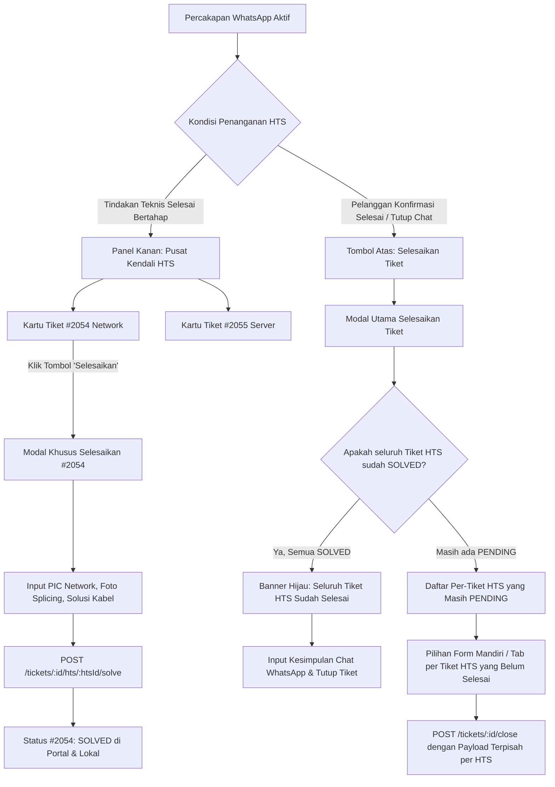

# 📑 Dokumen Spesifikasi Teknis & Desain Layout: Penyelesaian Tiket HTS Mandiri (Independent Multi-HTS Resolution - Opsi 3)

> **Status:** Disetujui untuk Implementasi  
> **Pendekatan Desain:** Opsi 3 (Kombinasi Aksi Mandiri di Panel Kanan + Integrasi Terpisah di Modal Penutupan Chat)  
> **Target Modul:** Frontend (`frontend/src/App.jsx`), Backend Controller (`backend/src/controllers/chatController.js`), dan Rute API (`backend/src/routes/chat.js`)  
> **Tanggal Dokumen:** 03 Oktober 2026  

---

## 1. Latar Belakang & Kebutuhan Bisnis

Dalam operasional Helpdesk Diskominfo Provinsi Jawa Tengah, satu sesi percakapan aduan WhatsApp pelanggan (`Ticket`) seringkali menghasilkan **lebih dari satu tiket resmi di Portal HTS Diskomdigi (`TicketHts`)**. Sebagai contoh:
* **Tiket HTS #1 (`#2054-TShoot-2026-jateng-10`):** Ditugaskan ke **Tim Jaringan (Network)** untuk perbaikan fisik kabel fiber optik / switch.
* **Tiket HTS #2 (`#2055-TShoot-2026-jateng-10`):** Ditugaskan ke **Tim Server / Aplikasi** untuk konfigurasi DNS / restart service web server.

### Masalah pada Sistem Saat Ini:
1. **Penyelesaian Massal Seragam (Bulk Uniform Resolution):**  
   Pada modal *Selesaikan Tiket* saat ini, sistem hanya menyediakan satu form teknis tunggal (1 tanggal, 1 jam, 1 daftar PIC, 1 bukti foto, dan 1 teks solusi). Saat operator menekan tombol *Selesaikan & Tutup HTS*, backend melakukan perulangan ke seluruh tiket HTS yang berstatus `PENDING` dengan **data yang sama persis**.
2. **Ketiadaan Fleksibilitas Waktu (Asynchronous Resolution):**  
   Di lapangan, Tim Jaringan mungkin sudah menyelesaikan masalah pada pukul 14:00, sedangkan Tim Server baru menyelesaikan pada pukul 16:30. Operator tidak dapat menyelesaikan tiket Jaringan di HTS lebih awal tanpa harus menutup seluruh percakapan pelanggan.
3. **Perbedaan Bukti & Solusi:**  
   Bukti foto penanganan jaringan (foto kabel/ODP) berbeda dengan bukti server (screenshot terminal/dashboard). PIC penanganannya pun berasal dari tim yang berbeda.

---

## 2. Arsitektur Solusi (Opsi 3: Hybrid Independent Resolution)

Sistem mengadopsi pendekatan dua pintu yang terintegrasi:



---

## 3. Spesifikasi Detail Layout Antarmuka (UI/UX Mockup)

### A. Layout 1: Kartu Tiket HTS di Panel Kanan (`Portal HTS Diskomdigi`)

Pada panel kanan obrolan, setiap tiket HTS ditampilkan dalam kartu mandiri dengan tombol aksi yang jelas:

```
┌─────────────────────────────────────────────────────────────┐
│ 🌐 Portal HTS Diskomdigi                           2 Tiket   │
├─────────────────────────────────────────────────────────────┤
│ ┌─────────────────────────────────────────────────────────┐ │
│ │ [#2054-TShoot-2026-jateng-10]  [Network]      [PENDING] │ │
│ │ PIC Awal: Helpdesk - Ori, Ahmad                         │ │
│ │                                                         │ │
│ │ [✓ Selesaikan HTS]             [📋 Salin]   [🗑 Lepas]   │ │
│ └─────────────────────────────────────────────────────────┘ │
│ ┌─────────────────────────────────────────────────────────┐ │
│ │ [#2055-TShoot-2026-jateng-10]  [Server]       [SOLVED]  │ │
│ │ Selesai: 03/10/2026 15:45 WIB oleh Chandra W.           │ │
│ │ Solusi: Service NGINX & Database direstart.             │ │
│ │                                                         │ │
│ │ [👁 Lihat Detail Solusi]                    [🗑 Lepas]   │ │
│ └─────────────────────────────────────────────────────────┘ │
│                                                             │
│ [ + Tautkan / Terbitkan Tiket HTS Lain ]                    │
└─────────────────────────────────────────────────────────────┘
```

#### Spesifikasi Elemen Kartu:
1. **Jika Status `PENDING`:**
   * Badge warna kuning-oranye (`bg-amber-100 text-amber-800 border-amber-300`).
   * Tombol **`[✓ Selesaikan HTS]`** (`bg-emerald-600 hover:bg-emerald-700 text-white`): Membuka Modal Khusus Penyelesaian Tiket Tersebut.
   * Tombol **`[🗑 Lepas]`** (*Unlink*).
2. **Jika Status `SOLVED`:**
   * Badge warna hijau (`bg-emerald-100 text-emerald-800 border-emerald-300`).
   * Menampilkan ringkasan singkat: Waktu selesai, PIC penangan, dan solusi ringkas.
   * Tombol aksi: `[👁 Lihat Solusi]` (membuka drawer/popover detail penanganan).

---

### B. Layout 2: Modal Khusus Selesaikan Tiket HTS Mandiri (`ModalSolveSingleHts`)

Modal ini muncul ketika operator menekan tombol `[✓ Selesaikan HTS]` pada kartu tiket HTS tertentu di panel kanan.

```
┌─────────────────────────────────────────────────────────────┐
│ Selesaikan Tiket Portal HTS                            [✕]  │
│ Penutupan aduan resmi di portal HTS Diskomdigi              │
├─────────────────────────────────────────────────────────────┤
│ ℹ️ Target Aduan HTS:                                         │
│    Nomor Tiket : #2054-TShoot-2026-jateng-10                │
│    Kategori    : DISTRIBUTION NETWORK (Tim Jaringan)        │
│    Pelapor     : Laurensius Liquori (Dinas Komunikasi...)   │
├─────────────────────────────────────────────────────────────┤
│ Tanggal Penanganan *            Jam Penanganan *            │
│ [ 03/10/2026           📅 ]     [ 16:45               🕒 ]  │
├─────────────────────────────────────────────────────────────┤
│ PIC Penanganan Teknis HTS *                   2 PIC Terpilih│
│ [🔍 Cari nama teknisi PIC...                              ] │
│ ┌─────────────────────────────────────────────────────────┐ │
│ │ ☑ [PIC Penerima] Helpdesk - Ori                         │ │
│ │ ☑ [PIC Penangan] Ahmad Arif Pamuji, S.Kom               │ │
│ │ ☐ Adi Kurniawan, S.Kom                                  │ │
│ └─────────────────────────────────────────────────────────┘ │
├─────────────────────────────────────────────────────────────┤
│ Bukti Lampiran / Foto Penanganan (Opsional)                 │
│ 📸 Dari Catatan Internal Teknisi:                           │
│ [ [Foto Kabel 1] ✓ ] [ [Foto Kabel 2] ]                     │
│                                                             │
│ 📎 Upload Foto Komputer (Bisa pilih 2-3 foto):              │
│ [ + Pilih Berkas Foto...                                  ] │
├─────────────────────────────────────────────────────────────┤
│ Solusi / Catatan Penanganan Teknis (Min. 10 Karakter) *     │
│ ┌─────────────────────────────────────────────────────────┐ │
│ │ Kabel fiber optik jalur switch lantai 2 telah disambung │ │
│ │ ulang menggunakan splicer. Redaman kembali normal -18dB.│ │
│ └─────────────────────────────────────────────────────────┘ │
├─────────────────────────────────────────────────────────────┤
│ [ Batal ]                   [ ✓ Selesaikan di Portal HTS ]  │
└─────────────────────────────────────────────────────────────┘
```

#### Spesifikasi Fungsional Modal Mandiri:
* **Pre-fill Cerdas:**
  * PIC Penerima awal tiket tercentang otomatis.
  * Jika ada catatan solusi dari Tim L2 terkait (`activeTicket.categories.find(c => c.category_id === targetHts.category_id)?.solution`), otomatis dimasukkan sebagai draf solusi.
* **Proses Submit:**
  * Mengirim *multipart/form-data* ke endpoint `POST /chat/tickets/:ticketId/hts/:htsId/solve`.
  * Memperbarui status kartu lokal dan mengirim notifikasi internal ke log percakapan.

---

### C. Layout 3: Modal Utama "Selesaikan Tiket" (Penutupan Sesi Chat WhatsApp)

Saat Helpdesk L1 menekan tombol utama **"Selesaikan"** di header obrolan untuk menutup tiket WhatsApp pelanggan:

#### Skenario 3.1: Seluruh Tiket HTS Sudah Berstatus `SOLVED`
```
┌─────────────────────────────────────────────────────────────┐
│ Selesaikan Tiket Percakapan                            [✕]  │
│ Penutupan resmi tiket aduan pelanggan oleh Helpdesk (L1)     │
├─────────────────────────────────────────────────────────────┤
│ 🌐 Tiket Portal HTS Terkait (2)                             │
│ ┌─────────────────────────────────────────────────────────┐ │
│ │ ✓ Seluruh Tiket HTS Sudah Selesai (SOLVED)              │ │
│ │   • #2054-TShoot-2026-jateng-10 (Network) - SOLVED      │ │
│ │   • #2055-TShoot-2026-jateng-10 (Server)  - SOLVED      │ │
│ └─────────────────────────────────────────────────────────┘ │
├─────────────────────────────────────────────────────────────┤
│ TAG KATEGORI TIM                                            │
│ ☑ Network  ☑ Server                                         │
├─────────────────────────────────────────────────────────────┤
│ KESIMPULAN PENANGANAN UNTUK PELANGGAN *                     │
│ ┌─────────────────────────────────────────────────────────┐ │
│ │ Kendala koneksi dan akses web server telah tertangani   │ │
│ │ dengan baik oleh tim teknis gabungan. Obrolan ditutup.  │ │
│ └─────────────────────────────────────────────────────────┘ │
├─────────────────────────────────────────────────────────────┤
│ [ Batal ]                         [ Tutup Tiket Selesai ]   │
└─────────────────────────────────────────────────────────────┘
```

#### Skenario 3.2: Masih Ada Tiket HTS yang Berstatus `PENDING`
Jika masih ada tiket HTS yang belum diselesaikan secara mandiri, modal menampilkan **Accordion / Tab Penyelesaian Per-Tiket**:

```
┌─────────────────────────────────────────────────────────────┐
│ Selesaikan Tiket Percakapan                            [✕]  │
├─────────────────────────────────────────────────────────────┤
│ 🌐 Tiket Portal HTS Terkait (2)                             │
│ Terdapat tiket HTS yang belum selesai di portal resmi:      │
│                                                             │
│ ┌─────────────────────────────────────────────────────────┐ │
│ │ [Tab: #2054 (Network) ✓ SOLVED]  [Tab: #2055 (Server) ⚠️]│ │
│ ├─────────────────────────────────────────────────────────┤ │
│ │ Penyelesaian untuk #2055-TShoot-2026-jateng-10:          │ │
│ │ ☑ Selesaikan tiket ini di portal HTS                      │ │
│ │ Tanggal: [ 03/10/2026 ]   Jam: [ 16:50 ]                 │ │
│ │ PIC: [ 1 PIC Terpilih v ]                                │ │
│ │ Bukti: [ + Upload Foto / Dari Chat ]                     │ │
│ │ Solusi Teknis HTS Server:                                │ │
│ │ [ Konfigurasi virtual host Apache telah diperbaiki...  ] │ │
│ └─────────────────────────────────────────────────────────┘ │
├─────────────────────────────────────────────────────────────┤
│ KESIMPULAN AKHIR UNTUK PELANGGAN *                          │
│ [ Masukkan rangkuman jawaban untuk customer WhatsApp...  ] │
├─────────────────────────────────────────────────────────────┤
│ [ Batal ]                      [ Selesaikan & Tutup Semua ] │
└─────────────────────────────────────────────────────────────┘
```

---

## 4. Spesifikasi Kontrak Data & API Backend

### A. Endpoint Penyelesaian Mandiri Per-Tiket HTS
* **Method & URL:** `POST /api/chat/tickets/:ticketId/hts/:htsId/solve`
* **Content-Type:** `multipart/form-data`
* **Middleware:** `requireRole(['ADMIN', 'SPV', 'L1'])`, `upload.array('attachment', 5)`
* **Payload Request:**
  ```typescript
  interface SolveHtsSinglePayload {
    solution: string;                     // Min 10 karakter
    picId?: string;                       // Fallback single PIC ID
    picIds?: string[] | string;           // Array PIC IDs terpilih
    tglteknis?: string;                   // Format: YYYY-MM-DD
    jam_problem?: string;                 // Format: HH:mm
    attachment?: File[];                  // Up to 5 uploaded files
    selectedAttachmentUrls?: string;      // JSON string array URL internal/chat
    useChatImage?: boolean | string;      // Boolean flag
  }
  ```
* **Respon Sukses (200 OK):**
  ```json
  {
    "message": "Tiket HTS #2054-TShoot-2026-jateng-10 berhasil diselesaikan",
    "ticketHts": {
      "id": 12,
      "ticket_id": 45,
      "hts_ticket_no": "2054-TShoot-2026-jateng-10",
      "hts_ticket_status": "SOLVED",
      "solution": "Kabel fiber optik disambung ulang...",
      "solved_at": "2026-10-03T09:45:00.000Z"
    }
  }
  ```

### B. Endpoint Penutupan Utama Chat (`POST /api/chat/tickets/:ticketId/close`)
* **Dukungan Payload Multi-HTS Terpisah (`htsResolutions`):**
  Operator dapat mengirimkan array data solusi untuk setiap tiket HTS yang masih pending:
  ```json
  {
    "summary": "Kendala jaringan dan server terselesaikan...",
    "categoryIds": [1, 2],
    "closeHtsTicket": true,
    "htsResolutions": [
      {
        "htsId": 12,
        "htsTicketNo": "2054-TShoot-2026-jateng-10",
        "solution": "Kabel FO diperbaiki",
        "picIds": ["14", "22"],
        "tglteknis": "2026-10-03",
        "jam_problem": "15:30"
      },
      {
        "htsId": 13,
        "htsTicketNo": "2055-TShoot-2026-jateng-10",
        "solution": "Restart daemon nginx",
        "picIds": ["14", "35"],
        "tglteknis": "2026-10-03",
        "jam_problem": "16:15"
      }
    ]
  }
  ```
* Jika `htsResolutions` dikirim, backend akan melakukan iterasi `solveTicketHts` sesuai dengan data masing-masing elemen array, bukan menimpa dengan data seragam.

---

## 5. Rencana Tahapan Eksekusi (Implementation Steps)

Bagi pengembang (developer / AI) yang akan mengeksekusi fitur ini, ikuti urutan langkah berikut secara terstruktur:

### Tahap 1: Pengayaan Controller Backend (`chatController.js`)
1. **Perkaya fungsi `solveTicketHtsSingle` (sekitar baris 1889):**
   - Tambahkan pembacaan `req.files`, `selectedAttachmentUrls`, `useChatImage`.
   - Teruskan `attachmentUrl`, `attachmentUrls`, `tglteknis`, dan `jam_problem` ke `htsClientService.solveTicketHts`.
   - Simpan `solution`, `hts_pic_ids`, dan `solved_at` pada model `prisma.ticketHts`.
2. **Perkaya fungsi `closeTicket` (sekitar baris 290):**
   - Dukung pembacaan payload `htsResolutions`. Jika tersedia, gunakan data solusi spesifik per `htsId`. Jika tidak tersedia (legacy), gunakan fallback data umum.

### Tahap 2: Komponen Frontend — Tombol & Modal Mandiri di Panel Kanan (`App.jsx`)
1. **State Management Baru:**
   - `showSolveSingleHtsModal` (boolean)
   - `selectedHtsToSolve` (objek TicketHts target)
   - State form mandiri: `singleHtsSolution`, `singleHtsPicIds`, `singleHtsTanggal`, `singleHtsJam`, `singleHtsFiles`, `singleHtsSelectedInternalUrls`.
2. **Modifikasi Kartu HTS di Panel Kanan (sekitar baris 3100):**
   - Tambahkan tombol aksi `[✓ Selesaikan]` jika `ht.hts_ticket_status !== 'SOLVED'`.
   - Jika sudah `SOLVED`, tampilkan ringkasan solusi dan tombol detail.
3. **Pembuatan Elemen UI `ModalSolveSingleHts`:**
   - Render modal penyelesaian mandiri sesuai mockup pada **Layout 2**.
   - Handler submit memanggil endpoint `POST /chat/tickets/:ticketId/hts/:htsId/solve`.
   - Setelah sukses: refresh tiket via `loadTickets()`, muat ulang pesan, dan tampilkan notifikasi toast/alert sukses.

### Tahap 3: Pembaruan Modal Utama "Selesaikan Tiket" (`App.jsx`)
1. Periksa daftar `activeTicket.hts_tickets`.
2. Jika seluruh tiket HTS sudah `SOLVED`, sembunyikan seluruh input teknis HTS dan tampilkan banner konfirmasi hijau (*clean UI*).
3. Jika masih ada yang `PENDING`, berikan pilihan tab/accordion per tiket HTS pending agar operator dapat mengisi solusi yang berbeda sebelum obrolan ditutup secara resmi.

### Tahap 4: Pengujian & Validasi Kualitas (QA)
1. **Uji Kasus 1:** Tiket dengan 2 aduan HTS (#2054 & #2055). Klik selesaikan pada kartu #2054 dari panel kanan. Pastikan hanya #2054 yang berstatus `SOLVED` di HTS dan lokal, sementara #2055 tetap `PENDING`.
2. **Uji Kasus 2:** Buka modal penutupan obrolan utama. Pastikan modal mengenali bahwa #2054 telah selesai dan hanya meminta penyelesaian untuk #2055.
3. **Uji Kasus 3:** Selesaikan #2055, lalu tutup tiket. Pastikan kedua tiket HTS memiliki rekaman riwayat penyelesaian (PIC, foto, solusi) yang berbeda dan akurat di database.
