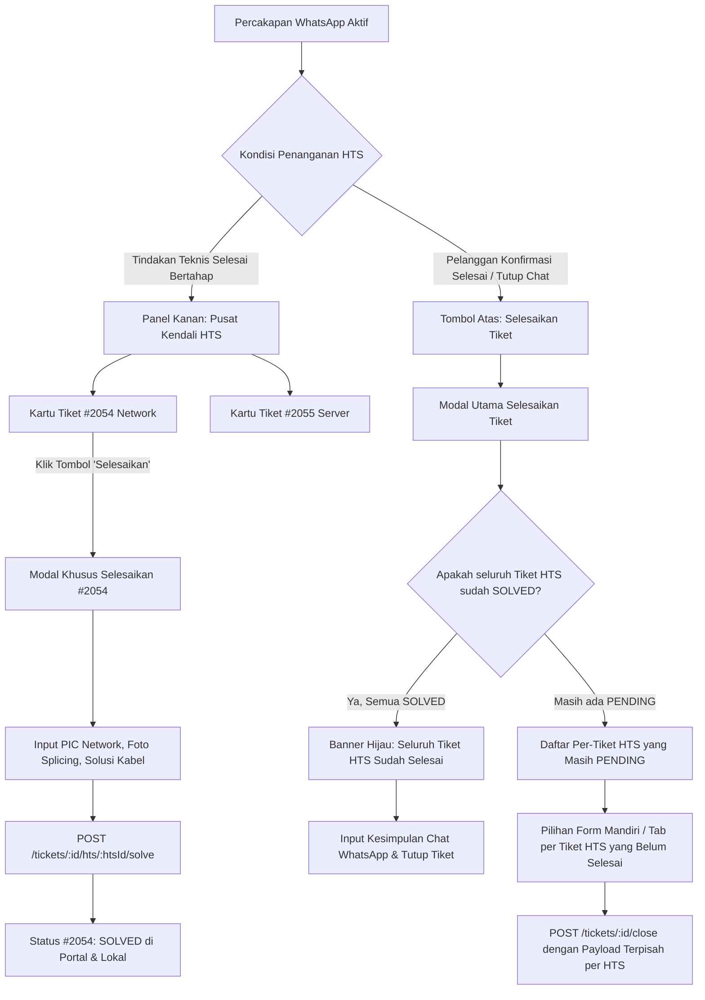

# 📑 Dokumen Spesifikasi Teknis & Desain Layout: Penyelesaian Tiket HTS Mandiri (Independent Multi-HTS Resolution - Opsi 3)

> **Status:** Disetujui untuk Implementasi  
> **Pendekatan Desain:** Opsi 3 (Kombinasi Aksi Mandiri di Panel Kanan + Integrasi Terpisah di Modal Penutupan Chat)  
> **Target Modul:** Frontend (`frontend/src/App.jsx`), Backend Controller (`backend/src/controllers/chatController.js`), dan Rute API (`backend/src/routes/chat.js`)  
> **Tanggal Dokumen:** 03 Oktober 2026  

---

## 1. Latar Belakang & Kebutuhan Bisnis

Dalam operasional Helpdesk Diskominfo Provinsi Jawa Tengah, satu sesi percakapan aduan WhatsApp pelanggan (`Ticket`) seringkali menghasilkan **lebih dari satu tiket resmi di Portal HTS Diskomdigi (`TicketHts`)**. Sebagai contoh:
* **Tiket HTS #1 (`#2054-TShoot-2026-jateng-10`):** Ditugaskan ke **Tim Jaringan (Network)** untuk perbaikan fisik kabel fiber optik / switch.
* **Tiket HTS #2 (`#2055-TShoot-2026-jateng-10`):** Ditugaskan ke **Tim Server / Aplikasi** untuk konfigurasi DNS / restart service web server.

### Masalah pada Sistem Saat Ini:
1. **Penyelesaian Massal Seragam (Bulk Uniform Resolution):**  
   Pada modal *Selesaikan Tiket* saat ini, sistem hanya menyediakan satu form teknis tunggal (1 tanggal, 1 jam, 1 daftar PIC, 1 bukti foto, dan 1 teks solusi). Saat operator menekan tombol *Selesaikan & Tutup HTS*, backend melakukan perulangan ke seluruh tiket HTS yang berstatus `PENDING` dengan **data yang sama persis**.
2. **Ketiadaan Fleksibilitas Waktu (Asynchronous Resolution):**  
   Di lapangan, Tim Jaringan mungkin sudah menyelesaikan masalah pada pukul 14:00, sedangkan Tim Server baru menyelesaikan pada pukul 16:30. Operator tidak dapat menyelesaikan tiket Jaringan di HTS lebih awal tanpa harus menutup seluruh percakapan pelanggan.
3. **Perbedaan Bukti & Solusi:**  
   Bukti foto penanganan jaringan (foto kabel/ODP) berbeda dengan bukti server (screenshot terminal/dashboard). PIC penanganannya pun berasal dari tim yang berbeda.

---

## 2. Arsitektur Solusi (Opsi 3: Hybrid Independent Resolution)

Sistem mengadopsi pendekatan dua pintu yang terintegrasi:



---

## 3. Spesifikasi Detail Layout Antarmuka (UI/UX Mockup)

### A. Layout 1: Kartu Tiket HTS di Panel Kanan (`Portal HTS Diskomdigi`)

Pada panel kanan obrolan, setiap tiket HTS ditampilkan dalam kartu mandiri dengan tombol aksi yang jelas:

```
┌─────────────────────────────────────────────────────────────┐
│ 🌐 Portal HTS Diskomdigi                           2 Tiket   │
├─────────────────────────────────────────────────────────────┤
│ ┌─────────────────────────────────────────────────────────┐ │
│ │ [#2054-TShoot-2026-jateng-10]  [Network]      [PENDING] │ │
│ │ PIC Awal: Helpdesk - Ori, Ahmad                         │ │
│ │                                                         │ │
│ │ [✓ Selesaikan HTS]             [📋 Salin]   [🗑 Lepas]   │ │
│ └─────────────────────────────────────────────────────────┘ │
│ ┌─────────────────────────────────────────────────────────┐ │
│ │ [#2055-TShoot-2026-jateng-10]  [Server]       [SOLVED]  │ │
│ │ Selesai: 03/10/2026 15:45 WIB oleh Chandra W.           │ │
│ │ Solusi: Service NGINX & Database direstart.             │ │
│ │                                                         │ │
│ │ [👁 Lihat Detail Solusi]                    [🗑 Lepas]   │ │
│ └─────────────────────────────────────────────────────────┘ │
│                                                             │
│ [ + Tautkan / Terbitkan Tiket HTS Lain ]                    │
└─────────────────────────────────────────────────────────────┘
```

#### Spesifikasi Elemen Kartu:
1. **Jika Status `PENDING`:**
   * Badge warna kuning-oranye (`bg-amber-100 text-amber-800 border-amber-300`).
   * Tombol **`[✓ Selesaikan HTS]`** (`bg-emerald-600 hover:bg-emerald-700 text-white`): Membuka Modal Khusus Penyelesaian Tiket Tersebut.
   * Tombol **`[🗑 Lepas]`** (*Unlink*).
2. **Jika Status `SOLVED`:**
   * Badge warna hijau (`bg-emerald-100 text-emerald-800 border-emerald-300`).
   * Menampilkan ringkasan singkat: Waktu selesai, PIC penangan, dan solusi ringkas.
   * Tombol aksi: **`[👁 Lihat Detail Solusi]`**: Membuka modal/drawer ringkas yang memuat:
     - Waktu penyelesaian resmi (`solved_at`).
     - Daftar nama teknisi PIC penangan (hasil pemetaan `hts_pic_ids` ke Master Data PIC).
     - Deskripsi solusi teknis (`solution`).
     - **Foto Bukti Penanganan:** Galeri thumbnail foto bukti yang pernah diunggah/dipilih saat penyelesaian (tersimpan di `attachment_urls`), yang dapat diklik untuk memperbesar tampilan (preview lightbox).

---

### B. Layout 2: Modal Khusus Selesaikan Tiket HTS Mandiri (`ModalSolveSingleHts`)

Modal ini muncul ketika operator menekan tombol `[✓ Selesaikan HTS]` pada kartu tiket HTS tertentu di panel kanan.

```
┌─────────────────────────────────────────────────────────────┐
│ Selesaikan Tiket Portal HTS                            [✕]  │
│ Penutupan aduan resmi di portal HTS Diskomdigi              │
├─────────────────────────────────────────────────────────────┤
│ ℹ️ Target Aduan HTS:                                         │
│    Nomor Tiket : #2054-TShoot-2026-jateng-10                │
│    Kategori    : DISTRIBUTION NETWORK (Tim Jaringan)        │
│    Pelapor     : Laurensius Liquori (Dinas Komunikasi...)   │
├─────────────────────────────────────────────────────────────┤
│ Tanggal Penanganan *            Jam Penanganan *            │
│ [ 03/10/2026           📅 ]     [ 16:45               🕒 ]  │
├─────────────────────────────────────────────────────────────┤
│ PIC Penanganan Teknis HTS *                   2 PIC Terpilih│
│ [🔍 Cari nama teknisi PIC...                              ] │
│ ┌─────────────────────────────────────────────────────────┐ │
│ │ ☑ [PIC Penerima] Helpdesk - Ori                         │ │
│ │ ☑ [PIC Penangan] Ahmad Arif Pamuji, S.Kom               │ │
│ │ ☐ Adi Kurniawan, S.Kom                                  │ │
│ └─────────────────────────────────────────────────────────┘ │
├─────────────────────────────────────────────────────────────┤
│ Bukti Lampiran / Foto Penanganan (Opsional)                 │
│ 📸 Dari Catatan Internal Teknisi:                           │
│ [ [Foto Kabel 1] ✓ ] [ [Foto Kabel 2] ]                     │
│                                                             │
│ 📎 Upload Foto Komputer (Bisa pilih 2-3 foto):              │
│ [ + Pilih Berkas Foto...                                  ] │
├─────────────────────────────────────────────────────────────┤
│ Solusi / Catatan Penanganan Teknis (Min. 10 Karakter) *     │
│ ┌─────────────────────────────────────────────────────────┐ │
│ │ Kabel fiber optik jalur switch lantai 2 telah disambung │ │
│ │ ulang menggunakan splicer. Redaman kembali normal -18dB.│ │
│ └─────────────────────────────────────────────────────────┘ │
├─────────────────────────────────────────────────────────────┤
│ [ Batal ]                   [ ✓ Selesaikan di Portal HTS ]  │
└─────────────────────────────────────────────────────────────┘
```

#### Spesifikasi Fungsional Modal Mandiri:
* **Pre-fill Cerdas:**
  * PIC Penerima awal tiket tercentang otomatis.
  * Jika ada catatan solusi dari Tim L2 terkait (`activeTicket.categories.find(c => c.category_id === targetHts.category_id)?.solution`), otomatis dimasukkan sebagai draf solusi.
* **Proses Submit:**
  * Mengirim *multipart/form-data* ke endpoint `POST /chat/tickets/:ticketId/hts/:htsId/solve`.
  * Memperbarui status kartu lokal dan mengirim notifikasi internal ke log percakapan.

---

### C. Layout 3: Modal Utama "Selesaikan Tiket" (Penutupan Sesi Chat WhatsApp)

Saat Helpdesk L1 menekan tombol utama **"Selesaikan"** di header obrolan untuk menutup tiket WhatsApp pelanggan:

#### Skenario 3.1: Seluruh Tiket HTS Sudah Berstatus `SOLVED`
```
┌─────────────────────────────────────────────────────────────┐
│ Selesaikan Tiket Percakapan                            [✕]  │
│ Penutupan resmi tiket aduan pelanggan oleh Helpdesk (L1)     │
├─────────────────────────────────────────────────────────────┤
│ 🌐 Tiket Portal HTS Terkait (2)                             │
│ ┌─────────────────────────────────────────────────────────┐ │
│ │ ✓ Seluruh Tiket HTS Sudah Selesai (SOLVED)              │ │
│ │   • #2054-TShoot-2026-jateng-10 (Network) - SOLVED      │ │
│ │   • #2055-TShoot-2026-jateng-10 (Server)  - SOLVED      │ │
│ └─────────────────────────────────────────────────────────┘ │
├─────────────────────────────────────────────────────────────┤
│ TAG KATEGORI TIM                                            │
│ ☑ Network  ☑ Server                                         │
├─────────────────────────────────────────────────────────────┤
│ KESIMPULAN PENANGANAN UNTUK PELANGGAN *                     │
│ ┌─────────────────────────────────────────────────────────┐ │
│ │ Kendala koneksi dan akses web server telah tertangani   │ │
│ │ dengan baik oleh tim teknis gabungan. Obrolan ditutup.  │ │
│ └─────────────────────────────────────────────────────────┘ │
├─────────────────────────────────────────────────────────────┤
│ [ Batal ]                         [ Tutup Tiket Selesai ]   │
└─────────────────────────────────────────────────────────────┘
```

#### Skenario 3.2: Masih Ada Tiket HTS yang Berstatus `PENDING`
> **Aturan Bisnis Mutlak:** Sesi obrolan pelanggan **TIDAK DAPAT DITUTUP** jika masih ada tiket HTS yang berstatus `PENDING`. Seluruh tiket HTS yang terhubung wajib diselesaikan.

Jika masih ada tiket HTS yang belum diselesaikan secara mandiri dari panel kanan, modal penutupan obrolan mewajibkan operator melengkapi penyelesaian seluruh tiket HTS tersebut melalui antarmuka **Tab / Accordion Penyelesaian Per-Tiket**:

```
┌─────────────────────────────────────────────────────────────┐
│ Selesaikan Tiket Percakapan                            [✕]  │
├─────────────────────────────────────────────────────────────┤
│ 🌐 Tiket Portal HTS Terkait (2)                             │
│ ⚠️ Seluruh tiket HTS wajib diselesaikan sebelum chat ditutup:│
│                                                             │
│ ┌─────────────────────────────────────────────────────────┐ │
│ │ [Tab: #2054 (Network) ✓ SOLVED]  [Tab: #2055 (Server) ⚠️]│ │
│ ├─────────────────────────────────────────────────────────┤ │
│ │ 🔒 Formulir Wajib HTS #2055-TShoot-2026-jateng-10:        │ │
│ │ Tanggal Penanganan: [ 03/10/2026 📅 ] Jam: [ 16:50 🕒 ]   │ │
│ │ PIC Penanganan:     [ 2 PIC Terpilih v ]                  │ │
│ │                                                         │ │
│ │ Bukti Lampiran / Foto Penanganan:                       │ │
│ │ 📎 Upload File Komputer (Khusus Tiket Ini):              │ │
│ │ [ + Pilih Berkas Foto... ]                              │ │
│ │ 📸 Atau pilih dari Catatan Internal / Chat WA           │ │
│ │                                                         │ │
│ │ Solusi Teknis HTS Server (Min. 10 Karakter) *:          │ │
│ │ [ Konfigurasi virtual host Apache telah diperbaiki...  ] │ │
│ └─────────────────────────────────────────────────────────┘ │
├─────────────────────────────────────────────────────────────┤
│ KESIMPULAN AKHIR UNTUK PELANGGAN *                          │
│ [ Masukkan rangkuman jawaban untuk customer WhatsApp...  ] │
├─────────────────────────────────────────────────────────────┤
│ [ Batal ]            [ ✓ Selesaikan Semua HTS & Tutup Tiket]│
└─────────────────────────────────────────────────────────────┘
```

* **Validasi Tombol Submit:** Tombol `[✓ Selesaikan Semua HTS & Tutup Tiket]` akan melakukan validasi bahwa seluruh tab tiket HTS yang berstatus `PENDING` telah terisi lengkap (Tanggal, Jam, minimal 1 PIC, dan Solusi min. 10 karakter). Jika ada tab yang belum lengkap, sistem akan menandai tab terkait dan menampilkan pesan peringatan.

---

## 4. Spesifikasi Kontrak Data & API Backend

### A. Endpoint Penyelesaian Mandiri Per-Tiket HTS
* **Method & URL:** `POST /api/chat/tickets/:ticketId/hts/:htsId/solve`
* **Content-Type:** `multipart/form-data`
* **Middleware:** `requireRole(['ADMIN', 'SPV', 'L1'])`, `upload.array('attachment', 5)`
* **Payload Request:**
  ```typescript
  interface SolveHtsSinglePayload {
    solution: string;                     // Min 10 karakter
    picId?: string;                       // Fallback single PIC ID
    picIds?: string[] | string;           // Array PIC IDs terpilih
    tglteknis?: string;                   // Format: YYYY-MM-DD
    jam_problem?: string;                 // Format: HH:mm
    attachment?: File[];                  // Up to 5 uploaded files
    selectedAttachmentUrls?: string;      // JSON string array URL internal/chat
    useChatImage?: boolean | string;      // Boolean flag
  }
  ```
* **Respon Sukses (200 OK):**
  ```json
  {
    "message": "Tiket HTS #2054-TShoot-2026-jateng-10 berhasil diselesaikan",
    "ticketHts": {
      "id": 12,
      "ticket_id": 45,
      "hts_ticket_no": "2054-TShoot-2026-jateng-10",
      "hts_ticket_status": "SOLVED",
      "solution": "Kabel fiber optik disambung ulang...",
      "solved_at": "2026-10-03T09:45:00.000Z"
    }
  }
  ```

### B. Endpoint Penutupan Utama Chat (`POST /api/chat/tickets/:ticketId/close`)
* **Method & URL:** `POST /api/chat/tickets/:ticketId/close`
* **Content-Type:** `multipart/form-data`
* **Middleware:** `requireRole(['ADMIN', 'SPV', 'L1'])`, `upload.any()` (mendukung berkas unggahan per-HTS)
* **Aturan Bisnis:** Backend **menolak penutupan tiket** (`400 Bad Request`) jika masih ada tiket HTS yang berstatus `PENDING` dan tidak berhasil diselesaikan. Seluruh tiket HTS wajib diselesaikan sebelum status tiket chat dapat berubah menjadi `CLOSED`.
* **Dukungan Payload Multi-HTS Terpisah (`htsResolutions`):**
  Frontend mengirimkan `FormData` dengan struktur:
  - `summary`: Teks rangkuman/kesimpulan akhir untuk pelanggan WhatsApp.
  - `categoryIds`: Array ID kategori.
  - `closeHtsTicket`: `true`
  - `htsResolutions`: JSON string array berisi data resolusi per-HTS.
  - Berkas komputer lokal per tiket HTS di-upload menggunakan key dinamis `attachment_${htsId}` (hingga 5 berkas per tiket).

  ```typescript
  interface HtsResolutionItem {
    htsId: number;                        // ID record TicketHts
    htsTicketNo: string;                  // Nomor tiket HTS
    solution: string;                     // Solusi teknis (min. 10 karakter)
    picIds: string[];                     // Array PIC teknis
    tglteknis: string;                    // YYYY-MM-DD
    jam_problem: string;                  // HH:mm
    selectedAttachmentUrls?: string[];    // URL dari Catatan Internal / Chat WA
    useChatImage?: boolean;               // Ambil gambar dari chat
  }
  ```

  *Contoh Payload JSON dalam `htsResolutions`:*
  ```json
  [
    {
      "htsId": 12,
      "htsTicketNo": "2054-TShoot-2026-jateng-10",
      "solution": "Kabel FO core 2 lantai 2 telah disambung kembali.",
      "picIds": ["14", "22"],
      "tglteknis": "2026-10-03",
      "jam_problem": "15:30",
      "selectedAttachmentUrls": ["/uploads/internal_patch_fo.jpg"]
    },
    {
      "htsId": 13,
      "htsTicketNo": "2055-TShoot-2026-jateng-10",
      "solution": "Daemon NGINX direstart dan alokasi memory php-fpm dinaikkan.",
      "picIds": ["14", "35"],
      "tglteknis": "2026-10-03",
      "jam_problem": "16:15"
    }
  ]
  ```
* **Mekanisme Eksekusi Backend:**
  1. Backend memvalidasi setiap item dalam `htsResolutions` serta mencocokkannya dengan `pendingHtsList`.
  2. Untuk masing-masing tiket HTS, ambil berkas yang cocok dari `req.files` (yang memiliki `fieldname === 'attachment_' + item.htsId` atau fallback `fieldname === 'attachment'`).
  3. Panggil `htsClientService.solveTicketHts` untuk setiap tiket secara berurutan.
  4. Simpan status `SOLVED`, `solution`, `hts_pic_ids`, `solved_at`, dan array foto bukti pada kolom `attachment_urls` di `TicketHts`.
  5. Jika salah satu tiket HTS gagal diselesaikan (dan rekonsiliasi gagal), backend membatalkan penutupan tiket chat, mengembalikan error `400` dengan nama tiket yang gagal, dan tidak mengubah status tiket chat menjadi `CLOSED`.

### C. Pembaruan Skema Database Prisma (`prisma/schema.prisma`)
Menambahkan kolom `attachment_urls` pada model `TicketHts` untuk menyimpan riwayat URL foto bukti penyelesaian (agar dapat ditampilkan pada modal `[👁 Lihat Detail Solusi]`):
```prisma
model TicketHts {
  id                Int          @id @default(autoincrement())
  ticket_id         Int
  ticket            Ticket       @relation(fields: [ticket_id], references: [id], onDelete: Cascade)
  category_id       Int?
  category          Category?    @relation(fields: [category_id], references: [id], onDelete: SetNull)
  hts_ticket_id     String       // ID numerik trouble HTS (misal: "2025")
  hts_ticket_no     String       // Nomor aduan resmi HTS (misal: "2025-TShoot-2026-jateng-09")
  hts_ticket_status String       @default("PENDING") // PENDING | SOLVED
  hts_kategori      String       @default("troubleshoot")
  hts_sub_kategori  String?
  hts_detil         String?      @db.Text
  hts_pic_ids       String?      // JSON array ID PIC penerima & penanganan
  solution          String?      @db.Text // Teks solusi penanganan teknis HTS
  attachment_urls   String?      @db.Text // JSON array URL bukti foto penanganan (V4.3)
  created_at        DateTime     @default(now())
  solved_at         DateTime?

  @@index([ticket_id])
  @@index([hts_ticket_no])
}
```

---

## 5. Rencana Tahapan Eksekusi (Implementation Steps)

Bagi pengembang (developer / AI) yang akan mengeksekusi fitur ini, ikuti urutan langkah berikut secara terstruktur:

### Tahap 1: Backend Database & Controller (`schema.prisma`, `routes/chat.js`, `chatController.js`)
1. **Pembaruan Skema Prisma:**
   - Tambahkan `attachment_urls String? @db.Text` pada model `TicketHts`.
   - Jalankan sinkronisasi database (`npx prisma db push` atau migrasi) dan generate Prisma Client.
2. **Pembaruan Rute API (`routes/chat.js`):**
   - Ubah middleware `upload.array('attachment', 5)` pada `POST /tickets/:ticketId/close` menjadi `upload.any()` agar mendukung berkas dinamis `attachment_${htsId}`.
3. **Pengayaan `solveTicketHtsSingle` (`chatController.js`):**
   - Tangani pembacaan berkas `req.files`, `selectedAttachmentUrls`, `useChatImage`.
   - Teruskan `tglteknis`, `jam_problem`, `attachmentUrls` ke `htsClientService.solveTicketHts`.
   - Simpan `solution`, `hts_pic_ids`, `solved_at`, dan `attachment_urls` (JSON array string) ke `prisma.ticketHts`.
4. **Pengayaan `closeTicket` (`chatController.js`):**
   - Baca payload `htsResolutions`. Jika dikirim, iterasi per-tiket dengan berkas `attachment_${htsId}` masing-masing.
   - Validasi ketat: jika ada tiket HTS pending yang gagal diselesaikan di HTS, gagalkan penutupan tiket chat dan kirim error responsif.
   - Simpan `attachment_urls` ke masing-masing record `TicketHts`.
   - Tetap pertahankan fallback kompatibilitas lama (legacy mode).

### Tahap 2: Frontend — Panel Kanan, Modal Mandiri, & Modal Detail Solusi (`App.jsx`)
1. **State Management Baru:**
   - `showSolveSingleHtsModal` & `selectedHtsToSolve`
   - `showDetailHtsModal` & `selectedHtsDetail`
   - State form mandiri: `singleHtsSolution`, `singleHtsPicIds`, `singleHtsTanggal`, `singleHtsJam`, `singleHtsFiles`, `singleHtsSelectedInternalUrls`.
2. **Modifikasi Kartu HTS di Panel Kanan:**
   - Tombol `[✓ Selesaikan HTS]` jika `PENDING`.
   - Tombol `[👁 Lihat Detail Solusi]` jika `SOLVED`.
3. **Komponen `ModalDetailHts`:**
   - Menampilkan modal detail: Nomor tiket, Kategori, Waktu selesai, Nama-nama teknisi PIC penangan, Solusi teknis, dan **Galeri Foto Bukti Penanganan** (dengan fitur preview klik gambar).
4. **Komponen `ModalSolveSingleHts`:**
   - Form modal penyelesaian mandiri sesuai **Layout 2**.
   - Kirim `POST /tickets/:ticketId/hts/:htsId/solve` dengan multipart form data.
   - Refresh state tiket & notifikasi toast sukses.

### Tahap 3: Frontend — Pembaruan Modal Utama "Selesaikan Tiket" (`App.jsx`)
1. **Pemeriksaan Status Seluruh HTS:**
   - Jika **semua SOLVED**: Sembunyikan seluruh formulir teknis, tampilkan banner hijau konfirmasi, langsung input kesimpulan chat WhatsApp.
   - Jika **masih ada PENDING**: Tampilkan tab per-tiket HTS yang pending.
2. **Dukungan Form Mandiri & Upload File per-Tab HTS:**
   - Setiap tab tiket HTS pending memiliki formulir mandiri: Tanggal, Jam, PIC, Solusi, dan Berkas Upload Komputer / Internal Catatan.
   - Operator wajib mengisi seluruh tab pending (tidak bisa di-skip).
3. **Payload Dispatcher pada `handleCloseTicket`:**
   - Bentuk payload `htsResolutions` dan lampirkan file ke `FormData` dengan key `attachment_${htsId}`.
   - Validasi kelengkapan form sebelum mengirim request.

### Tahap 4: Pengujian & Validasi Kualitas (QA)
1. **Uji Kasus 1 (Penyelesaian Asinkron Mandiri):** Tiket dengan 2 aduan HTS (#2054 & #2055). Selesaikan #2054 dari panel kanan dengan upload foto kabel. Pastikan #2054 menjadi `SOLVED` lengkap dengan riwayat foto di `[👁 Lihat Detail Solusi]`, sedangkan #2055 tetap `PENDING`.
2. **Uji Kasus 2 (Blokir Penutupan Chat Jika Belum Lengkap):** Buka modal tutup chat saat #2055 masih `PENDING`. Pastikan tombol tutup tidak dapat disubmit jika tab #2055 belum diisi.
3. **Uji Kasus 3 (Penutupan Chat Berhasil & Data Tersimpan Akurat):** Isi solusi #2055 dengan upload foto server, lalu klik tutup. Pastikan kedua tiket HTS di database memiliki solusi, PIC, dan bukti foto yang berbeda sesuai input masing-masing.
