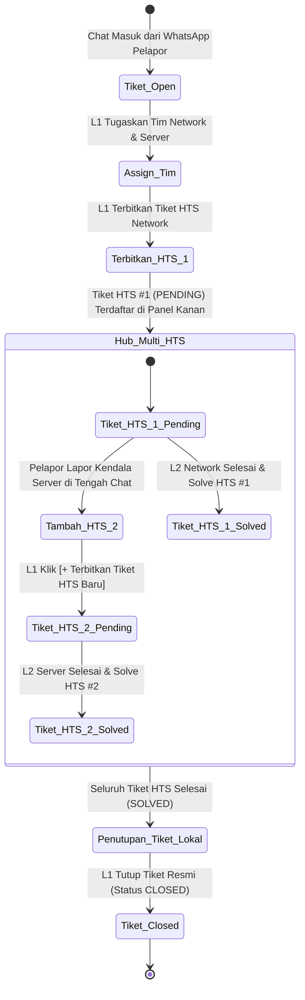

# 🛠️ Spesifikasi Teknis & Panduan Migrasi V4.0 (Technical Spec & Migration Guide)
**Proyek:** HTS Chat Integration (WhatsApp Helpdesk to Web Ticketing System)  
**Tujuan Dokumen:** Spesifikasi Rinci Antarmuka, Skema Database, Kontrak API, dan Panduan Migrasi Data untuk Rombak Besar V4  
**Target Rilis:** Workflow V4.0  
**Tanggal:** 30 September 2026  

---

## 📌 1. Daftar Isi
1. [Wireframe Komponen & Desain UI/UX Baru](#1-wireframe-komponen--desain-uiux-baru)
2. [Spesifikasi Skema Database & Skrip Migrasi Aman](#2-spesifikasi-skema-database--skrip-migrasi-aman)
3. [Spesifikasi Kontrak REST API Baru V4](#3-spesifikasi-kontrak-rest-api-baru-v4)
4. [Alur Logika & State Management Frontend](#4-alur-logika--state-management-frontend)
5. [Daftar Kriteria Pengujian (Acceptance Criteria)](#5-daftar-kriteria-pengujian-acceptance-criteria)

---

## 📐 1. Wireframe Komponen & Desain UI/UX Baru

Menggantikan antarmuka lama yang sarat modal pop-up dengan layout **Modern 3-Column Desk** dan **Slide-over Drawer** (Laci Samping).

### A. Layout Utama 3 Kolom
```
┌─────────────────┬───────────────────────────────────┬─────────────────────────────────┐
│   KOLOM KIRI    │           KOLOM TENGAH            │           KOLOM KANAN           │
│ (280px - Nav)   │          (Fluid - Chat)           │      (340px - Action Hub)       │
├─────────────────┼───────────────────────────────────┼─────────────────────────────────┤
│ [🔍 Cari Aduan] │ [Header: Nama Pelapor | OPD | L2] │ [Tab: 🏛️ HTS | 👥 L2 | 👤 Info]│
│                 │ --------------------------------- │ ------------------------------- │
│ Filter Status:  │ [📜 Lihat Riwayat Chat (2 Tiket)] │ [🏛️ HUB TIKET HTS DISKOMDIGI]   │
│ [Semua] [L1/L2] │ ─── 🔒 TIKET #12 (15 Sep 2026) ── │                                 │
│ [HTS] [Closed]  │ [Chat lama semi-transparan]       │ Tiket 1: #2025-TShoot (Network) │
│                 │ ─── 🟢 PERCAKAPAN AKTIF #24 ───── │ [Status: PENDING] [Selesaikan]  │
│ Daftar Tiket:   │ Pelapor: "Aplikasi error..."      │                                 │
│ • Budi (Dinkes) │ L1: "Sedang dicek teknisi..."     │ Tiket 2: #2026-TShoot (Server)  │
│   Network+Server│ L2: 🏷️ [Foto Perangkat FO]       │ [Status: SOLVED]                │
│ • Siti (BKD)    │ --------------------------------- │                                 │
│   Pending HTS   │ [💬 Balas WhatsApp] [🔒 Catatan L2]│ [+ Terbitkan Tiket HTS Baru]    │
│                 │ [Ketik balasan...] [📎] [Kirim]   │ (Membuka Slide-over Drawer)     │
└─────────────────┴───────────────────────────────────┴─────────────────────────────────┘
```

---

### B. Wireframe Kolom Tengah: Divider Riwayat Lampau & Catatan Gambar L2
```
┌─────────────────────────────────────────────────────────────────────────────┐
│  📜 [ ▾ Sembunyikan Riwayat Lampau Pelanggan Ini (2 Tiket Sebelumnya) ]    │
├─────────────────────────────────────────────────────────────────────────────┤
│  ────────── 🔒 TIKET LALU #10 (Closed pada 12/09/2026 - Internet Lemot) ─── │
│  (Pelapor) [09:12] Pak internet di dinas kami lemot sekali                   │
│  (L1)      [09:15] Baik pak, teknisi sedang mereset router pusat             │
│                                                                             │
│  ────────── 🔒 TIKET LALU #18 (Closed pada 20/09/2026 - Setting IP) ────── │
│  (Pelapor) [14:00] Mas minta alokasi IP baru untuk server BKD               │
│  (L1)      [14:20] Sudah dialokasikan IP 10.1.104.55 ya pak                  │
├─────────────────────────────────────────────────────────────────────────────┤
│  ────────── 🟢 PERCAKAPAN AKTIF SAAT INI (Tiket #24 - Open) ─────────────── │
│  (Pelapor) [10:00] Pagi helpdesk, kabel optik putus kena pohon dan aplikasi  │
│                    e-surat tidak bisa diakses sama sekali                   │
│  (L1)      [10:02] Baik kami buatkan tiket penanganan jaringan dan server ya │
│                                                                             │
│  [🏷️ Catatan Internal - Tim Network (Teknisi Budi)]                          │
│  ┌─────────────────────────┐                                                │
│  │ 📷 [Foto OTB FO Rusak]  │ "Kabel drop core putus 2 core di depan gerbang"│
│  └─────────────────────────┘                                                │
├─────────────────────────────────────────────────────────────────────────────┤
│  [💬 Balas WhatsApp (Pelapor)]  [🔒 Catatan Internal (L1 & L2)]  <-- Tab Aktif│
│  ┌─────────────────────────────────────────────────────────┬──────────────┐ │
│  │ Ketik catatan teknis internal untuk koordinasi...       │  📎   KIRIM  │ │
│  └─────────────────────────────────────────────────────────┴──────────────┘ │
└─────────────────────────────────────────────────────────────────────────────┘
```

---

### C. Wireframe Kolom Kanan: Slide-over Drawer (Formulir Tiket HTS Baru)
Ketika L1 mengklik tombol `[+ Terbitkan Tiket HTS Baru]`, layar samping kanan bergeser membuka formulir tanpa menutupi ruang obrolan di tengah:
```
┌──────────────────────────────────────────────┐
│ 🏛️ Terbitkan Tiket Resmi HTS Baru        [✕] │
├──────────────────────────────────────────────┤
│ Terkait Tiket Chat: #24 (Budi - Dinkes)      │
│                                              │
│ 1. Hubungkan ke Tim L2:                      │
│    [ ] Tim Network   [✔] Tim Server  [ ] M&E │
│                                              │
│ 2. Kategori HTS:                             │
│    [ Troubleshoot ▾ ]                        │
│                                              │
│ 3. Sub-Kategori HTS:                         │
│    [ SERVER ▾ ]                              │
│                                              │
│ 4. OPD Induk (Opsional):                     │
│    [ 🔍 Cari: Dinas Kesehatan ▾ ]            │
│                                              │
│ 5. Detil Permasalahan HTS: (min 10 karakter) │
│    ┌──────────────────────────────────────┐  │
│    │ Layanan e-surat Dinkes mengalami     │  │
│    │ database connection timeout.         │  │
│    └──────────────────────────────────────┘  │
│    (48 / 250 karakter)                       │
│                                              │
│ 6. PIC Penerima Aduan:                       │
│    [✔] Helpdesk - Ori   [ ] Lainnya          │
│                                              │
│ 7. Lampiran Bukti Masalah:                   │
│    (•) Dari Chat Pelapor   ( ) Unggah Baru   │
│                                              │
│ [ Batal ]            [ 🚀 Terbitkan Tiket ]  │
└──────────────────────────────────────────────┘
```

---

### D. Arsitektur Responsif & Fleksibilitas Resolusi Layar (Adaptive Multi-Screen Layout)
Untuk memastikan sistem tidak mengalami kendala pemotongan antarmuka (*overflow/clipping*) saat diakses di laptop kantor beresolusi 1366×768 maupun saat diakses teknisi L2 melalui ponsel di lapangan, sistem menerapkan 4 pilar responsif:

#### 1. Matriks Breakpoint Layar Adaptif
| Perangkat & Resolusi | Perilaku Antarmuka (Layout Behavior) | Area Fokus Pengguna |
|---|---|---|
| **Desktop Monitor (≥ 1280px)** | **3 Kolom Penuh Sekaligus:** Kiri (260px), Tengah (Fluid 1fr), Kanan (320px). | Pengawasan komprehensif seluruh data & tiket. |
| **Laptop Kantor (1024px – 1279px / 1366×768)** | **3 Kolom dengan Panel Kanan Collapsible:** Tombol toggle `[ 📑 ]` di kanan atas untuk menyembunyikan/menampilkan panel HTS. Saat disembunyikan, ruang obrolan melebar lega. | Mengetik percakapan panjang tanpa terhimpit. |
| **Tablet (768px – 1023px)** | **2 Kolom + Drawer Melayang:** Panel HTS otomatis beralih menjadi *Slide-over Drawer* samping yang muncul saat tombol HTS diklik. | Koordinasi fleksibel saat rapat/inspeksi. |
| **Smartphone / HP (< 768px)** | **Single View (Mobile App Style):** Tampilan bertingkat satu layar penuh. List Tiket $\rightarrow$ Masuk Obrolan $\rightarrow$ Tombol `[⬅️ Kembali]` ke daftar. | **Teknisi L2 Lapangan:** Ketik catatan internal cepat & memfoto kerusakan langsung dari kamera HP. |

#### 2. Standar Formulir Bebas Terpotong (Sticky Viewport Pattern)
Semua modal, slide-over drawer, dan formulir teknis wajib menerapkan pola layout CSS:
- **Header:** Selalu menempel di atas (`sticky top-0 bg-white z-10`).
- **Footer Aksi (`Batal` / `Simpan`):** Selalu menempel di bawah (`sticky bottom-0 bg-white border-t z-10`).
- **Area Isian:** Memakai batas tinggi dinamis dengan auto-scroll (`max-h-[75vh] md:max-h-[85vh] overflow-y-auto`).
- **Hasil:** Tombol submit dijamin **100% selalu terlihat dan dapat diklik** di resolusi laptop sekecil apa pun tanpa tenggelam ke bawah layar.

---

## 🗄️ 2. Spesifikasi Skema Database & Skrip Migrasi Aman

### A. Perubahan Skema Prisma (`schema.prisma`)
1. **Membuat Model Tabel `TicketHts`:**
```prisma
model TicketHts {
  id                Int          @id @default(autoincrement())
  ticket_id         Int
  ticket            Ticket       @relation(fields: [ticket_id], references: [id], onDelete: Cascade)
  category_id       Int?
  category          Category?    @relation(fields: [category_id], references: [id], onDelete: SetNull)
  hts_ticket_id     String       // ID numerik trouble HTS (misal: "2025")
  hts_ticket_no     String       // Nomor aduan resmi HTS
  hts_ticket_status String       @default("PENDING") // PENDING | SOLVED
  hts_kategori      String       @default("troubleshoot")
  hts_sub_kategori  String?
  hts_detil         String?      @db.Text
  hts_pic_ids       String?      // JSON array ID PIC penerima & penanganan
  solution          String?      @db.Text // Teks solusi penanganan teknis HTS
  created_at        DateTime     @default(now())
  solved_at         DateTime?

  @@index([ticket_id])
  @@index([hts_ticket_no])
}
```

2. **Pembaruan pada Model `Ticket`:**
```prisma
model Ticket {
  id                Int              @id @default(autoincrement())
  customer_id       Int
  customer          Customer         @relation(fields: [customer_id], references: [id])
  status            TicketStatus     @default(OPEN)
  service_type      ServiceType?
  summary           String?
  hts_tickets       TicketHts[]      // Relasi One-to-Many ke tabel baru
  created_at        DateTime         @default(now())
  closed_at         DateTime?
  categories        TicketCategory[]
  messages          Message[]
}
```

---

### B. Skrip Migrasi Data Otomatis (*Zero Data Loss Migration*)
Agar tiket HTS yang dibuat pada V3 tidak hilang saat migrasi skema ke V4:

```sql
-- 1. Buat tabel TicketHts baru
CREATE TABLE IF NOT EXISTS "TicketHts" (
    "id" SERIAL PRIMARY KEY,
    "ticket_id" INTEGER NOT NULL REFERENCES "Ticket"("id") ON DELETE CASCADE,
    "category_id" INTEGER REFERENCES "Category"("id") ON DELETE SET NULL,
    "hts_ticket_id" TEXT NOT NULL,
    "hts_ticket_no" TEXT NOT NULL,
    "hts_ticket_status" TEXT NOT NULL DEFAULT 'PENDING',
    "hts_kategori" TEXT NOT NULL DEFAULT 'troubleshoot',
    "hts_sub_kategori" TEXT,
    "hts_detil" TEXT,
    "hts_pic_ids" TEXT,
    "solution" TEXT,
    "created_at" TIMESTAMP(3) NOT NULL DEFAULT CURRENT_TIMESTAMP,
    "solved_at" TIMESTAMP(3)
);

-- 2. Migrasikan seluruh data tiket HTS yang sudah ada pada tabel Ticket ke TicketHts
INSERT INTO "TicketHts" ("ticket_id", "hts_ticket_id", "hts_ticket_no", "hts_ticket_status", "hts_pic_ids", "created_at")
SELECT 
    "id" AS "ticket_id",
    "hts_ticket_id",
    "hts_ticket_no",
    COALESCE("hts_ticket_status", 'PENDING') AS "hts_ticket_status",
    "hts_pic_ids",
    COALESCE("hts_synced_at", "created_at") AS "created_at"
FROM "Ticket"
WHERE "hts_ticket_no" IS NOT NULL AND "hts_ticket_no" != '';

-- 3. Indeks untuk performa query cepat
CREATE INDEX IF NOT EXISTS "idx_tickethts_ticket_id" ON "TicketHts"("ticket_id");
CREATE INDEX IF NOT EXISTS "idx_tickethts_ticket_no" ON "TicketHts"("hts_ticket_no");
```

---

## 📡 3. Spesifikasi Kontrak REST API Baru V4

### A. Endpoint Multi-Tiket HTS

#### 1. Mengambil Seluruh Tiket HTS yang Terhubung ke Obrolan
* **Method & URL:** `GET /api/chat/tickets/:ticketId/hts`
* **Response (200 OK):**
  ```json
  [
    {
      "id": 1,
      "ticket_id": 24,
      "category": { "id": 7, "name": "Network" },
      "hts_ticket_id": "2025",
      "hts_ticket_no": "2025-TShoot-2026-jateng-09",
      "hts_ticket_status": "PENDING",
      "hts_kategori": "troubleshoot",
      "hts_sub_kategori": "DISTRIBUTION NETWORK",
      "hts_pic_ids": "[\"14\"]",
      "created_at": "2026-09-30T10:00:00.000Z"
    },
    {
      "id": 2,
      "ticket_id": 24,
      "category": { "id": 8, "name": "Server" },
      "hts_ticket_id": "2026",
      "hts_ticket_no": "2026-TShoot-2026-jateng-10",
      "hts_ticket_status": "SOLVED",
      "hts_kategori": "troubleshoot",
      "hts_sub_kategori": "SERVER",
      "hts_pic_ids": "[\"14\",\"8\"]",
      "solution": "Database pool server SIMPEG telah ditingkatkan.",
      "created_at": "2026-09-30T11:30:00.000Z",
      "solved_at": "2026-09-30T12:00:00.000Z"
    }
  ]
  ```

#### 2. Menerbitkan Tiket HTS Baru ke Tiket yang Sedang Aktif
* **Method & URL:** `POST /api/chat/tickets/:ticketId/hts`
* **Content-Type:** `multipart/form-data`
* **Request Body:**
  - `categoryId`: `8` (ID Tim L2 terkait)
  - `hts_cust`, `hts_opd`, `induk_opd_id`, `hts_tgltshoot`, `hts_jam_problem`
  - `hts_kategori`, `hts_sub_kategori`, `hts_detil` (min 10 karakter)
  - `hts_pic_ids`: Array PIC terpilih
  - `attachment`: Berkas bukti (Opsional: `.jpg`, `.png`, `.pdf`)
* **Response (200 OK):** Mengembalikan objek `TicketHts` yang baru terbit.

#### 3. Menyelesaikan Tiket HTS Spesifik Secara Mandiri
* **Method & URL:** `POST /api/chat/tickets/:ticketId/hts/:htsId/solve`
* **Content-Type:** `multipart/form-data`
* **Request Body:**
  - `solution`: Teks detil penanganan teknis HTS
  - `picIds`: Multi-PIC penanganan (otomatis di-merge dengan PIC awal)
  - `tglteknis`, `jam_problem`
  - `attachment`: Foto bukti penyelesaian teknis
* **Response (200 OK):** Update status tiket HTS tersebut menjadi `SOLVED`.

---

### B. Endpoint Catatan Internal Multimedia L1 $\leftrightarrow$ L2

* **Method & URL:** `POST /api/chat/tickets/:ticketId/internal-media`
* **Akses:** `L1`, `L2`, `ADMIN`
* **Content-Type:** `multipart/form-data`
* **Form Data:**
  - `text`: Keterangan / caption catatan internal (Opsional)
  - `media`: File gambar (.jpg / .png maksimal 10 MB)
* **Logika Backend:**
  - Menyimpan file ke `/uploads/internal_xxx.jpg`.
  - Membuat record `Message` dengan atribut:  
    `sender_type: "AGENT"`, `is_internal: true`, `attachment_url: "/uploads/internal_xxx.jpg"`.
  - **Keamanan:** Memastikan pesan ini **TIDAK DIKIRIMKAN** ke Evolution API / WhatsApp pelapor.
  - Broadcast via Socket.io `new_message` khusus klien web.

---

### C. Endpoint Riwayat Percakapan Lampau

#### 1. Mengambil Histori Tiket Lokal Pelanggan yang Sudah Closed
* **Method & URL:** `GET /api/chat/customers/:customerId/history`
* **Response (200 OK):**
  Mengembalikan daftar tiket `CLOSED` milik pelanggan tersebut lengkap dengan pesan-pesannya untuk ditampilkan pada *Accordion Timeline Divider*.

#### 2. Menarik Histori WhatsApp Lama dari Ponsel (On-Demand / Lazy-Load)
* **Method & URL:** `POST /api/chat/customers/:customerId/fetch-wa-history`
* **Request Body:** `{ "limit": 20 }`
* **Logika Backend:**
  - Memanggil Evolution API: `POST /chat/findMessages/:instance` khusus untuk `remoteJid = customer.wa_number`.
  - Menyimpan pesan lampau ke database lokal dengan tanda penanda arsip (`sender_type: "CUSTOMER"` atau `"AGENT"` dengan metadata `is_archive: true`).
  - **Aman dari Banned:** Hanya mengambil 20 pesan untuk 1 kontak saat diminta petugas.

---

## 🔄 4. Alur Logika & State Management Frontend



---

## ✅ 5. Daftar Kriteria Pengujian (Acceptance Criteria)

1. **Multi-HTS Verification:**
   - Dalam 1 ruang obrolan tiket Helpdesk, L1 dapat menerbitkan minimal 2 nomor tiket resmi HTS yang berbeda sub-kategori (`DISTRIBUTION NETWORK` dan `SERVER`).
   - Masing-masing tiket HTS dapat diselesaikan secara independen tanpa membatalkan tiket HTS lainnya.
2. **Kerahasiaan Catatan Internal Multimedia:**
   - Ketika teknisi L2 mengirimkan foto perangkat via Catatan Internal, foto tersebut **TIDAK MUNCUL** di WhatsApp pelapor.
   - Foto dari catatan internal L2 dapat dipilih oleh L1 sebagai berkas bukti penyelesaian saat menutup tiket HTS.
3. **Penyambungan Riwayat Lampau:**
   - Saat pelanggan lama mengirim pesan baru, L1 dapat membuka riwayat chat tiket sebelumnya melalui tombol accordion.
   - Percakapan lama memiliki penanda waktu penutupan tiket dan warna redup (*dimmed*) sehingga tidak membingungkan penanganan aktif.
4. **Keamanan Sesi WhatsApp:**
   - Penarikan pesan lama dari HP WhatsApp via on-demand fetch tidak memicu disconnection socket atau peringatan spam dari Meta.
