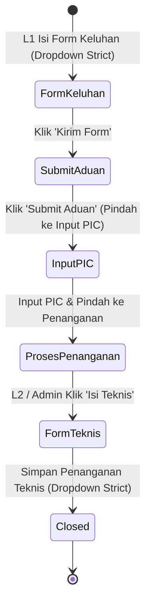
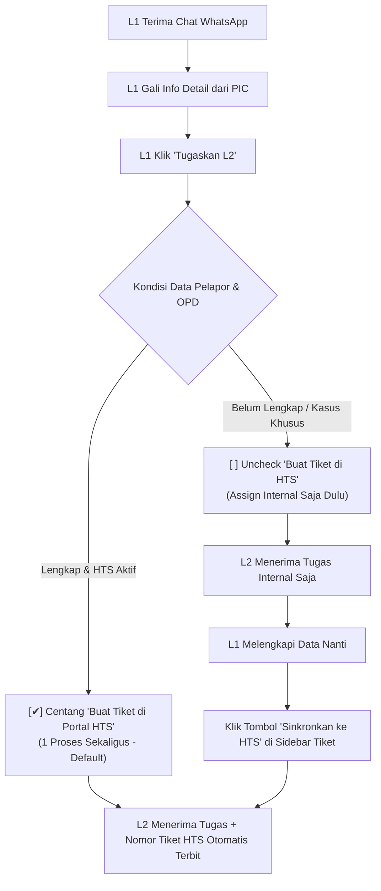

# 📑 User Stories & Spesifikasi Integrasi Portal HTS Diskomdigi Jateng

**Dokumen:** Spesifikasi Integrasi Sistem Eksternal & Alur Tiketing Otomatis  
**Target Integrasi:** Portal Aduan Data Center Jawa Tengah (`https://hts.diskomdigi.jatengprov.go.id`)  
**Status:** Disetujui (Updated berdasarkan Klarifikasi Kebutuhan Pengguna)  
**Tanggal Diperbarui:** 29 September 2026  

---

## 🎯 1. Latar Belakang & Tujuan Integrasi

Sistem Helpdesk WhatsApp saat ini telah berhasil menangani komunikasi dua arah antara pelapor (PIC SKPD/OPD) dengan Helpdesk L1 dan pendelegasian ke Tim Teknisi L2 (Network, Server, M&E).

Namun, untuk standardisasi pelaporan resmi di lingkungan Pemerintah Provinsi Jawa Tengah, seluruh keluhan wajib tercatat pada portal resmi:  
👉 **`https://hts.diskomdigi.jatengprov.go.id/list_aduan`**

Tujuan integrasi ini adalah **mengotomatiskan sinkronisasi** dari percakapan WhatsApp Helpdesk ke portal resmi Diskomdigi tersebut, meminimalkan *double-input* data manual oleh operator Helpdesk L1 maupun Teknisi L2, serta menjaga konsistensi nomor tiket antara pesan WhatsApp dan portal resmi.

---

## 🔍 2. Karakteristik & Arsitektur Portal Target (HTS Diskomdigi)

Berdasarkan inspeksi langsung pada sistem portal target:
1. **Teknologi Portal:** PHP CodeIgniter (CI) dengan tema Bootstrap 5 SuKhaTech.
2. **Mekanisme Autentikasi:**
   - URL Login: `https://hts.diskomdigi.jatengprov.go.id/login`
   - Field: `email`, `password`, `captcha_code`, dan `csrf_test_name` (CSRF Token dinamis).
   - Gambar CAPTCHA: `https://hts.diskomdigi.jatengprov.go.id/captcha?rand=...` (Gambar teks numerik/alfanumerik dinamis yang diregenerasi setiap request).
   - Session: Cookie berbasis session PHP (`ci_session`).
3. **Kepemilikan Akun Petugas (Per-User Account):**
   - Setiap personil Dispatcher L1 memiliki **akun login masing-masing** di portal HTS Diskomdigi (bukan 1 akun bersama).
   - Sesi dan histori pembuatan tiket di portal HTS harus terikat dengan identitas akun L1 yang sedang bertugas.
4. **Validasi Formulir yang Ketat (Strict Master Data):**
   - Form pembuatan aduan (`Tambah Aduan`) dan form penanganan teknis (`Isi Teknis`) memiliki pilihan dropdown yang **strict / baku** (Instansi/OPD, OPD Induk, Kategori, Sub-Kategori, serta PIC Penanganan teknis).
   - Sistem integrasi harus mengambil/menyinkronkan opsi master data resmi dari HTS agar tidak ditolak saat submit formulir.



---

## 👥 3. User Stories Terstruktur

### US-01: Autentikasi Mandiri Akun HTS Per-User L1 (Individual Session & CAPTCHA)
> **Sebagai** Dispatcher L1,  
> **Saya ingin** menghubungkan akun personal saya di portal HTS Diskomdigi ke akun Helpdesk saya,  
> **Sehingga** setiap tiket yang saya sinkronkan tercatat atas nama akun HTS saya sendiri dan sesi saya tetap aktif selama jam kerja.

* **Kriteria Penerimaan (Acceptance Criteria):**
  1. Setiap akun pengguna dengan role **L1** (dan **ADMIN**) dapat menyimpan konfigurasi akun HTS pribadinya (Email & Password HTS terenkripsi) di profil masing-masing.
  2. Sistem menyimpan *session cookie* HTS secara terisolasi per `user_id` (bukan sesi global satu kantor).
  3. Di header Dasbor L1 terdapat widget status koneksi HTS personal:
     - 🟢 **"HTS Terhubung ([Email Petugas])"**: Jika sesi login aktif.
     - 🟡 **"Koneksi HTS Diperlukan"**: Jika sesi kedaluwarsa atau belum login.
  4. Ketika L1 mengklik tombol koneksi, muncul modal verifikasi yang memuat:
     - Email & Password HTS (bisa auto pre-fill jika sudah disimpan di profil).
     - Gambar CAPTCHA dinamis yang diambil *real-time* dari server HTS.
     - Tombol refresh CAPTCHA jika gambar kurang jelas.
     - Input kode CAPTCHA.
  5. Setelah verifikasi berhasil, sesi PHP CodeIgniter disimpan di backend untuk user tersebut dan dilakukan *keep-alive* secara berkala.

---

### US-02: Pendelegasian Tugas & Pembuatan Tiket HTS (Solusi Hybrid - Disetujui)
> **Sebagai** Dispatcher L1,  
> **Setelah** saya menggali informasi komplain dari PIC via WhatsApp dan mendapatkan detail keluhan,  
> **Saya ingin** mendelegasikan tugas ke Teknisi L2 sekaligus membuatkan tiket resmi di HTS Diskomdigi dalam satu modal praktis, dengan fleksibilitas untuk menyusulkannya nanti jika diperlukan.

#### 💡 Alur Kerja Solusi Hybrid:



* **Kriteria Penerimaan (Acceptance Criteria):**
  1. **Alur Utama (1 Proses Sekaligus - Default):**
     - Di Modal Penugasan Tim L2, checkbox `[✔] Sekaligus Buat Tiket di HTS Diskomdigi` aktif secara default jika user L1 sedang terhubung ke HTS.
     - Form penugasan menampilkan isian yang dibutuhkan oleh portal HTS dengan opsi dropdown yang baku (*strict*).
     - Data pelapor (Nama, No WA, Instansi, Tanggal & Jam problem) otomatis terisi (*auto pre-fill*).
     - Saat L1 klik *"Simpan & Tugaskan"*, backend menjalankan:
       1. Assign L2 di sistem internal + blast notifikasi WhatsApp ke teknisi.
       2. Submit form tambah aduan ke portal HTS menggunakan sesi L1.
       3. Melakukan tahapan otomatis *"Submit Aduan"* -> *"Input PIC"* di HTS.
       4. Menyimpan Nomor Aduan / ID Tiket HTS ke database Helpdesk kita.
  2. **Alur Alternatif (Susulan / Two-Step):**
     - Jika L1 mematikan centang (misal identitas instansi belum jelas dari chat), tiket tetap dapat ditugaskan ke L2 di internal.
     - Pada sidebar detail tiket tetap muncul tombol `[+ Sinkronkan ke HTS]` untuk membuat tiket resmi kapan saja setelah data dilengkapi.

---

### US-03: Form Keluhan Pelanggan dengan Opsi Dropdown Baku (Strict Mapping)
> **Sebagai** Dispatcher L1,  
> **Saya ingin** pilihan Instansi, OPD, Kategori, dan Sub-Kategori di modal sistem kita sesuai persis 100% dengan opsi yang ada di portal HTS Diskomdigi,  
> **Sehingga** data yang disubmit tidak mengalami error validasi dari server HTS.

* **Kriteria Penerimaan (Acceptance Criteria):**
  1. Sistem melakukan sinkronisasi / inspeksi master data dari portal HTS:
     - Daftar pilihan **Instansi / OPD** resmi.
     - Relasi **OPD Induk**.
     - Daftar **Kategori** (Troubleshoot, Permohonan Layanan, Monitoring).
     - Daftar 3 opsi **Sub-Kategori** saat Kategori dipilih *Troubleshoot*.
  2. Input form di web dashboard kita menggunakan dropdown/autocomplete yang merujuk pada master data tersebut.
  3. Foto kendala yang dikirim PIC melalui WhatsApp otomatis disertakan sebagai file lampiran bukti problem.

---

### US-04: Eksekusi L2 & Pencatatan Solusi via Modal "Tandai Selesai"
> **Sebagai** Teknisi L2 (Network / Server / M&E),  
> **Setelah** saya melakukan penanganan kendala di lapangan/sistem,  
> **Saya ingin** mencatat detail solusi dan foto bukti perbaikan secara langsung saat mengklik tombol *"Tandai Selesai"*,  
> **Tanpa harus** mengurus akun atau form di portal HTS Diskomdigi,  
> **Sehingga** saya dapat fokus penuh pada eksekusi teknis lapangan dan data solusi saya otomatis siap digunakan oleh L1.

* **Kriteria Penerimaan (Acceptance Criteria):**
  1. Teknisi L2 **tidak memerlukan** akun di portal HTS Diskomdigi.
  2. Saat teknisi L2 mengklik tombol **"Tandai Selesai"**, sistem tidak lagi sekadar memunculkan alert konfirmasi biasa, melainkan menampilkan **Modal Penyelesaian Teknis L2**:
     - **Header Modal:** `Penyelesaian Kendala - Tim [Network / Server / M&E]`
     - **Field Wajib:** **Detail Penanganan / Solusi Teknis \*** (Textarea: langkah/tindakan perbaikan yang telah dilakukan di lapangan).
     - **Field Opsional:** Upload foto bukti hasil kerja/dokumentasi perbaikan.
     - **Tombol Aksi:** *Simpan & Tandai Selesai*.
  3. Setelah tombol simpan ditekan:
     - Sistem otomatis memposting teks solusi tersebut ke riwayat obrolan sebagai **Catatan Internal** bertag identitas tim dan nama teknisi:  
       `🏷️ Catatan Internal - Tim [Network] ([Nama Teknisi]): [SOLUSI PENANGANAN] <teks solusi>`
     - Status per-tim tiket lokal berubah menjadi selesai (`is_resolved = true`).
     - Jika seluruh tim L2 telah selesai, status tiket lokal otomatis naik menjadi `RESOLVED`.
     - Teks solusi ini otomatis disimpan untuk nantinya dijadikan bahan **auto pre-fill** pada modal penutupan L1 (*Selesaikan Tiket*).


---

### US-05: Konfirmasi PIC & Penutupan Ganda oleh L1 (Auto Submit Teknis HTS + Dual-Close)
> **Sebagai** Dispatcher L1,  
> **Setelah** seluruh tim L2 menyelesaikan pekerjaannya (Tiket `RESOLVED`) dan saya mengonfirmasi ke PIC WhatsApp bahwa kendala telah normal,  
> **Saya ingin** menutup tiket di Helpdesk lokal sekaligus mengeksekusi pengisian form teknis (`/submit_teknis`) di portal HTS Diskomdigi secara otomatis,  
> **Sehingga** tiket di kedua sistem resmi ditutup secara sinkron dalam satu kali klik.

* **Kriteria Penerimaan (Acceptance Criteria):**
  1. L1 menghubungi PIC via WhatsApp untuk memastikan kendala sudah tuntas.
  2. L1 membuka modal *"Selesaikan Tiket"* di Dasbor Helpdesk:
     - Form penutupan otomatis mengambil (*auto pre-fill*) ringkasan tindakan dari Catatan Internal L2 sebagai draf solusi.
     - Pilihan nama PIC Penanganan teknis (sesuai personil teknisi yang menangani).
     - Tanggal & jam penyelesaian (otomatis terisi waktu saat ini).
  3. Saat L1 menekan tombol *"Tutup & Selesaikan Tiket"*:
     - Sistem Helpdesk mengeksekusi `POST /submit_teknis` ke portal HTS menggunakan sesi login L1.
     - Status tiket di portal HTS resmi berubah menjadi **SOLVED (Selesai)**.
     - Status tiket di Helpdesk lokal resmi berubah menjadi **CLOSED**.


---

## 📋 4. Rincian Pemetaan Data Baku (Strict Data Mapping)

### A. Form Keluhan Pelanggan (`/list_aduan/tambah`)

| Field di Portal HTS | Tipe Input | Nilai / Sumber di Helpdesk | Validasi / Aturan |
|---|---|---|---|
| **Nama Pemohon \*** | Teks | `Customer.name` | Minimal 3 karakter |
| **No. Handphone/WA \*** | Nomor Teks | `Customer.wa_number` | Format nomor telepon aktif |
| **Instansi/OPD \*** | **Dropdown Strict** | `Customer.skpd_name` | Harus persis cocok dengan master OPD HTS |
| **OPD Induk** | **Dropdown / Auto** | Berelasi dengan OPD terpilih | Sesuai hierarki OPD di HTS |
| **Tanggal Problem \*** | Tanggal (`YYYY-MM-DD`) | `Ticket.created_at` (Date) | Tanggal pesan pertama masuk |
| **Jam Problem \*** | Waktu (`HH:mm`) | `Ticket.created_at` (Time) | Jam pesan pertama masuk |
| **Kategori \*** | **Dropdown Strict** | `Ticket.service_type` | Opsi baku: `Troubleshoot`, `Permohonan Layanan`, `Monitoring` |
| **Sub Kategori \*** | **Dropdown Strict** | `TicketCategory.category.name` | Wajib jika Kategori = Troubleshoot (3 opsi baku tim L2) |
| **Detil Permasalahan \*** | Textarea | Pesan komplain dari PIC | Rincian masalah yang disampaikan PIC |
| **Bukti Lampiran** | File Lampiran | `Message.attachment_url` | File foto bukti yang dikirim PIC via WA |

---

### B. Form Penanganan Teknis (`/list_aduan/isi_teknis`)

| Field di Portal HTS | Tipe Input | Nilai / Sumber di Helpdesk | Validasi / Aturan |
|---|---|---|---|
| **Tanggal Penanganan \*** | Tanggal (`YYYY-MM-DD`) | Waktu saat L2 klik Selesai | Tanggal pekerjaan diselesaikan |
| **Jam Penanganan \*** | Waktu (`HH:mm`) | Waktu saat L2 klik Selesai | Jam pekerjaan diselesaikan |
| **Detil Penanganan \*** | Textarea | Rincian tindakan L2 | Penjelasan langkah teknis perbaikan |
| **PIC Penanganan \*** | **Dropdown Strict** | `User.name` (Teknisi L2) | Harus sesuai dengan daftar PIC di HTS |
| **Bukti Penanganan** | File Lampiran | Upload bukti penanganan L2 | Foto dokumentasi hasil perbaikan |

---

## 🗄️ 5. Perubahan Skema Database (`schema.prisma`)

Untuk mendukung akun HTS per-user dan status sinkronisasi tiket:

```prisma
// Penyesuaian pada model User: Menyimpan kredensial HTS per-petugas L1/Admin
model User {
  // ... field yang sudah ada ...
  hts_email       String?         // Email akun login HTS Diskomdigi pribadi petugas
  hts_password    String?         // Password akun HTS (terenkripsi)
  hts_session     HtsUserSession? // Relasi ke sesi aktif HTS user bersangkutan
}

// Model sesi login HTS individual per-user
model HtsUserSession {
  id           Int      @id @default(autoincrement())
  user_id      Int      @unique
  user         User     @relation(fields: [user_id], references: [id], onDelete: Cascade)
  cookie_data  String   @db.Text   // Cookie PHP Session (ci_session)
  is_logged_in Boolean  @default(false)
  last_login   DateTime @default(now())
  updated_at   DateTime @updatedAt
}

// Penyesuaian pada model Ticket: Menyimpan referensi tiket HTS
model Ticket {
  // ... field yang sudah ada ...
  hts_ticket_id     String?         // Nomor/ID tiket resmi di HTS (misal: ID / No Aduan)
  hts_ticket_status String?         // Status di HTS ("DRAFT", "INPUT_PIC", "PROSES", "SELESAI")
  hts_created_by    Int?            // ID User L1 yang men-submit tiket ke HTS
  hts_synced_at     DateTime?       // Waktu terakhir sinkronisasi berhasil
}
```

---

## ️ 6. Spesifikasi Teknis Hasil Analisis File HAR (`hts.diskomdigi.jatengprov.go.id.har`)

Dari analisis rekaman browser file HAR, berikut adalah endpoint dan parameter **100% riil** yang digunakan oleh portal HTS Diskomdigi:

### A. Autentikasi Login Petugas
* **URL:** `POST https://hts.diskomdigi.jatengprov.go.id/login`
* **Content-Type:** `application/x-www-form-urlencoded`
* **Payload:**
  ```urlencoded
  csrf_test_name=<token_csrf>
  email=<email_petugas_l1>
  password=<password_petugas_l1>
  captcha_code=<kode_captcha>
  ```
* **Cookie Response:** Menyimpan cookie `ci_session`.
* **URL Live Captcha:** `GET https://hts.diskomdigi.jatengprov.go.id/captcha?rand=<timestamp_random>`

---

### B. Tahap 1: Pembuatan Tiket Aduan Baru (`/submit_aduan`)
* **URL:** `POST https://hts.diskomdigi.jatengprov.go.id/submit_aduan`
* **Content-Type:** `multipart/form-data`
* **Headers:** `X-Requested-With: XMLHttpRequest`
* **Field Payload:**

| Nama Parameter Form | Tipe | Contoh Nilai | Keterangan |
|---|---|---|---|
| `csrf_test_name` | String | `900df72eaf97c651...` | Diambil dari halaman `/tshoot` |
| `cust` | String | `"Testing HTS"` | Nama Pemohon (`Customer.name`) |
| `wa` | String | `"089999999999"` | No HP/WA (`Customer.wa_number`) |
| `opd` | String | `"Dinas Komunikasi dan Informatika Provinsi Jawa Tengah"` | Nama Instansi (`Customer.skpd_name`) |
| `induk_opd_id` | String | `"57"` | ID OPD Induk dari daftar 97 instansi |
| `tgltshoot` | Date | `"2026-09-29"` | Tanggal kendala (`YYYY-MM-DD`) |
| `jam_problem` | Time | `"13:17"` | Jam kendala (`HH:mm`) |
| `kategori` | Enum | `"troubleshoot"` | Opsi: `troubleshoot`, `request`, `monitoring` |
| `sub-kategori` | Enum | `"DISTRIBUTION NETWORK"` | Opsi: `DISTRIBUTION NETWORK`, `CORE NETWORK`, `SERVER`, `MECHANICAL & ELECTRICAL`, `EMAIL`, `INTERNET DESA` |
| `detil` | Text | `"Kendala koneksi internet..."` | Detil permasalahan pelanggan |
| `pic[]` | File Binary | `file lampiran (foto)` | Opsional, max 1MB per file (jpg/png) |

* **Format Respon Server:**
  ```json
  {
    "success": true,
    "message": "Aduan anda sudah terinput dengan nomor aduan 2025-TShoot-2026-jateng-09 <strong>. Dan saat ini telah dikirimkan ke teknikal terkait."
  }
  ```
  *(Sistem Helpdesk mengekstrak `id_trouble: 2025` dan `no_trouble: 2025-TShoot-2026-jateng-09` dari pesan respon ini).*

---

### C. Tahap 2: Pemindahan Status Aduan (`/submit_aduan_status`)
* **Tujuan:** Memindahkan tiket dari status `unsubmitted` ke `input-pic`.
* **URL:** `POST https://hts.diskomdigi.jatengprov.go.id/submit_aduan_status`
* **Content-Type:** `multipart/form-data`
* **Payload:**
  * `id_trouble`: `"2025"`
  * `csrf_test_name`: `<token_csrf>`
* **Respon Server:**
  ```json
  {
    "success": true,
    "message": "Aduan 2025-TShoot-2026-jateng-09 berhasil dikirim ke tim teknis"
  }
  ```

---

### D. Tahap 3: Penetapan PIC Penanganan (`/submit_pic`)
* **Tujuan:** Menugaskan PIC dan memindahkan tiket dari `input-pic` ke `pending` (Proses Penanganan).
* **URL:** `POST https://hts.diskomdigi.jatengprov.go.id/submit_pic`
* **Content-Type:** `multipart/form-data`
* **Payload:**
  * `id_trouble`: `"2025"`
  * `pic_id`: `"14"` (contoh: Helpdesk - Ori) atau ID Teknisi L2
  * `csrf_test_name`: `<token_csrf>`
* **Respon Server:**
  ```json
  {
    "success": true,
    "message": "PIC penanganan berhasil ditetapkan untuk aduan 2025-TShoot-2026-jateng-09",
    "redirect": "https://hts.diskomdigi.jatengprov.go.id/list_aduan"
  }
  ```

---

### E. Tahap 4: Pembukaan & Pengisian Form Teknis L2 (`/submit_teknis`)
* **Trigger Pembuka:**
  * **URL:** `POST https://hts.diskomdigi.jatengprov.go.id/submit_input_teknis`
  * **Payload:** `id_trouble: "2025"`, `csrf_test_name: "<token_csrf>"`
  * **Respon:** Membuka formulir pengisian teknis `GET /submit_teknis_form`.

* **Simpan Penanganan Teknis (Menuntaskan Tiket):**
  * **URL:** `POST https://hts.diskomdigi.jatengprov.go.id/submit_teknis`
  * **Content-Type:** `multipart/form-data`
  * **Field Payload:**

| Nama Parameter Form | Tipe | Contoh Nilai | Keterangan |
|---|---|---|---|
| `csrf_test_name` | String | `900df72eaf97c...` | Token CSRF aktif |
| `id_trouble` | String | `"2025"` | ID tiket di portal HTS |
| `tglteknis` | Date | `"2026-09-29"` | Tanggal penanganan (`YYYY-MM-DD`) |
| `jam_problem` | Time | `"13:29"` | Jam penanganan (`HH:mm`) |
| `detil` | Text | `"cuma untuk testing solved"` | Solusi teknis yang diberikan teknisi |
| `pic_id` | String | `"14"` | ID Personil PIC penanganan teknis |
| `pic[]` | File Binary | `file bukti (foto/pdf)` | Opsional lampiran bukti penanganan |

* **Format Respon Server:**
  ```json
  {
    "success": true,
    "message": "Data penanganan berhasil disimpan untuk aduan 2025-TShoot-2026-jateng-09",
    "redirect": "https://hts.diskomdigi.jatengprov.go.id/list_aduan"
  }
  ```
  *(Dengan request ini, tiket di portal HTS otomatis berpindah ke tab **"solved"** dengan status resmi **Selesai**).*

---

## 🗺️ 7. Rencana Implementasi Bertahap (Implementation Plan)

Berikut roadmap konkret implementasi integrasi portal HTS ke sistem Helpdesk:

### 🚀 Fase 1: Modul Layanan Backend (`htsClientService.js`) & Sesi Login Per-User
- [ ] Buat modul `backend/src/services/htsClientService.js` menggunakan `axios` + `tough-cookie` / cookie handling.
- [ ] Fitur `getCaptcha()`: Stream gambar live captcha dari HTS ke klien.
- [ ] Fitur `loginHts(userId, email, password, captcha)`: Melakukan autentikasi dan menyimpan cookie sesi terisolasi per `user_id`.
- [ ] Penyesuaian skema database Prisma (`HtsUserSession`, kolom `hts_ticket_id` & `hts_status` pada `Ticket`).
- [ ] API endpoint backend:
  - `GET /api/hts/status`: Mengecek status koneksi sesi HTS user yang sedang login.
  - `GET /api/hts/captcha`: Mengambil captcha baru.
  - `POST /api/hts/login`: Melakukan login ke portal HTS.

### 📋 Fase 2: Master Data Caching & Antarmuka Dasbor L1 (Modal Assign Hybrid)
- [ ] Endpoint backend untuk mengambil list 97 OPD Induk, Kategori, Sub-kategori, dan 17 PIC dari HTS (dengan caching lokal agar cepat).
- [ ] Widget status koneksi HTS personal di header Dasbor Web Helpdesk (Indikator Hijau/Kuning + Modal Login CAPTCHA).
- [ ] Pembaruan pada **Modal Assign L2**:
  - Checkbox toggle `[✔] Sekaligus Buat Tiket Resmi di Portal HTS`.
  - Dropdown strict OPD Induk & Sub-Kategori.
  - Auto-submit pipeline berantai: `submit_aduan` ➔ `submit_aduan_status` ➔ `submit_pic`.
  - Tombol susulan manual `[+ Sinkronkan ke HTS]` pada detail tiket yang belum terhubung.

### 🔧 Fase 3: Integrasi Penutupan Tiket L1 & Otomasi `submit_teknis` HTS
- [ ] Pembaruan pada **Modal "Selesaikan Tiket" L1**:
  - Auto pre-fill rangkuman solusi yang diambil otomatis dari Catatan Internal L2 terakhir.
  - Dropdown pilihan PIC Penanganan teknis (sesuai daftar master PIC di HTS).
  - Checkbox toggle `[✔] Sekaligus Tutup Tiket di Portal HTS (Submit Penanganan Teknis)` (otomatis tercentang jika tiket ini terhubung ke HTS).
- [ ] Handler backend untuk mengeksekusi `POST /submit_teknis` ke portal HTS secara instan menggunakan sesi L1.
- [ ] Status tiket di kedua sistem berubah serentak: di portal HTS menjadi **SOLVED** dan di Helpdesk lokal menjadi **CLOSED**.

### ✅ Fase 4: Pengujian Menyeluruh (End-to-End Testing)
- [ ] Uji coba skenario lengkap dari pesan masuk WhatsApp PIC ➔ L1 Create Tiket HTS ➔ L2 Catatan Internal & Tandai Selesai ➔ L1 Konfirmasi & Tutup Tiket Bersama.
- [ ] Penanganan kasus kendala koneksi / fallback jika sesi HTS kedaluwarsa saat penutupan.


