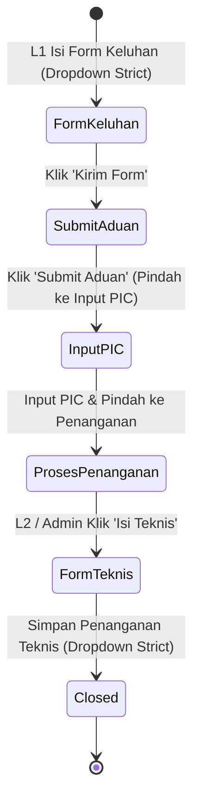
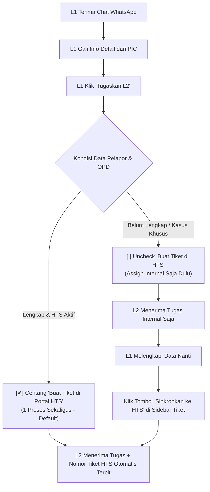

# 📑 User Stories & Spesifikasi Integrasi Portal HTS Diskomdigi Jateng

**Dokumen:** Spesifikasi Integrasi Sistem Eksternal & Alur Tiketing Otomatis  
**Target Integrasi:** Portal Aduan Data Center Jawa Tengah (`https://hts.diskomdigi.jatengprov.go.id`)  
**Status:** Disetujui (Updated berdasarkan Klarifikasi Kebutuhan Pengguna)  
**Tanggal Diperbarui:** 29 September 2026  

---

## 🎯 1. Latar Belakang & Tujuan Integrasi

Sistem Helpdesk WhatsApp saat ini telah berhasil menangani komunikasi dua arah antara pelapor (PIC SKPD/OPD) dengan Helpdesk L1 dan pendelegasian ke Tim Teknisi L2 (Network, Server, M&E).

Namun, untuk standardisasi pelaporan resmi di lingkungan Pemerintah Provinsi Jawa Tengah, seluruh keluhan wajib tercatat pada portal resmi:  
👉 **`https://hts.diskomdigi.jatengprov.go.id/list_aduan`**

Tujuan integrasi ini adalah **mengotomatiskan sinkronisasi** dari percakapan WhatsApp Helpdesk ke portal resmi Diskomdigi tersebut, meminimalkan *double-input* data manual oleh operator Helpdesk L1 maupun Teknisi L2, serta menjaga konsistensi nomor tiket antara pesan WhatsApp dan portal resmi.

---

## 🔍 2. Karakteristik & Arsitektur Portal Target (HTS Diskomdigi)

Berdasarkan inspeksi langsung pada sistem portal target:
1. **Teknologi Portal:** PHP CodeIgniter (CI) dengan tema Bootstrap 5 SuKhaTech.
2. **Mekanisme Autentikasi:**
   - URL Login: `https://hts.diskomdigi.jatengprov.go.id/login`
   - Field: `email`, `password`, `captcha_code`, dan `csrf_test_name` (CSRF Token dinamis).
   - Gambar CAPTCHA: `https://hts.diskomdigi.jatengprov.go.id/captcha?rand=...` (Gambar teks numerik/alfanumerik dinamis yang diregenerasi setiap request).
   - Session: Cookie berbasis session PHP (`ci_session`).
3. **Kepemilikan Akun Petugas (Per-User Account):**
   - Setiap personil Dispatcher L1 memiliki **akun login masing-masing** di portal HTS Diskomdigi (bukan 1 akun bersama).
   - Sesi dan histori pembuatan tiket di portal HTS harus terikat dengan identitas akun L1 yang sedang bertugas.
4. **Validasi Formulir yang Ketat (Strict Master Data):**
   - Form pembuatan aduan (`Tambah Aduan`) dan form penanganan teknis (`Isi Teknis`) memiliki pilihan dropdown yang **strict / baku** (Instansi/OPD, OPD Induk, Kategori, Sub-Kategori, serta PIC Penanganan teknis).
   - Sistem integrasi harus mengambil/menyinkronkan opsi master data resmi dari HTS agar tidak ditolak saat submit formulir.



---

## 👥 3. User Stories Terstruktur

### US-01: Autentikasi Mandiri Akun HTS Per-User L1 (Individual Session & CAPTCHA)
> **Sebagai** Dispatcher L1,  
> **Saya ingin** menghubungkan akun personal saya di portal HTS Diskomdigi ke akun Helpdesk saya,  
> **Sehingga** setiap tiket yang saya sinkronkan tercatat atas nama akun HTS saya sendiri dan sesi saya tetap aktif selama jam kerja.

* **Kriteria Penerimaan (Acceptance Criteria):**
  1. Setiap akun pengguna dengan role **L1** (dan **ADMIN**) dapat menyimpan konfigurasi akun HTS pribadinya (Email & Password HTS terenkripsi) di profil masing-masing.
  2. Sistem menyimpan *session cookie* HTS secara terisolasi per `user_id` (bukan sesi global satu kantor).
  3. Di header Dasbor L1 terdapat widget status koneksi HTS personal:
     - 🟢 **"HTS Terhubung ([Email Petugas])"**: Jika sesi login aktif.
     - 🟡 **"Koneksi HTS Diperlukan"**: Jika sesi kedaluwarsa atau belum login.
  4. Ketika L1 mengklik tombol koneksi, muncul modal verifikasi yang memuat:
     - Email & Password HTS (bisa auto pre-fill jika sudah disimpan di profil).
     - Gambar CAPTCHA dinamis yang diambil *real-time* dari server HTS.
     - Tombol refresh CAPTCHA jika gambar kurang jelas.
     - Input kode CAPTCHA.
  5. Setelah verifikasi berhasil, sesi PHP CodeIgniter disimpan di backend untuk user tersebut dan dilakukan *keep-alive* secara berkala.

---

### US-02: Pendelegasian Tugas & Pembuatan Tiket HTS (Solusi Hybrid - Disetujui)
> **Sebagai** Dispatcher L1,  
> **Setelah** saya menggali informasi komplain dari PIC via WhatsApp dan mendapatkan detail keluhan,  
> **Saya ingin** mendelegasikan tugas ke Teknisi L2 sekaligus membuatkan tiket resmi di HTS Diskomdigi dalam satu modal praktis, dengan fleksibilitas untuk menyusulkannya nanti jika diperlukan.

#### 💡 Alur Kerja Solusi Hybrid:



* **Kriteria Penerimaan (Acceptance Criteria):**
  1. **Alur Utama (1 Proses Sekaligus - Default):**
     - Di Modal Penugasan Tim L2, checkbox `[✔] Sekaligus Buat Tiket di HTS Diskomdigi` aktif secara default jika user L1 sedang terhubung ke HTS.
     - Form penugasan menampilkan isian yang dibutuhkan oleh portal HTS dengan opsi dropdown yang baku (*strict*).
     - Data pelapor (Nama, No WA, Instansi, Tanggal & Jam problem) otomatis terisi (*auto pre-fill*).
     - Saat L1 klik *"Simpan & Tugaskan"*, backend menjalankan:
       1. Assign L2 di sistem internal + blast notifikasi WhatsApp ke teknisi.
       2. Submit form tambah aduan ke portal HTS menggunakan sesi L1.
       3. Melakukan tahapan otomatis *"Submit Aduan"* -> *"Input PIC"* di HTS.
       4. Menyimpan Nomor Aduan / ID Tiket HTS ke database Helpdesk kita.
  2. **Alur Alternatif (Susulan / Two-Step):**
     - Jika L1 mematikan centang (misal identitas instansi belum jelas dari chat), tiket tetap dapat ditugaskan ke L2 di internal.
     - Pada sidebar detail tiket tetap muncul tombol `[+ Sinkronkan ke HTS]` untuk membuat tiket resmi kapan saja setelah data dilengkapi.

---

### US-03: Form Keluhan Pelanggan dengan Opsi Dropdown Baku (Strict Mapping)
> **Sebagai** Dispatcher L1,  
> **Saya ingin** pilihan Instansi, OPD, Kategori, dan Sub-Kategori di modal sistem kita sesuai persis 100% dengan opsi yang ada di portal HTS Diskomdigi,  
> **Sehingga** data yang disubmit tidak mengalami error validasi dari server HTS.

* **Kriteria Penerimaan (Acceptance Criteria):**
  1. Sistem melakukan sinkronisasi / inspeksi master data dari portal HTS:
     - Daftar pilihan **Instansi / OPD** resmi.
     - Relasi **OPD Induk**.
     - Daftar **Kategori** (Troubleshoot, Permohonan Layanan, Monitoring).
     - Daftar 3 opsi **Sub-Kategori** saat Kategori dipilih *Troubleshoot*.
  2. Input form di web dashboard kita menggunakan dropdown/autocomplete yang merujuk pada master data tersebut.
  3. Foto kendala yang dikirim PIC melalui WhatsApp otomatis disertakan sebagai file lampiran bukti problem.

---

### US-04: Eksekusi L2 & Pengisian Penanganan Teknis (Form Teknis Strict)
> **Sebagai** Teknisi L2 (Network / Server / M&E),  
> **Setelah** saya menyelesaikan penanganan di lapangan,  
> **Saya ingin** mengisi form penanganan teknis yang sesuai dengan standar HTS Diskomdigi,  
> **Sehingga** tahapan *"Isi Teknis"* di portal HTS langsung terupdate dan status aduan menjadi Selesai.

* **Kriteria Penerimaan (Acceptance Criteria):**
  1. Saat L2 mengklik tombol *"Tandai Selesai"*, muncul modal *Form Penanganan Teknis* yang mencakup:
     - **Tanggal Penanganan \*** (default: hari ini).
     - **Jam Penanganan \*** (default: jam saat ini).
     - **Detil Penanganan \*** (penjelasan pekerjaan teknis yang dilakukan).
     - **PIC Penanganan \*** (pilihan dropdown / nama teknisi sesuai master PIC HTS).
     - **Bukti Penanganan** (unggah foto hasil pekerjaan/screenshot).
  2. Setelah disimpan, sistem lokal mencatatnya sebagai *Internal Note* bertag tim L2, dan secara otomatis mem-POST ke form *Isi Teknis* HTS (`Simpan penanganan`).
  3. Status tiket di portal HTS berubah menjadi **SELESAI / CLOSED**.

---

### US-05: Konfirmasi Akhir ke PIC & Penutupan Ganda (Dual-Close)
> **Sebagai** Dispatcher L1,  
> **Setelah** seluruh tim L2 menyelesaikan pekerjaannya (Status Tiket `RESOLVED`),  
> **Saya ingin** mengonfirmasi kembali ke PIC melalui WhatsApp apakah keluhan sudah tuntas,  
> **Dan jika sudah oke**, saya menutup tiket resmi (`CLOSED`), memastikan tiket di portal HTS juga telah terverifikasi selesai.

* **Kriteria Penerimaan (Acceptance Criteria):**
  1. L1 melakukan chat konfirmasi via WhatsApp ke PIC bahwa perbaikan telah selesai dilakukan oleh tim teknisi.
  2. Jika PIC merespons bahwa layanan sudah kembali normal dan tidak ada komplain lagi, L1 membuka modal *"Selesaikan Tiket"*.
  3. Sistem memverifikasi bahwa tiket di HTS sudah berstatus selesai (dari tahap Isi Teknis L2), lalu L1 memasukkan kesimpulan akhir untuk menutup tiket di Helpdesk lokal secara permanen.

---

## 📋 4. Rincian Pemetaan Data Baku (Strict Data Mapping)

### A. Form Keluhan Pelanggan (`/list_aduan/tambah`)

| Field di Portal HTS | Tipe Input | Nilai / Sumber di Helpdesk | Validasi / Aturan |
|---|---|---|---|
| **Nama Pemohon \*** | Teks | `Customer.name` | Minimal 3 karakter |
| **No. Handphone/WA \*** | Nomor Teks | `Customer.wa_number` | Format nomor telepon aktif |
| **Instansi/OPD \*** | **Dropdown Strict** | `Customer.skpd_name` | Harus persis cocok dengan master OPD HTS |
| **OPD Induk** | **Dropdown / Auto** | Berelasi dengan OPD terpilih | Sesuai hierarki OPD di HTS |
| **Tanggal Problem \*** | Tanggal (`YYYY-MM-DD`) | `Ticket.created_at` (Date) | Tanggal pesan pertama masuk |
| **Jam Problem \*** | Waktu (`HH:mm`) | `Ticket.created_at` (Time) | Jam pesan pertama masuk |
| **Kategori \*** | **Dropdown Strict** | `Ticket.service_type` | Opsi baku: `Troubleshoot`, `Permohonan Layanan`, `Monitoring` |
| **Sub Kategori \*** | **Dropdown Strict** | `TicketCategory.category.name` | Wajib jika Kategori = Troubleshoot (3 opsi baku tim L2) |
| **Detil Permasalahan \*** | Textarea | Pesan komplain dari PIC | Rincian masalah yang disampaikan PIC |
| **Bukti Lampiran** | File Lampiran | `Message.attachment_url` | File foto bukti yang dikirim PIC via WA |

---

### B. Form Penanganan Teknis (`/list_aduan/isi_teknis`)

| Field di Portal HTS | Tipe Input | Nilai / Sumber di Helpdesk | Validasi / Aturan |
|---|---|---|---|
| **Tanggal Penanganan \*** | Tanggal (`YYYY-MM-DD`) | Waktu saat L2 klik Selesai | Tanggal pekerjaan diselesaikan |
| **Jam Penanganan \*** | Waktu (`HH:mm`) | Waktu saat L2 klik Selesai | Jam pekerjaan diselesaikan |
| **Detil Penanganan \*** | Textarea | Rincian tindakan L2 | Penjelasan langkah teknis perbaikan |
| **PIC Penanganan \*** | **Dropdown Strict** | `User.name` (Teknisi L2) | Harus sesuai dengan daftar PIC di HTS |
| **Bukti Penanganan** | File Lampiran | Upload bukti penanganan L2 | Foto dokumentasi hasil perbaikan |

---

## 🗄️ 5. Perubahan Skema Database (`schema.prisma`)

Untuk mendukung akun HTS per-user dan status sinkronisasi tiket:

```prisma
// Penyesuaian pada model User: Menyimpan kredensial HTS per-petugas L1/Admin
model User {
  // ... field yang sudah ada ...
  hts_email       String?         // Email akun login HTS Diskomdigi pribadi petugas
  hts_password    String?         // Password akun HTS (terenkripsi)
  hts_session     HtsUserSession? // Relasi ke sesi aktif HTS user bersangkutan
}

// Model sesi login HTS individual per-user
model HtsUserSession {
  id           Int      @id @default(autoincrement())
  user_id      Int      @unique
  user         User     @relation(fields: [user_id], references: [id], onDelete: Cascade)
  cookie_data  String   @db.Text   // Cookie PHP Session (ci_session)
  is_logged_in Boolean  @default(false)
  last_login   DateTime @default(now())
  updated_at   DateTime @updatedAt
}

// Penyesuaian pada model Ticket: Menyimpan referensi tiket HTS
model Ticket {
  // ... field yang sudah ada ...
  hts_ticket_id     String?         // Nomor/ID tiket resmi di HTS (misal: ID / No Aduan)
  hts_ticket_status String?         // Status di HTS ("DRAFT", "INPUT_PIC", "PROSES", "SELESAI")
  hts_created_by    Int?            // ID User L1 yang men-submit tiket ke HTS
  hts_synced_at     DateTime?       // Waktu terakhir sinkronisasi berhasil
}
```

---

## 🗺️ 6. Langkah Kerja Selanjutnya (Next Steps)

1. **Inspeksi Master Data HTS:**  
   Membuka halaman portal HTS bersama pengguna untuk mendokumentasikan nilai pasti (*exact options*) dari:
   - Daftar nama Instansi/OPD & OPD Induk.
   - Opsi Kategori & 3 Sub-Kategori Troubleshoot.
   - Daftar PIC Penanganan Teknis.
2. **Pengembangan Backend HTS Client Service:**  
   Modul Node.js untuk menangani login per-user L1, captcha proxy/stream, penyimpanan cookie per user, dan multipart POST form.
3. **Penyusunan Form UI di Dasbor:**  
   Dropdown terintegrasi pada Modal Assign L1 (dengan toggle hybrid) dan Modal Selesai L2.
